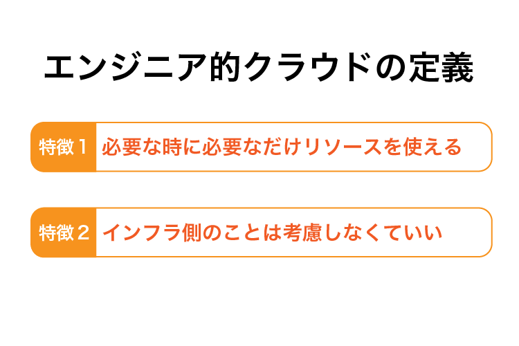

# (1)クラウドとは 

## 1.本章の目的

- クラウドとは何かを知る
- 本コースの目的を理解する

  
本コースでは、クラウド業界の最大手であるAWS（Amazon Web Service）を使って「クラウドとは何か」を学習します。まず最初に「クラウドとは何か」を学習しましょう。

## 2.クラウドとは何か

クラウドとは何か、これを解説すると意外に広いことが分かります。エンジニアやプログラミング学習者にとっての「クラウド」もあれば、エンジニアでない人たちにとってのGmailやEvernote、iCloudだって「クラウド」です。どうやら、語る人の立場や対象が違えば、クラウドの定義が異なるようです。まず最初に、**エンジニア的にクラウドとは何か**をザックリと考えてみましょう。

さまざまなサイトが「エンジニア的クラウドとは何か」を解説していますが、だいたい以下のようなことを書いています。

正直、よく分かりませんね。では、そもそもクラウドとは何かというより、いきなりですが**AWSとは何か**を簡単に触れてみましょう。何か見えてくるかもしれません。後ほど詳しく解説するので、ここでは概要にとどめます。

**AWSとは、クラウドサービスを提供する企業です。クラウドプロバイダと呼ぶこともあります。** AWSの代表的なサービスで「EC2」という仮想サーバを立てるサービスがあります。このEC2を例にとり解説しましょう。AWS自身が超巨大なインフラを保有しており、そのインフラの中に私たちは仮想的なサーバを立てることができます。実機ではありません。形がないだけで、それ以外は普通のサーバとして機能します。仮想サーバはブラウザからコントロール可能です。新規に立ち上げたり廃棄したり、一時的に止めることだってできます。

しかも、すべてAWSのインフラ内での仮想サーバなので、**ディスクの磨耗や設置スペース、電気代の心配すらありません。** これらの特徴が、先に述べた特徴１と特徴２に結びつくのです。これから私たちは、この２つの特徴を存分に活用し、クラウドを使いこなせるように勉強していきます。

このように、**ハードやインフラのことを気にする必要がなく、サービスだけを受け取れることをクラウド**というのです。

先にあげた2つの特徴、何となく分かったでしょうか？もちろん今はボヤッとした感覚で問題ありません。先に手を動かして感覚をつかみましょう。

## 3.本コースの目的

このコースでは、先に述べたクラウドやAWSのメリットを活用し、実際にAWSの基盤上に仮想サーバを構築し、実機のようにRailsやLaravelのプロジェクトをデプロイ（簡単にいうとアップロード）して、ブラウザでアクセスして動作することを確認します。その過程で、クラウドとは何か、またクラウドのメリットを学習します。

本来Webアプリ環境を構築しインターネットに公開するには、Webサーバが必要です。サーバといっても普通のコンピュータに違いありません。コンピュータを購入、または機材を買って組み立てて、OSをインストールして、ミドルウェアや言語、フレームワークをセットアップして・・・という流れが必要です。

ところが、本コースで構築する環境は全てクラウド上で行います。ブラウザ以外は不要です。従来の流れと比べていかに簡単にWebシステムを構築できるかを学びます。

「レンタルサーバと同じでは？」と思った方も多数おられると思います。その疑問、本コースを進めるにつれて解消されます。

本コースを終了する頃には、クラウドを活用して自身のサイトを公開したり、クラウドの特性を活かして柔軟なシステム基盤を構築できるようになっているでしょう。

1〜6章まではクラウドとは何か、AWSとは何かという基礎講義が続きます。よって、**前提知識より手を動かしたい、理屈はその後でいい、待てない**という方は7章から開始することをオススメします。6章までを飛ばして7章以降から学習するとしても、多少は知らない単語は出てくるくらいで理解できないということは決してありませんのでご安心ください。7章以降から先に手をつけて、全て終わって感覚的なものが身に付いてから2〜6章を読むというのも大いにアリです。

ただ１点お断りしておきますが、現在の時点でMacを使うことを想定しているので、Windowsでの記述が弱いところがあります。Windowsで学習できるようにコンテンツを順次追加していきますので、今しばらくお待ちください。

それでは始めましょう！
