# (10) EC2を立ち上げる

## 1.本章の目的

- インスタンスを立ち上げる
- AWSの操作の感覚をつかむ

  
本章では、サーバインスタンスの立ち上げを通じて、インスタンスに限定せずAWSを操作するという雰囲気・感覚をつかんでいただきます。

各種操作に慣れることを目的としているので、理論や設計、基礎知識は一切触れていません。今は分からなくても大丈夫！もちろんそれらが不要というわけではなく、全て後の方で解説が出てきますのでご安心ください。分からないことがたくさん出てきますが、とりあえずは「先に進めること」に注力してください。詳細の解説は後の11章にて出てきます。

また11章はすべて技術解説なので、時間のある時や電車の中でじっくりお読みください。お好みで、次章を先に読んでから本章を実践するのもアリですよ。

それでは始めます。

## 2.インスタンスを立ち上げる

AWSマネジメントコンソールにログインした状態で学習を開始してください。

### 2-1.EC2のサービスを立ち上げる

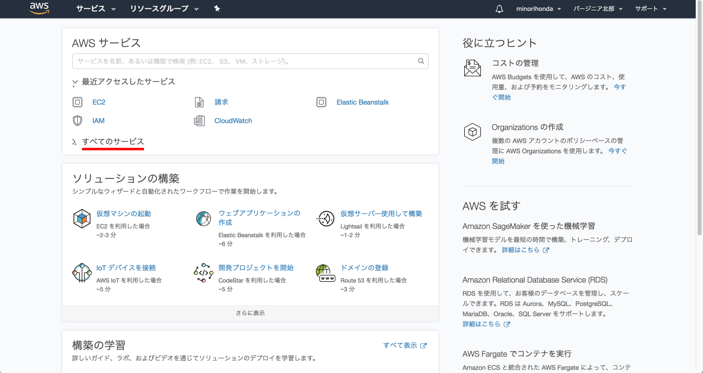

「すべてのサービス」をクリックして、すべてのサービスを開いてください。もちろん最初から開いている場合はそのままで結構です。

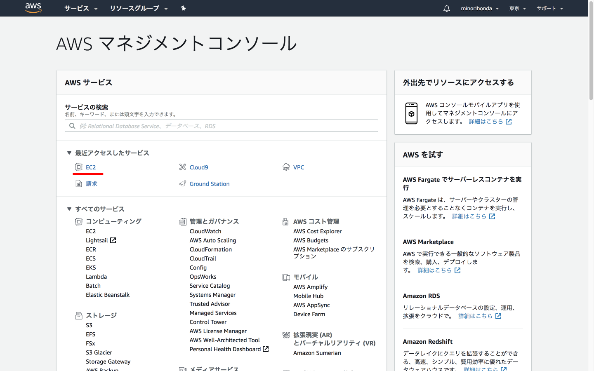

開いた中にEC2と表示されているので、それをクリックしてください。

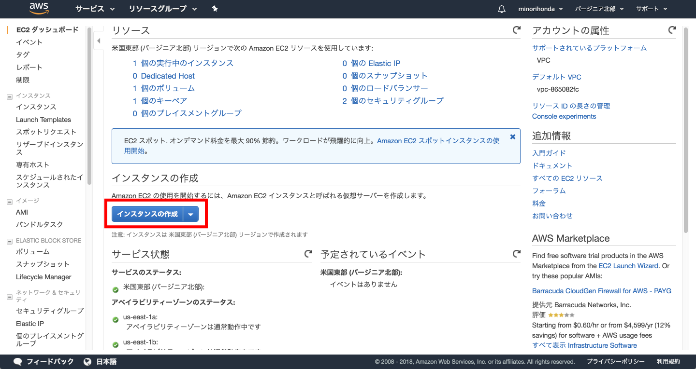

EC2のメニューが開きました。

### 2-2.インスタンスの作成

次に、画面中央あたりにある「インスタンスの作成」ボタンをクリックしてください。

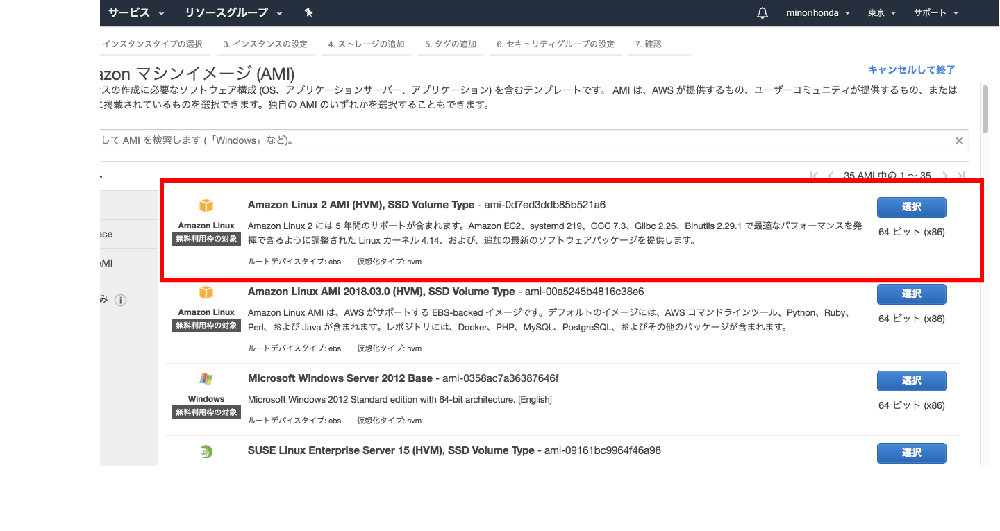

Amazon マシンイメージ(AMI)を選択する画面が開きました。AMIとは、要はインスタンスのテンプレートのことです。ここではOSの選択をするという程度で理解してください。

ぜひ下までスクロールして、どんなOSが選択できるのかを知ってください。

そしてここでは、一番上の「Amazon Linux 2 AMI (HVM), SSD Volume Type」を選択しますので、赤枠内左側にある「選択」ボタンをクリックしてください。なお、ami-のあとの数値は厳密に同じである必要はありません。

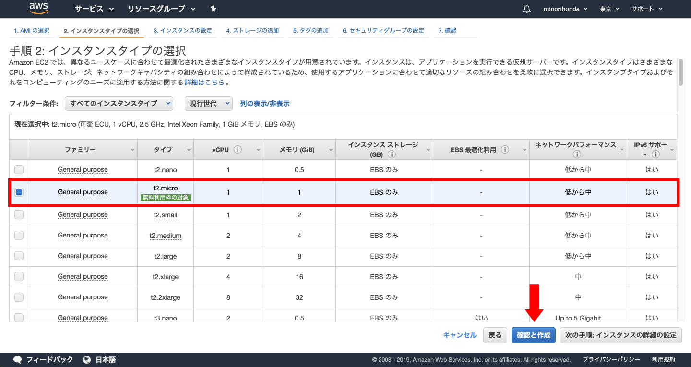

インスタンスタイプの選択が開きました。先の画面でOSを選択したので、ここではインスタンスタイプ（規模）を選択します。「無料利用枠の対象」と書かれているt2.microが選択されていることを確認して下さい。さらにサーバインスタンスの詳細項目を指定できるのですが、今回は単にインスタンスを作るだけなので、何も変えず「確認と作成」ボタンをクリックしてください。

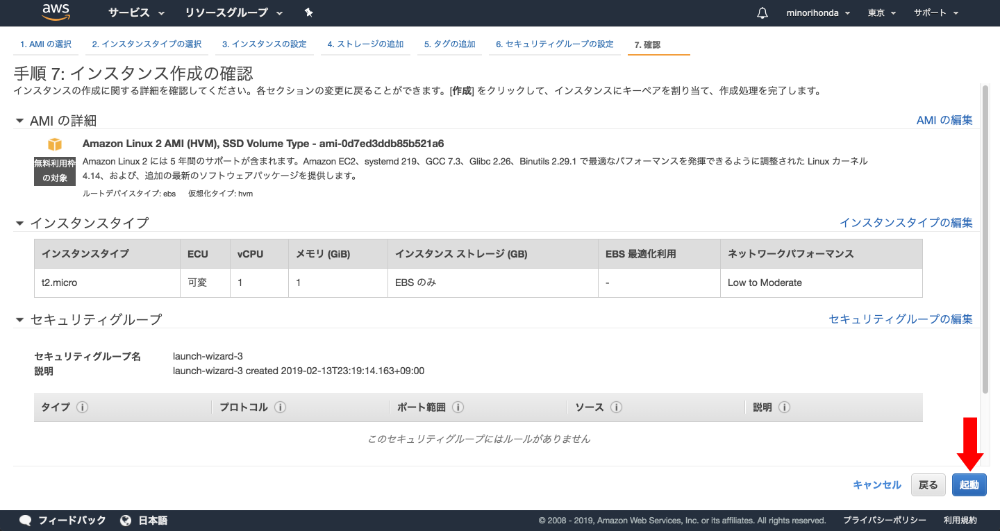

最終確認の画面が開きました。

### 2-3.キーペアの作成

諸々の内容はさておいて「起動」ボタンをクリックしてください。キーペアの選択画面が開きます。

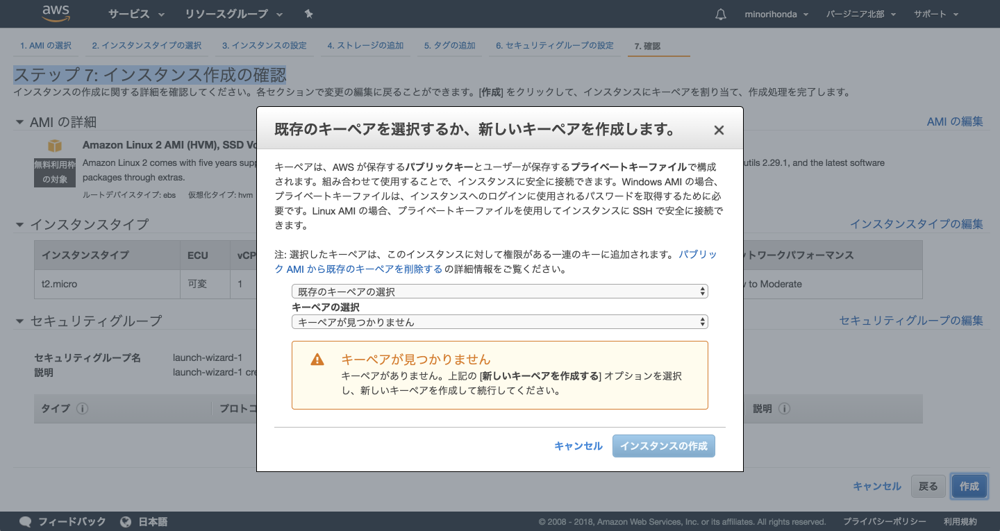

アカウント登録したばかりの皆さんは、当然キーペアは1つも持っていません。「既存のキーペアの選択」プルダウンをクリックして「新しいキーペアの作成」を選択して下さい。キーペア名とダウンロード先の入力画面が開きます。

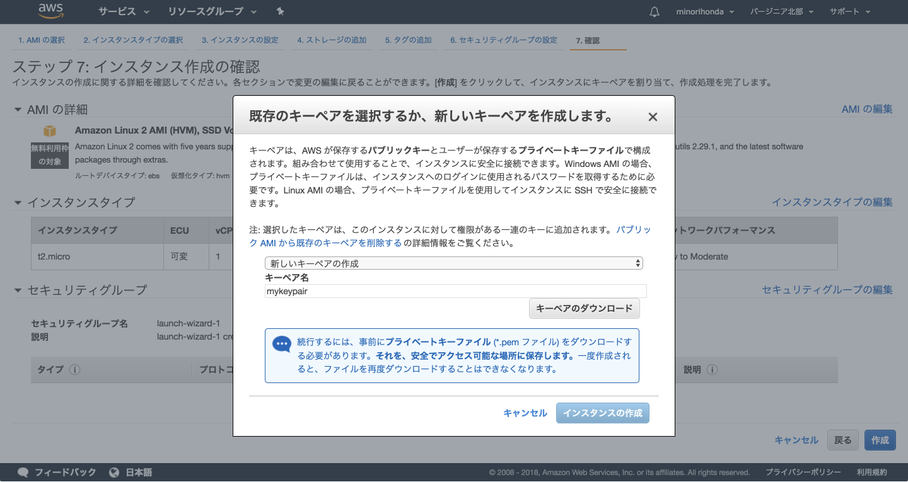

お好きなキーペア名を入力して「キーペアのダウンロード」ボタンをクリックして、キーペアをダウンロードしてください。

**重要！！：キーペアがどこにダウンロードされたのか確認しておきましょう。一般的にMac/Windowsともに、PCにログインしたアカウントのダウンロードフォルダです。**

キーペアは、次の接続するステップで使います。キーペアは紛失しても再発行不可能で、インスタンスにもアクセスできなくなります。厳重に保管しておいてください。

**また、キーペアを立ち上げた仮想サーバやGitHubにアップするのも絶対おやめください。必ず自分の手元に保存しておいてください。**

### 2-4.インスタンスの作成実行

キーペアのダウンロードが終わったら「インスタンスの作成」ボタンをクリックしてください。

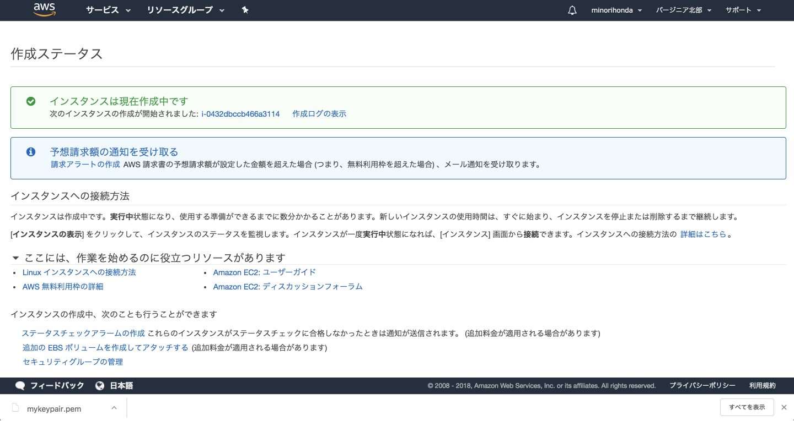

インスタンスの作成が始まりました。5分程度したら、画面の一番上のAWSロゴのとなり「サービス」をクリックし、その中の「EC2」クリックしてください。

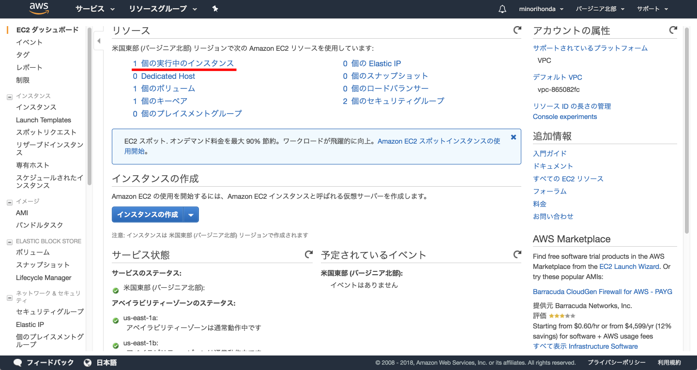

「リソース」にて「1個の実行中のインスタンス」をクリックしてください。

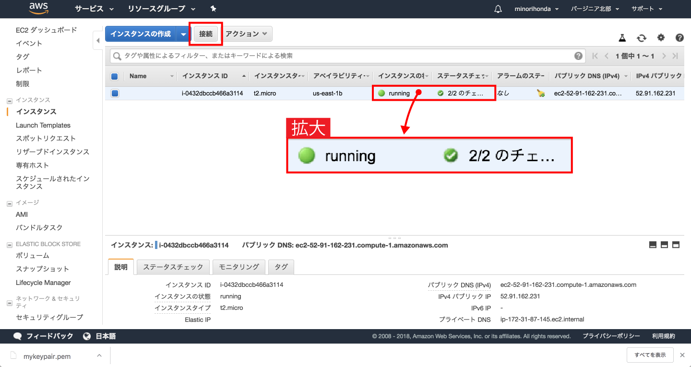

「インスタンスの状態」がrunningで「ステータスのチェック」が2/2であればインスタンスの立ち上げが完了しています。

### 2-5.インスタンスの接続

いよいよ接続します。

「接続」ボタンをクリックしてください。

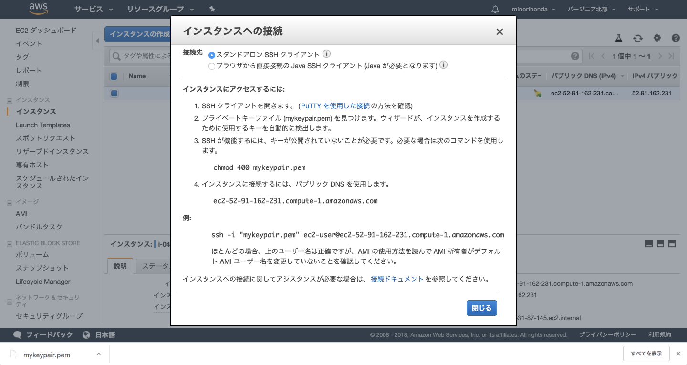

ここで表示されている情報は、Mac/Windowsともに参照しなくてはなりません。閉じないように気をつけてください。ここからはMacとWindowsで手順が異なりますので、ご使用のOSに応じて進めてください。

## 3.インスタンスへ接続する（Mac）

MacのLaunchpadより「ターミナル」を立ち上げてください。Launchpadの「その他」の中にあります。

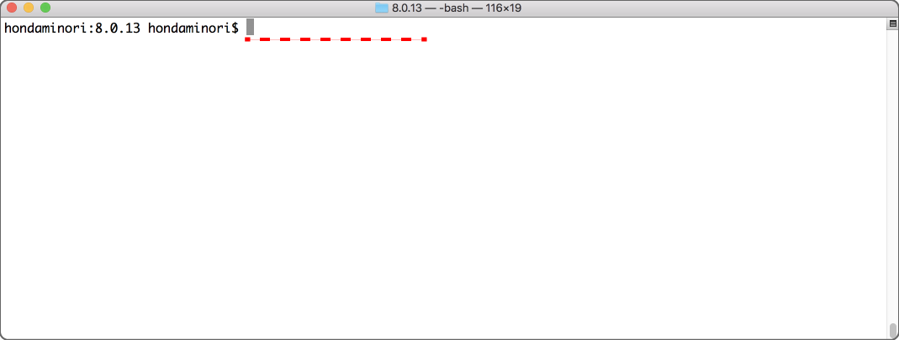

赤い点線の上に、グレーのカーソルがあります。初めてターミナルを見たという方は、試しにaやbと打ち込んでみて下さい。赤い点線の上に打った文字が表示されるのが分かります。

以降、先頭の$より以前は省略します。入力するコマンドのみを記載します。教材に書いてあるままに入力して下さい。

コマンドを実行して下さい、とは「ターミナル上でコマンドを打ち込むか、またはどこかでコピーしたものをペースト（貼り付け）し、Enterする」ことを意味します。

まず、キーペアをダウンロードしたディレクトリ（フォルダと同じ意味）へ移動します。デフォルトでログインしたユーザーのDownloadsディレクトリにありますので、以下のコマンドで移動できます。

```cd ~/Downloads```

そこでダウンロードしたキーペアを探しましょう。以下のコマンドを実行してください。

``` ls -al | grep *.pem ```

間違いなくキーペアが存在していれば、以下のように表示されます。

```-rw-r--r--@   1 (PC名)  staff       1696  9 24 13:19 (キーペア名).pem```

何も表示されなければ、そこにはキーペアは存在していません。ダウンロードした場所を再確認してください。

次にキーペアのパーミッションを変更しましょう。

``` chmod 400 (キーペア名).pem ```

何もメッセージが表示されなければ成功です。念のため確認しておきましょう。もう一度以下のコマンドを実行してみてください。

``` ls -al | grep *.pem ```

先頭のrやwのあたりが変わります。

```-r--------@   1 (PC名)  staff       1696  9 24 13:19 (キーペア名).pem```

-rw-r--r--が-r--------に変われば成功です。

ここで、上で出てきた画面「インスタンスへの接続」の「例：」にあるssh〜で始まるコマンドを、そのままコピーして、ターミナルで貼り付けして下さい。

``` ssh -i "(キーペア名).pem" ec2-user@ec2-###-###-###-###.compute-1.amazonaws.com ```

Enterキーを押すと、以下のように表示されます。

```
(PC名):Downloads (PC名)$ ssh -i "(キーペア名).pem" ec2-user@ec2-###-###-###-###.compute-1.amazonaws.com
The authenticity of host '###-###-###-###.compute-1.amazonaws.com (###.###.###.###)' can't be established.
ECDSA key fingerprint is SHA256:(超長い英数字))
Are you sure you want to continue connecting (yes/no)? y
Please type 'yes' or 'no': yes 
```

yesかnoを聞いてきたので、yesと入力してEnterして下さい。

```Warning: Permanently added 'ec2-###-###-###-###.compute-1.amazonaws.com,###.###.###.###' (ECDSA) to the list of known hosts.

       __|  __|_  )
       _|  (     /   Amazon Linux 2 AMI
      ___|\___|___|

https://aws.amazon.com/amazon-linux-2/
2 package(s) needed for security, out of 9 available
Run "sudo yum update" to apply all updates.
```

2chを彷彿させるAA（アスキーアート：普通の文字を組み合わせて作った図柄）によるEC2のロゴが出てくれば成功です！インスタンスの立ち上げと接続ができました！あなたの指示により、AWSのデータセンター内にあなただけの仮想サーバができあがり、接続できているのです。

接続できたことに感動し、余韻にひたり終えたらexitコマンドを実行して切断します。

``` exit ```

ここまでできたので、本作業は完了です。『作業の後始末』へ進んでください。

## 4.インスタンスへ接続する（Windows）

Windowsからサーバインスタンスに接続するとき、Mac同様にSSH接続をします。しかしWindowsの場合は一工夫必要です。Macほど単純にSSH接続できないのです。Macは標準で、つまり何もインストールせずにSSH接続ができます。ところがWindowsでは、標準でSSH接続できず、何らかのアプリケーションをインストールしなければいけません。

厳密にいうとOpenSSHというWindows公式ツールがありますが、OSに標準搭載され始めたのは『Windows 10 April 2018 Update』からです。皆さんの中にはWindows8や7をお使いの方がいるはずですので、OpenSSHは選択肢から外さなくてはいけません。

インターネット上ではTeraTerm（テラターム）やPuTTY（パティ、プティ）を使った接続方法をよく目にします。AWSの公式サイトではPuTYYを使った説明をしています。

本コースでは、古くから存在して定評のあるフリーツール、**TeraTerm**を利用します。PuTTYはAWSでダウンロードしたキーペアをPuTTY形式に変換しなくてはなりません。一方、TeraTermは複雑な設定は不要で、慣れてくれば運用にマクロを導入できるというメリットもあります。またTeraTermは多数のITの現場で使われており実績は数多くあります。以上より、本コースではTeraTermを採用しました。

もちろん、もしSSH接続ができる他のツールをお持ちなら、それを使っても大丈夫です。TeraTermのインストールを飛ばしてください。

### 4-1.TeraTermのダウンロード

TeraTermのダウンロードをしましょう。古くからあるフリーソフトのダウンロードサイト『窓の杜』へアクセスして下さい。ちなみに「まどのしゃ（社）」ではなく「まどのもり（杜）」です。多くの方がまちがって「しゃ」と読んでいます。まちがっている方が周りにいたら、できるだけ優しく訂正してあげてください。このサイトのロゴが木をモチーフとしていたり、ロゴの下にWINDOWS FOREST（FOREST:森林）と書いてあるのもうなずけますね。

今後、窓の杜を利用する機会があることを予想して、今回使って見慣れておきましょう。

話が逸れましたが、以下のリンクをクリックしてください。

https://forest.watch.impress.co.jp/library/software/utf8teraterm/

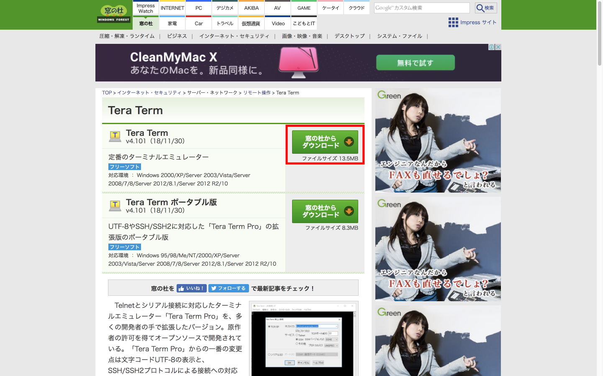

赤枠の「窓の杜からダウンロード」ボタンをクリックしてください。次の画面へ遷移し、インストーラがダウンロードできます。

ここからはお使いのブラウザや個人設定によって変わりますが、要は実行形式（.exe）のインストーラがダウンロードできればよいのです。

2018年10月時点ではバージョン4.100なので、ダウンロードしたインストーラファイルの名称も「teraterm-4.100.exe」でした。ダウンロードしたインストーラをダブルクリックしてください。

〜〜　以降、次の画面が出るまで、全ての画面で何も変えずに次へ次へで進んでください。〜〜

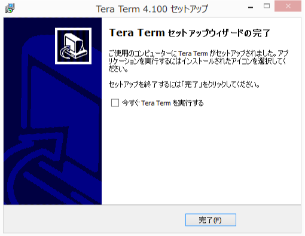

このままセットアップまで済ませてしまうので「今すぐTera Term を実行する」にチェックを入れて「完了」ボタンをクリックしてください。TeraTermの接続設定画面が開きます。

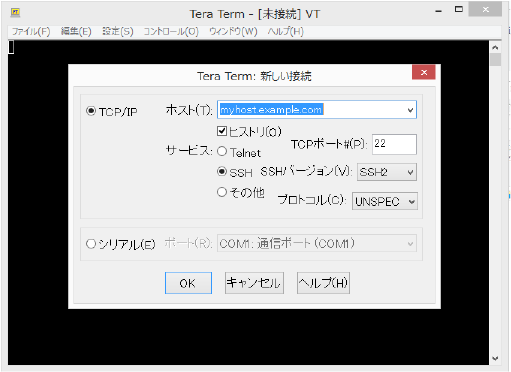

「ホスト」の欄に、前述の「接続」ボタンを押した時に表示されている情報の4番「〜amazonaws.com」をコピーペーストで貼り付けてください。先に出てきた画面を念のためもう一度載せておきます。以下の画面の4番です。


貼り付けたら、その他は何も変更せずに「OK」ボタンをクリックしてください。すると、ドキッとする画面が開きます。

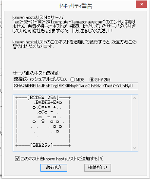

セキュリティ警告、と出ますが、これは何か良くないことが起こったことを示すものではありません。初めて接続する相手だとこのような画面が出ます。気にせずそのまま「続行」ボタンをクリックしてください。

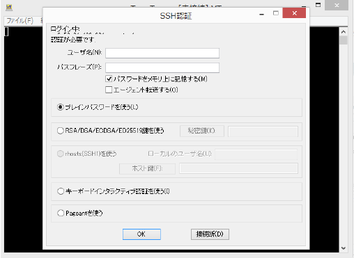

ユーザ名は「ec2-user」と入力してください。

「プレインパスワードを使う」というラジオボタンにチェックが入っていますが、その下の「RSA/DSA/ECDSA/ED2551９鍵を使う」にチェックを入れてください。すると、ラジオボタンの右の「秘密鍵」というボタンがアクティブになります。クリックするとファイル選択ダイアログが開くので、前述の手順でダウンロードした「〜.pem」を指定してください。

ただし、ファイル名の右のファイルの種類を「すべてのファイル」に変更しないとpemファイルは表示されないので注意してください。

ファイルを指定してもとの画面に戻ってきたら「OK」ボタンをクリックしてください。

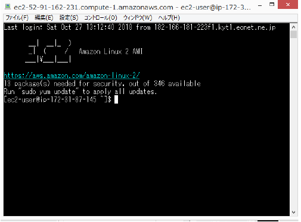

2chを彷彿させるAA（アスキーアート：普通の文字を組み合わせて作った図柄）によるEC2のロゴが出てくれば成功です！インスタンスの立ち上げと接続ができました！あなたの指示により、AWSのデータセンター内にあなただけの仮想サーバができあがり、接続できているのです。

接続できたことに感動し、余韻にひたり終えたらexitコマンドを実行して切断します。そのままexitと入力してEnterしてください。黒い画面は閉じます。

## 5.後始末をしましょう

以上で、作業の慣れを目的としたEC2インスタンスの立ち上げ・接続は終了です。これから順に後始末をしていきます。

### 5-1.サーバインスタンスから切断

Macの方はターミナル、Windowsの方はTeraTermの画面にて、```exit```と入力して、Enterキーを押してください。サーバインスタンスから切断できます。 

### 5-2.終了と削除

4-1で行ったのはあくまで切断しただけなので、サーバインスタンスはまだ稼働したままです。終了してサーバインスタンスごと削除しましょう。コンソールを開いてください。手順通りに実施しているなら、セキュリティグループ設定画面のはずです。ここからEC2の画面へ移動しましょう。

画面左上のAWSのロゴをクリックする、その隣の「サービス」をクリックする、「最近アクセスしたサービス」をクリックする、と様々なアクセス方法があります。お好きな方法で遷移してください。もうそろそろコンソールの扱いに慣れましたか？


「1 個の実行中のインスタンス」をクリックしてください。

「アクション」→「インスタンスの状態」→「終了」を選択して下さい。インスタンスは削除せずに停止させる時は「停止」で、インスタンス自体を削除する時は「終了」を選択します。

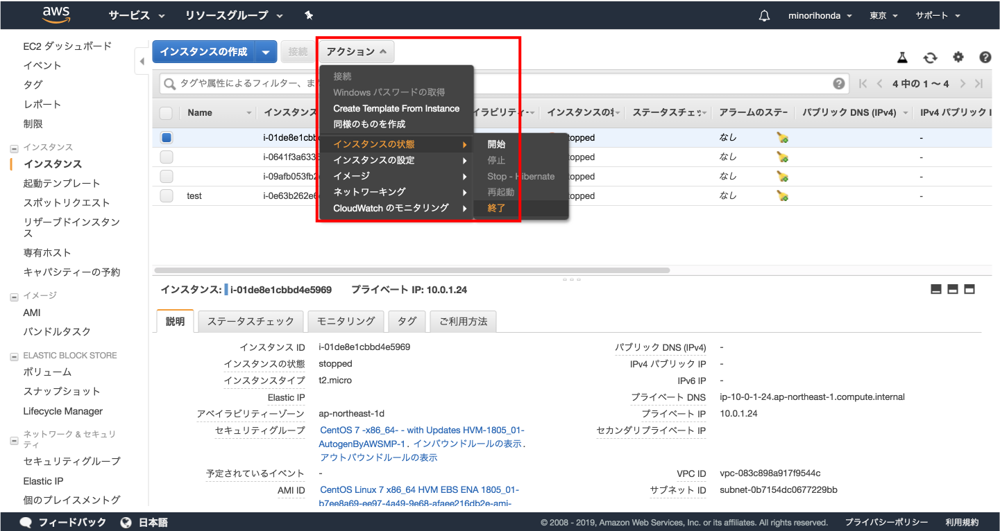

本当に削除するのか確認するメッセージが表示されます。

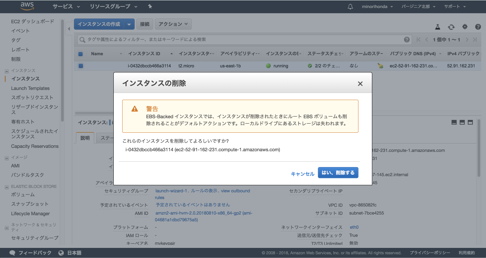

「はい、削除します」ボタンをクリックしてください。削除が始まります。数分待つとインスタンスの削除が完了し、状態が「Terminated」になれば完了です。

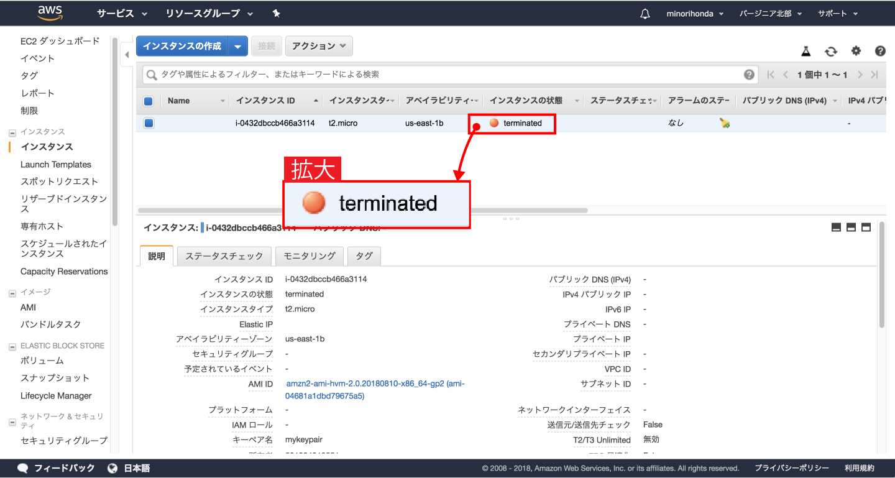

削除してもTerminatedと状態が変わるだけで残ってしまいます。でもご心配なく。時間が経つとEC2ダッシュボードの一覧から消えます。

## 6.一連の作業の振り返り

一連の作業が終わった訳ですが、少し振り返ってみてください。サーバを立てるといいながら、サーバの筐体やLAN線に触れることもなかったし、手続きや承認といった面倒なプロセスは一切ありませんでした。さらにいうなら、実機のサーバを立てるのとは比較にならないくらいの時間や費用コストだったことにお気づきでしょうか？これがまさしく、クラウドのメリットなのです。

「でも、これだけならレンタルサーバと変わりないじゃんw」

特にレンタルサーバを借りたことのある方はそう思うのも無理はありません。ですが決してそうではありません。詳しくは11章を再確認してください。

## 7.まとめ

本章では、作業ベースでのサーバインスタンス立ち上げをしました。

分からないこと、たくさん出てきたはずです。このまま分からないままにしておくとAWS実践編でとても困ることになります。よって、AWS実践編へ進む前に、次章で今まで出てきた内容の深掘りをしておきましょう。
