# (10) EC2を立ち上げる 2.EC2の立ち上げ 

## 本章の目的：

- インスタンスを立ち上げる
- 操作の感覚をつかむ

***


本章では、サーバインスタンスの立ち上げを通じて、インスタンスに限定せずAWSを操作するという雰囲気・感覚をつかんでいただきます。

各種操作に慣れることを目的としているので、理論や設計は一切触れていません。もちろんそれらが不要というわけではなく、全て後の方で出てきますのでご安心ください。分からないことがたくさん出てきますが、とりあえずは「先に進めること」に注力してください。

AWSマネジメントコンソール(以下「コンソール」)にログインした状態で学習を開始してください。

## 1. EC2を開く

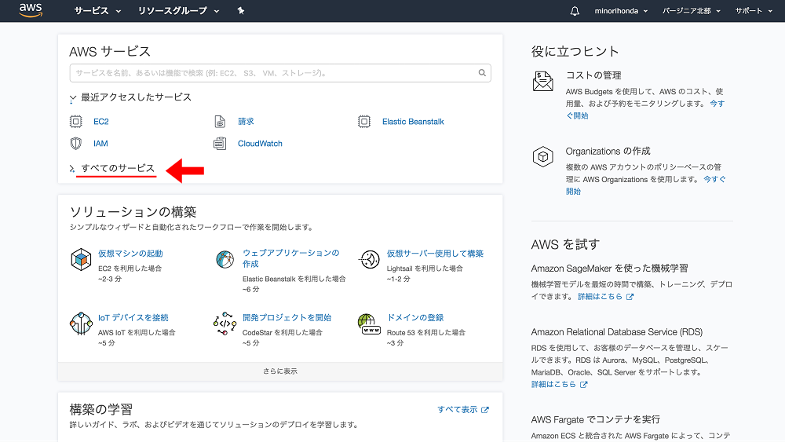

「すべてのサービス」をクリックして、すべてのサービスを開いてください。もちろん最初から開いている場合はそのままで結構です。

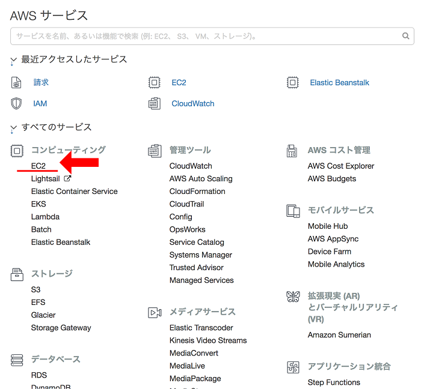

開いた中にEC2と表示されているので、それをクリックしてください。

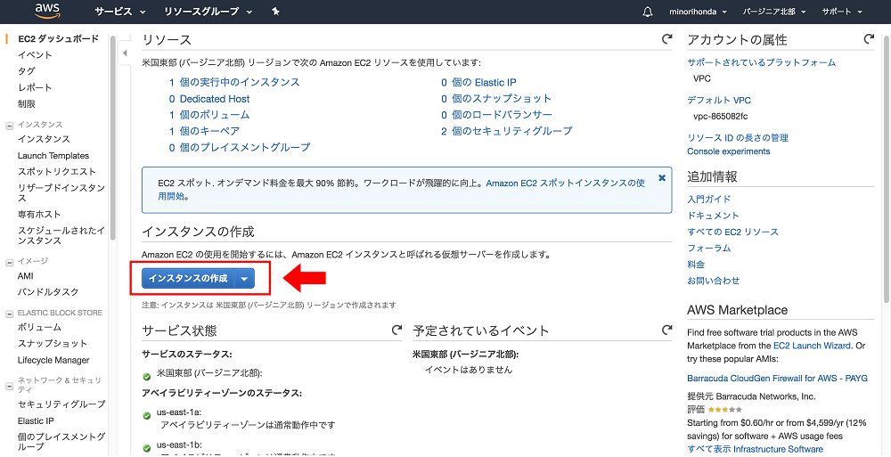

EC2のメニューが開きました。次に、画面中央あたりにある「インスタンスの作成」ボタンをクリックしてください。

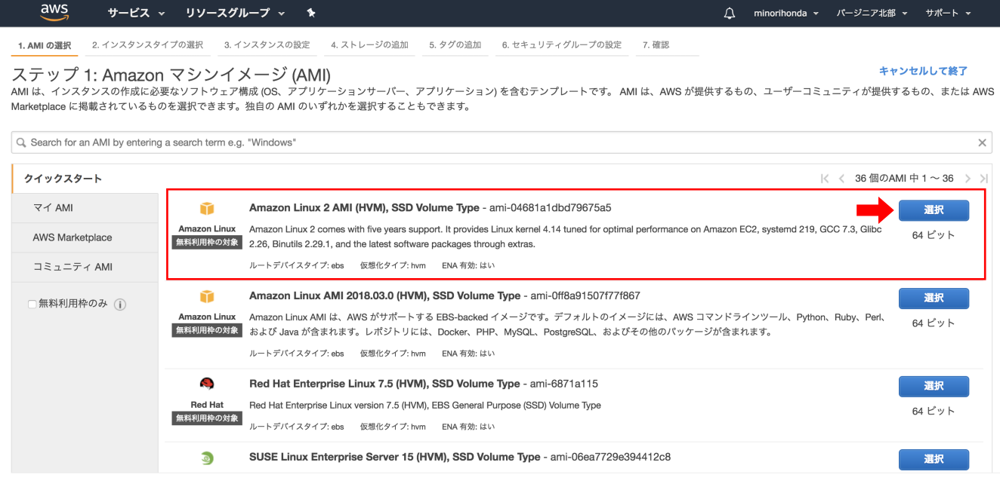

Amazon マシンイメージ(AMI)を選択する画面が開きました。AMIとは、要はインスタンスのテンプレートのことです。ここではOSの選択をするという程度で理解してください。

ぜひ下までスクロールして、どんなOSが選択できるのかを知ってください。

そしてここでは、一番上の「Amazon Linux 2 AMI (HVM), SSD Volume Type」を選択しますので、左側にある「選択」ボタンをクリックしてください。

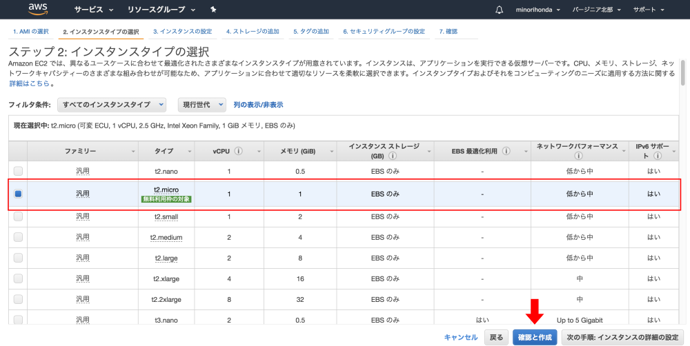

インスタンスタイプの選択が開きました。先の画面でOSを選択したので、ここではインスタンスタイプ（規模）を選択します。「無料利用枠の対象」と書かれているt2.microが選択されていることを確認して下さい。さらにサーバインスタンスの詳細項目を指定できるのですが、今回は単にインスタンスを作るだけなので、何も変えず「確認と作成」ボタンをクリックしてください。。

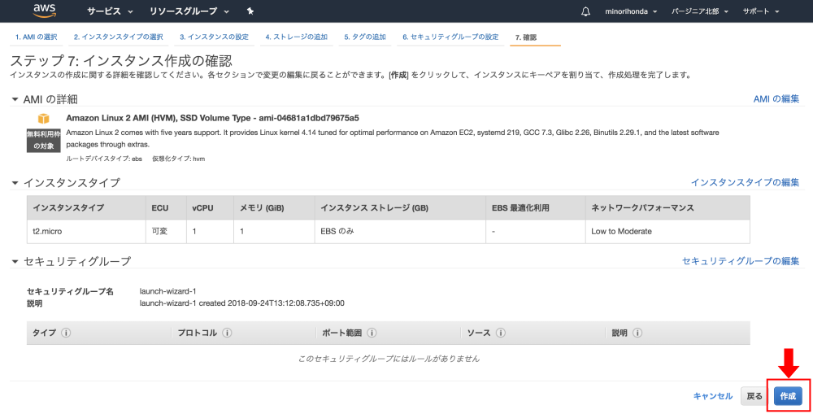

最終確認の画面が開きました。諸々の内容はさておいて「作成」ボタンをクリックしてください。キーペアの選択画面が開きます。

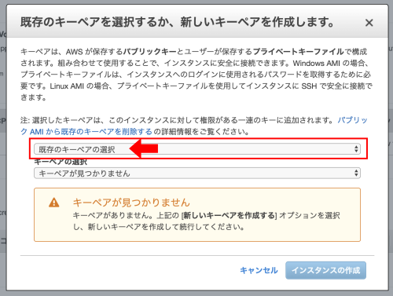

アカウント登録したばかりの皆さんは、当然キーペアは1つも持っていません。「既存のキーペアの選択」プルダウンをクリックして「新しいキーペアの作成」を選択して下さい。キーペア名とダウンロード先の入力画面が開きます。

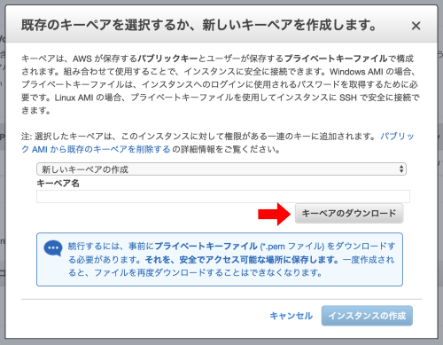


お好きなキーペア名を入力して「キーペアのダウンロード」ボタンをクリックして、キーペアをダウンロードしてください。

**重要！！：キーペアがどこにダウンロードされたのか確認しておきましょう。Mac/Windows共に、PCにログインしたアカウントのダウンロードフォルダです。**

キーペアは、次の接続するステップで使います。キーペアは紛失しても再発行不可能で、インスタンスにもアクセスできなくなります。厳重に保管しておいてください。

キーペアのダウンロードが終わったら「インスタンスの作成」ボタンをクリックしてください。

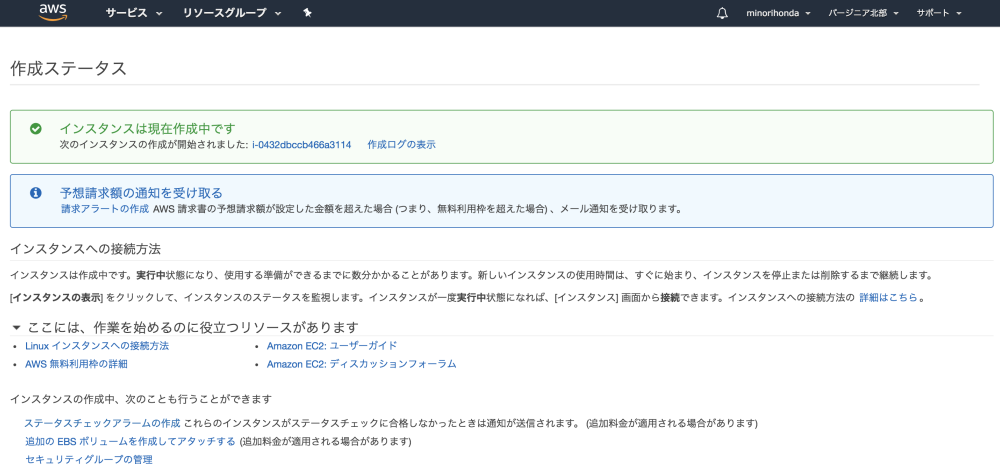

インスタンスの作成が始まりました。5分程度したら、画面上の「サービス」から「EC2」を選択してください。

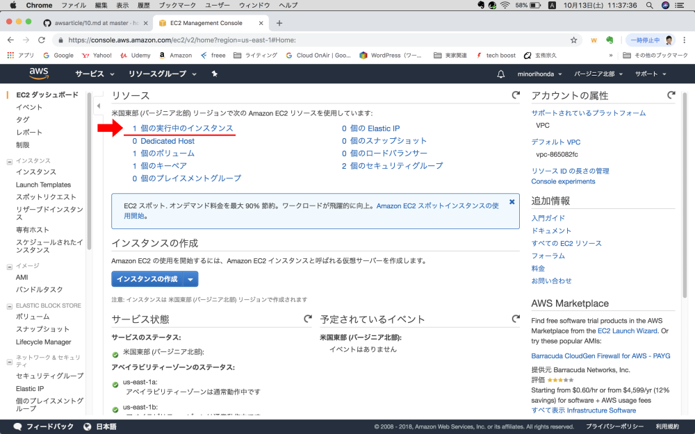

「リソース」にて「1個の実行中のインスタンス」をクリックしてください。

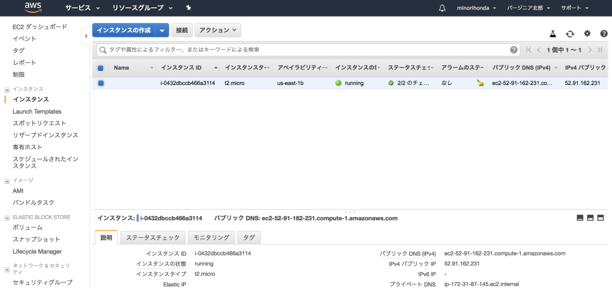

「インスタンスの状態」がrunningで「ステータスのチェック」が2/2であればインスタンスの立ち上げが完了しています。

いよいよ接続します。ここからはMacとWindowsで手順が異なりますので、ご使用のOSに応じて進めてください。

## 2. インスタンスへ接続する（Mac）

「接続」ボタンをクリックしてください。

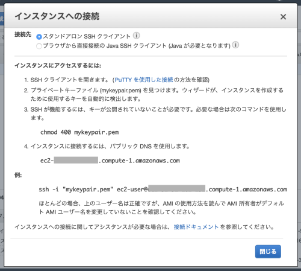

インスタンスへ接続する手順が分かります。指示通りに進めましょう。

MacのLaunchpadより「ターミナル」を立ち上げてください。Launchpadの「その他」の中にあります。

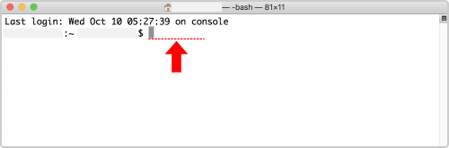

赤い点線の上に、グレーのカーソルがあります。初めてターミナルを見たという方は、試しにaやbと打ち込んでみて下さい。赤い点線の上に打った文字が表示されるのが分かります。

以降、先頭の$より以前は省略します。入力するコマンドのみを記載します。教材に書いてあるままに入力して下さい。

コマンドを実行して下さい、とは「ターミナル上でコマンドを打ち込むか、またはどこかでコピーしたものをペースト（貼り付け）し、Enterする」ことを意味します。

まず、キーペアをダウンロードしたディレクトリ（フォルダと同じ意味）へ移動します。デフォルトでログインしたユーザーのDownloadsディレクトリにありますので、以下のコマンドで移動できます。

```cd ~/Downloads```

そこでダウンロードしたキーペアを探しましょう。以下のコマンドを実行してください。

``` ls -al | grep *.pem ```

間違いなくキーペアが存在していれば、以下のように表示されます。

```-rw-r--r--@   1 (PC名)  staff       1696  9 24 13:19 (キーペア名).pem```

何も表示されなければ、そこにはキーペアは存在していません。ダウンロードした場所を再確認してください。

次にキーペアのパーミッションを変更しましょう。

``` chmod 400 (キーペア名).pem ```

何もメッセージが表示されなければ成功です。念のため確認しておきましょう。もう一度以下のコマンドを実行してみてください。

``` ls -al | grep *.pem ```

先頭のrやwのあたりが変わります。

```-r--------@   1 (PC名)  staff       1696  9 24 13:19 (キーペア名).pem```

-rw-r--r--が-r--------に変われば成功です。

ここで、上で出てきた画面「インスタンスへの接続」の「例：」にあるssh〜で始まるコマンドを、そのままコピーして、ターミナルで貼り付けして下さい。

``` ssh -i "(キーペア名).pem" ec2-user@ec2-###-###-###-###.compute-1.amazonaws.com ```

Enterキーを押すと、以下のように表示されます。

```
(PC名):Downloads (PC名)$ ssh -i "(キーペア名).pem" ec2-user@ec2-###-###-###-###.compute-1.amazonaws.com
The authenticity of host '###-###-###-###.compute-1.amazonaws.com (###.###.###.###)' can't be established.
ECDSA key fingerprint is SHA256:(超長い英数字))
Are you sure you want to continue connecting (yes/no)? y
Please type 'yes' or 'no': yes 
```

yesかnoを聞いてきたので、yesと入力してEnterして下さい。

```Warning: Permanently added 'ec2-###-###-###-###.compute-1.amazonaws.com,###.###.###.###' (ECDSA) to the list of known hosts.

       __|  __|_  )
       _|  (     /   Amazon Linux 2 AMI
      ___|\___|___|

https://aws.amazon.com/amazon-linux-2/
2 package(s) needed for security, out of 9 available
Run "sudo yum update" to apply all updates.
```

EC2のロゴが出てくれば成功です！インスタンスの立ち上げと接続ができました！あなたの指示により、アメリカのAWSのデータセンター内に仮想サーバができあがり、さらに海を越えて接続できているのです。

接続できたことに感動し、余韻にひたり終えたらexitコマンドを実行して切断します。

``` exit ```

ここまでできたので、本作業は完了です。『作業の後始末』へ進んでください。

