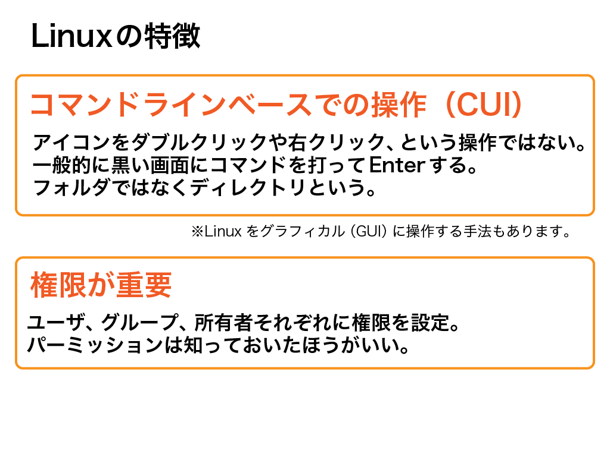

# (11) まとめ（Linux編)

## 本章の目的：

- 今までに、そしてこれから必要となるLinuxの知識を習得する。

***

本章では、前章までに出てきたLinuxの知識、そして今後必要となるLinuxの知識を解説します。Linuxを全く知らない方向けに書いています。さらに深く、LinuxはOS（オペレーティングシステム）のうちの一つですが、そもそもOSとは何か、そこから解説しています。肩の力を抜いてお読み下さい。

※本章に手を動かす場面はありますが、読み物風にしました。最初は読むだけでも十分です。

前章まででLinuxという単語をひんぱんに使ってきましたが、LinuxはおろかOSとは何かからピンとこない方もおられるはずです。ここではパソコンをさわったことくらいはある程度の方を対象に、今後の章に進む上で必要になる知識を解説します。

開発経験がないなら知らない方が普通なことばかりですので、安心して下さい。ただし今後アプリを開発して公開する上で、これらは避けて通れない話です。よって、急いで先に進むより、ちょっと立ち止まって整理しておきましょう。

## 1. OSとは一体何か？

OSとは何か、これをやみくもに探求しても壮大すぎるので、理解するポイントを先にお伝えしておきましょう。


### 1-1. コンピュータの必要最低限の機能を提供

コンピュータは、本来手のかかるものです。何か仕事をさせるなら、その全てを指示しなければいけません。例えばAというキーを押せばAと画面に表示される、それだけでもコンピュータは指示なしではやってくれません。

それ以外に、演算や記憶といったアプリに依存しない基本機能を提供してくれるのが

### 1-2. 種類が複数存在している

OSはいろいろと種類があります。私たちに馴染みのある「パソコンの世界」で有名なものはMacやWindowsではないでしょうか。またパソコンだけでなくスマホだってOS上でアプリが動作しています。スマホを分類分けするとしたらAndroidとiPhoneと思ってしまいがちですが、OSという観点でいうとAndroidとiOSです。

### 1-3. Webアプリを動作させるには一般的にLinuxが使われる

サーバ用OSには、LinuxやWindows Serverが有名です。今回はLinuxを採用しました。Webアプリを動作させるには、一般的にLinuxを採用されることが多いのです。よって本コースでも、Linuxの中でAWSが独自に開発したAmazon Linuxを採用します。

## 2. Linuxとは一体何か？

今度は、これから私たちが使うLinuxに的を絞りましょう。特に、私たちが日頃使っているMacやWindowsと何が違うのかを理解しておきましょう。



### 2-1. コマンドラインベースでの操作(CUI)

WindowsやMacOSでは、デスクトップ上にファイルやフォルダがあり、それをマウスでダブルクリックして開いたり実行するのが基本です。ですが、Linuxではアイコンやフォルダといったものはありません。右クリックでプロパティを見る、ということもできません。全てコマンドを叩くしかありません。ちなみにパソコンでいうフォルダは、Linuxの世界ではディレクトリといいます。

Linuxではフォルダを開くのもコマンド入力＋Enter、何かを実行するのもコマンド入力＋Enter、つまりダブルクリックや右クリックの操作は全てコマンド入力＋Enterなのです。

ここで１つ用語を覚えましょう。デスクトップ画面やアイコンといった視覚的に操作できることをGUI（グラフィカル・ユーザ・インターフェース）といい、コマンドベースの操作をCUI(コマンド・ユーザ・インターフェース）といいます。Linuxはもちろん、CUIですね。

### 2-2. コマンドでの基本操作

では、フォルダをダブルクリックする、ファイルを削除する、などのいつもの操作をLinuxで実行することを考えましょう。

```
フォルダを開ける：ls
フォルダを移動する：cd
フォルダを作る：mkdir
ファイルを消す：rm
```

いかがでしょうか？サーバインスタンスに接続できるようになれば、上記のコマンドは一通り実行してみることをオススメします。慣れると映画に出てくるハッカーのごとくバチバチとキーを打ち、さっそうと操作できるようになりますよ。

### 2-3. 権限が重要

みなさんがお使いのPCのように、OSは複数のユーザを管理できます。Linuxも当然可能です。

ユーザはグループ単位で管理できます。例えばファイルAは特定ユーザのみ開ける、またはグループAに属するユーザなら開ける、または管理者権限を有するユーザのみ開けるといった、細かな制御が可能です。もちろんフォルダにも権限を付与できます。これをパーミッションといいます。

パーミッション、すでに前章で出てきましたが覚えていますか？

```-rw-r--r--@   1 (PC名)  staff       1696  9 24 13:19 (キーペア名).pem```

この```-rw-r--r--```がパーミッションを表現したものです。先頭のハイフンはのぞいて、

・最初の3桁は「管理者」ができること    
・次の3桁が「同一グループのユーザ」ができること  
・次の3桁が「そのファイルの所有者」ができること  

となります。

＜図：パーミッション（3桁区切り）＞

3桁の内訳を、管理者権限を例にとり見てみましょう。

・最初の1桁が参照権限（中身を見られる）  
・次の1桁が編集権限  
・最後の1桁が実行権限  
・ハイフンはその行為ができない  

＜図：パーミッション（3桁の内訳）＞

ということです。実行権限とは、ファイルがWindowsでいうところのexeファイルだったら、それを実行できるかどうかだと考えてください。よって、管理者権限の3桁である```-rw-```は、

・参照可能  
・編集可能  
・実行不可能  

を表します。なんでもあり権限は```rwx```です。というわけでもう一度。

```-rw-r--r--```

・管理者権限を持つユーザは参照と編集が可能。  
・同一グループのユーザは参照のみ。  
・所有者は参照のみ。  

を表します。

### 2-3. パーミッションでちょっと算数

前章では権限の変更をする時、```chmod 400 ファイル名```としましたよね。この400って何でしょう？

chmodはパーミッションの変更コマンドです。本来ならビット演算という数学チックな話になりますが、それはみなさんの嫌いなところですので以下のように考えてください。

・rは4  
・wは2  
・xは1  

つまり権限を400に変更する```chmod 400 ファイル名```というコマンドは、管理者権限を有するユーザのみ参照だけできるように、それ以外のユーザは何もできないように変更するという意味になります。

では誰でも何でもできるように変更したい場合、どうすればよいか分かりますか？以下のようになります。

```chmod 777 ファイル名```

例をもう一つ。管理者権限を持つユーザのみフル権限、それ以外のユーザは読み込み＆編集というのは？

```chmod 755 ファイル名```

となります。

## 3.まとめ

本章ではLinuxについて軽く触れました。

Linuxとは本来相当奥が深いもので、それだけで本1冊書けます。本章では次の章へ進むのに必要な内容だけに絞って説明しました。

今後Linuxについて深く知りたい場合、以下をオススメしておきます。

https://linuc.org/textbooks/linux/

LPI JapanというLinux認定試験「Linuc」を主催する団体のホームページです。そのLPI Japanが公開しているLinuxの標準教科書です。

Linuxの最低限の知識を得たところで、次の章へ進みましょう。次はネットワークやAWSそのものについてです。

