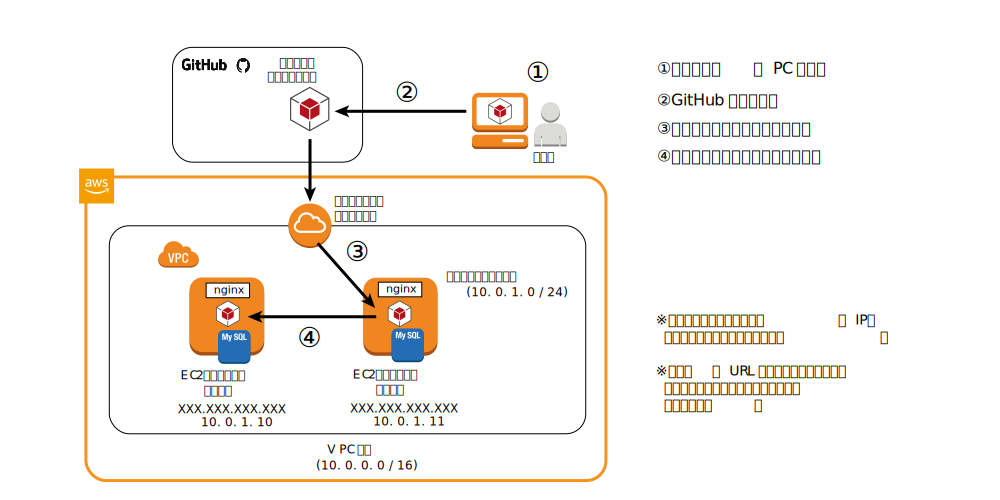

# (12) まとめ（ネットワーク・AWS編)

## 本章の目的：

- 今までに、そしてこれから必要となるネットワークの知識を習得する。
- AWSの概要よりもう少し深い知識を習得する。

***

本章では、ネットワークの基礎を学習します。同時に、AWSの概要よりもう少し深い知識を習得します。

本章は手を動かす内容はありません。座学でしっかりと知識を頭に入れてください。

## 1.ネットワークとは何か

非常にざっくりとしたタイトルをつけました。ネットワーク（コンピュータネットワーク）とは何か、それは複数台のPCが接続された状態といえます。

1台で特定用途だけで使っているなら、ネットワークは必要ありません。ところが、複数台で情報共有するとなると、とたんに接続が必須となります。情報共有、それはもちろんインターネットも含まれます。

会社でPCを使って業務をしている方々は、ExcelやPowerPointなどのドキュメントファイルを共有サーバに保管している、という方も多いでしょう。そんな方は、比較的イメージがしやすいですね。

「でも自宅でノートPC使っているけど、何もつないでないよ？」
「スマホは何もしてないけど、なんでネットを見れているの？」

確かにその通りです。

会社のデスクトップならLAN線が繋がっているので、見るからに接続している感満載です。

＜図：LAN接続＞

ノートPCやスマホは線らしきものは何もありません。でもインターネットには接続できています。これらは結局、どういう経路でインターネットに繋がるかの違いだけです。ノートPCならWifi接続でプロバイダーの光回線などを経由して、スマホならdocomoやau、ソフトバンクなどのキャリアを経由してインターネットに繋がっている、というわけです。

＜図：インターネットへ繋がるさまざまな経路＞

### 1-1. インターネットへの公開・非公開とIPアドレス

前置きが長くなりましたが、ここから後の作業に直結する大事な話が始まります。

一般的に、ネットワークは分割します。企業内のネットワークを例にすると、部署ごとにネットワークを区切ります。

＜図：ネットワークを部署ごとに区切る＞

では、開発部のAさんのPCを指定するにはどうすればいいでしょうか？実は、分割されたネットワークやAさんのPCなどなど、固有の番号を振って識別します。その番号を、IPアドレスといいます。

＜図：ネットワークアドレスとPC固有のIPアドレス＞

上の図でいうと、ネットワークアドレスは10.0.0.0で、AさんのPCは10.0.0.0となります。

### 1-2. IPアドレスとは何か

IPアドレスとはそもそも何でしょうか？

IPアドレスとは、コンピュータ（サーバやPC、スマホなどネットワークに接続する端末全て）に振られた固有の番号です。

3桁の数字のかたまりを4つ、ピリオドで区切って表現します。

＜図：IPの例（10.10.10.10)＞

本来は総じて32ビットの2進数を8桁ごとに区切って10進数に変換し・・・という解説をするのが一般的な講義スタイルですが、ここではあえて割愛します。なぜなら、今そこを深掘りするよりも、もっと他に覚えて欲しいことがあるからです。

今のところは「ネットワークに接続するコンピュータは全て固有の番号を降る、それをIPアドレスという」ということだけで十分です。

ただし、もっと深く知りたい人のために、調べて欲しいキーワードを列挙しておきます。余裕のある方はぜひ自己学習することをオススメします。

＜発展的学習キーワード＞
IPアドレスとネットワークアドレス、2進数、2進数から10進数への変換。特に2進数を理解すると、IPアドレスの4つの数値の最大値が255である理由が分かるだけでなく、今後のネットワークの学習の有力な武器になります。

### 1-3. 中のネットワーク、外のインターネット

### 1-4. ポート番号

### 1-5. インバンドとアウトバウンド

## 2. AWSの基礎知識

以降の章に進む上で必要となる、AWSに関する必要最低限の知識を解説します。

### 2-1. IAMによる権限管理

「権限管理」というと何だか厳戒命令や超ルール的、という感じがしますが決してそうではありません。ここではもっと軽いイメージで解説していきます。

誰が何でもできる環境があったら、どうなるでしょうか？もちろん、データは抜き放題、ページの内容は書き換え放題、もうやりたい放題になるでしょう。

でも、それはダメというのは言うまでもありません。では次に、誰に何を許すのでしょうか？例えば全権限を持つのはあなた一人、それ以外にヘルプで入ってくれる人はサーバの電源ON/OFFやデータの参照だけ、としてしまえばよいですね。

よし・・・というわけで、一人づつ権限を設定するでしょうか？それは面倒です。ここでは一つ、役割とできることをセットで考えましょう。

管理者： なんでもあり
運用者： サーバの再起動やデータベースの参照のみ

そしてあなたはもちろん管理者、手伝ってくれる人は運用者の権限を付与すれば、一人づつできることを定義する必要はなくなります。

運用者・管理者といったいわゆる権限セットをロールといいます。AWSでは参加してくれる人のアカウントを追加して、その人にロールを付与することができます。そのサービスをIAMといいます。

あらすじ

ネットワークとは何か？
    各PCやサーバに振られるIPアドレス
    ネットワークを分ける


AWSの基礎知識
    リージョン
    アベイラビリティゾーン
    セキュリティグループ
    インバウンドとアウトバウンド
    

非機能要件

・環境は、検証環境と本番環境。  
・検証機は検証時以外はシャットダウン（非課金）。  
・クライアントで開発、検証機で検証、問題ないなら本番へ移行。  
・ソース管理はGitHub。  
・自分のPCで開発、GitHubへプッシュ、検証機へデプロイ。  
・検証機でOKなら本番機へ反映。  

課題
・AWS Code Commitが使えないか検討してみる。
・
