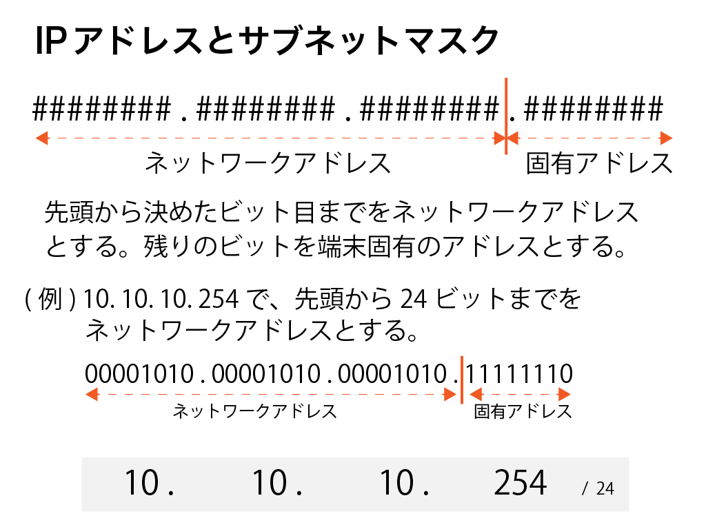

# (12) まとめ（ネットワーク編)

## 1.本章の目的

- これから必要となるネットワークの知識を習得する。
- AWSの概要よりもう少し深い知識を習得する。

  
本章では、ネットワークの基礎を学習します。同時に、AWSの概要よりもう少し深い知識を習得します。

本章は手を動かす内容はありません。座学でしっかりと知識を頭に入れてください。

## 2.ネットワークとは何か

非常にざっくりとしたタイトルをつけました。**ネットワーク（コンピュータネットワーク）とは何か、それは複数台のPCが接続された状態といえます。**

1台で特定用途だけで使っているなら、ネットワークは必要ありません。ところが、複数台で情報共有するとなると、とたんに接続が必須となります。情報共有、それはもちろんインターネットも含まれます。

会社でPCを使って業務をしている方々は、ExcelやPowerPointなどのドキュメントファイルを共有サーバに保管している、という方も多いでしょう。そんな方は、比較的イメージがしやすいですね。

「でも自宅でノートPC使っているけど、何もつないでないよ？」
「スマホは何もしてないけど、なんでネットを見れているの？」

確かにその通りです。

会社のPCなら多くはLAN線が繋がっているので、見るからに接続している感満載です。

スマホは線らしきものは何もありません。でもインターネットには接続できています。これらは結局、どういう経路でインターネットに繋がるかの違いだけです。Wifi接続でプロバイダーの光回線などを経由して、またはdocomoやau、ソフトバンクなどのキャリアを経由してインターネットに繋がっている、というわけです。

## 3.IPアドレスとは

IPアドレス、よく聞きますよね。でもそれって、そもそも何でしょうか？

IPアドレスとは、コンピュータ（サーバやPC、スマホなどネットワークに接続する機器全て）に振られた固有の番号です。番号といっても1から順番に連番で振るのではなく、ある規則性に基づいて付与しています。

元々は32個のビット列ですが、それでは覚えにくいし伝えにくいですね。よって、人間にもっとわかりやすく、8つごとに分けてさらに10進数に変換したもので表現します。

図では10.10.10.254というIPアドレスを例にとって説明しています。00001010.〜というアドレスを8つづつに区切って、それぞれを10進数に変換しているイメージがつかめたでしょうか？

00001010がなぜ10と変換されるのか、それはここでは解説しません。しかしぜひネットで調べてみることをおすすめします。今のところは「ネットワークに接続するコンピュータは全て固有の番号を振る、それをIPアドレスという」ということだけで十分です。

ただし、もっと深く知りたい人のために、調べて欲しいキーワードを列挙しておきます。余裕のある方はぜひ自己学習することをオススメします。

＜発展的学習キーワード＞  
- IPアドレスとネットワークアドレス
- 2進数、2進数から10進数への変換。

特に2進数を理解すると、IPアドレスの4つの数値の最大値が255である理由が分かるだけでなく、今後のネットワークの学習の有力な武器になります。

### 1-2.サブネット

通常、ネットワークは複数の単位に分割します。その方が細かい要件に対応しやすいし、障害時の影響も最小限で済みます。分割したネットワークそれぞれを**サブネット**といいます。そして、サブネットそれぞれがまたIPアドレスを持ちます。この場合のIPアドレスは**ネットワークアドレス**といいます。

１つのコンピュータに注目してみますと、そのコンピュータが所属するネットワークアドレスと自身のアドレスの二つを持ちます。これらは完全に別個ではなく、自分のIPアドレスのどこからどこまでがネットワークアドレス、そしてそれ以降が自分の固有のアドレス、ということになります。この「どこからどこまで」を管理するのはサブネットマスクといいます。

ネットワークアドレスの長さを10.10.10.254/24というように、その長さを表現することも覚えてください。

あとついでに用語を覚えましょう。**ネットワークの外から内に向かう方向をインバウンド、内から外へ向かう方向をアウトバウンド**といいます。セキュリティ設定において、インバウンドに制限をかけてアウトバウンドは無制限、といったことをよくします。

### 1-3.ポート番号

インバウンドやアウトバウンドの話でよく出てくるテーマで、ポート番号というものがあります。セキュリティ設定で「WebはOK、FTPは通さない。SSHはOK」といったことをよくします。コンピュータネットワークの世界で、用途を識別するために用途ごとに番号が振られています。これを**ポート番号**といいます。

「SSHのポートを開ける」などなど、いかにも穴を開けるような表現が使われます。

## 2.まとめ

本章では、今後進む上で本当に最低限の知識を解説しました。

プログラマは一般的にネットワークやインフラに弱いです。しかしインフラの知識を身につけると、できることは確実に広がります。ここで解説したことが全てではありません。ぜひこれを機に、ネットワークにも興味を持ってください。
