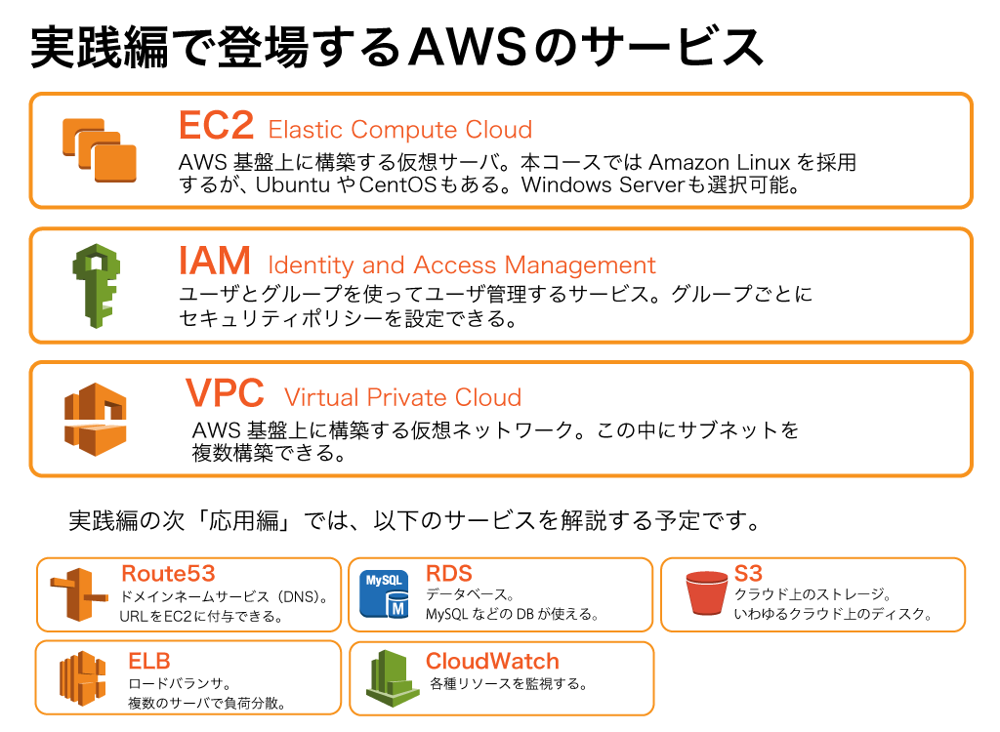
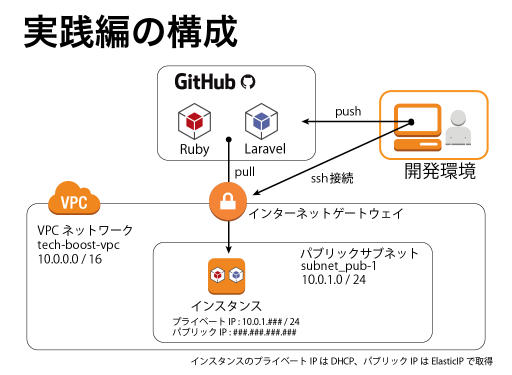

# (13)今回の完成イメージ  

## 本章の目的：

- AWS実践編の完成イメージを理解する。
- AWS応用編の完成イメージをチラ見する。

***

前章までで、AWSのサービスの基本的な使い方と、今後必要となる知識を得ました。ここからは実践編へと突入します。

実践編では、アプリを載せる土台を作るまでを目標とします。ちなみに実践編の後は、Ruby on RailsやLaravelのアプリを実際に乗せてみる章へと入ります。

本章ではどのAWSサービスをどのように構成するかを解説します。ちなみにこのような「今から構築するシステムに何ができるのか」ということを定義したものを機能要件といいます。それ以外、システムを動かす上で直接関係ないものの、稼働する上で決めなければいけないことを非機能要件といいます。まずは次の図で、ざっと確認してください。

### 1. EC2

OSはAmazonの標準であるAmazon Linuxを採用しました。他のディストリビューション（UbuntuやCentOS）などと比較すると、Amazonのツールが最初から導入されていたり、サポートを受けやすいというメリットがあります。

EC2タイプ、つまりスペックはt2.smallを選択します。1CPUでメモリは2Gです。心もとないスペックですが、実はここで構築するサーバは検証環境として使うため、さほど大きなものは必要ありません。EC2は起動するたびにIPアドレスが変化するので、固定のIPアドレスを付与します。データベースはMySQLを採用します。実践編ではAWS RDSを使わず、構築したサーバに直接インストールします。WebサーバはApache（アパッチ）です。これもインストールします。

リージョンはどこでもよいのですが、何もわざわざ海外に作る必要はないので、東京リージョンを選択します。

### 2. VPC

今回は、インターネットとは分離してAWSのデータセンター内部にネットワークを構築します。実際に配線せずにバーチャルに構築するネットワークをバーチャルプライベートネットワーク（VPC）といいます。

実践編ではVPC内にまだサブネットが１つ、サーバ1台しか構築しません。今のところVPCのありがたみは分かりませんが、のちにこれが大きなメリットとなってきます。

### 3. IAM

管理者には管理者権限、その他のユーザには運用者権限を付与します。もちろん当面は構築したあなただけのサーバなのですが、規模が大きくなって誰かに運用をお願いすることも想定して、念のため作っておきましょう。

### 4. その他

ソースはGitHubにて管理します。開発イメージは、クライアント側で開発したものをGitHubにプッシュ、そしてインスタンスにSSHでログインしてプルするという感じです。

今まで述べたことを全て図にまとめてみました。

では早速IAMのセットアップから始めましょう。
