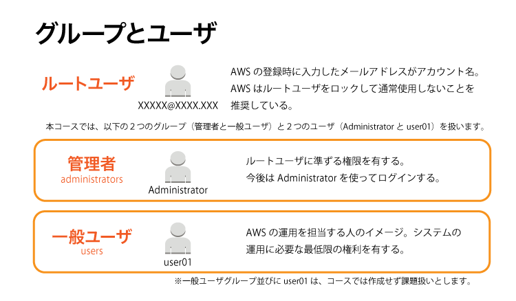

# (14)IAMを使ったアクセス管理 

## 本章の目的：

- セキュリティポリシーを設計する。
- IAMを使ったセキュリティポリシーを実装する。

***

**誰が何をできるか設定することをセキュリティポリシーと呼ぶ** ということはすでに解説しました。今回はより深くセキュリティポリシーを考えて、それをAWSのサービスである**AWS IAM**を使って実装しましょう。

実は本コースの開発時にも、IAMによるセキュリティ管理体系を策定しました。記事執筆ならびにコース責任者のアカウントは「administrator」、それ以外は個人ごとのアカウントを作成しました。

### 1. セキュリティ設計

このコースを受講の方は、教材通りに学習してきたとすればAWSにユーザ登録したアカウント、つまりメールアドレスでログインしているはずです。これは**ルートユーザ**という神アカウントです。何でもできる、これは言い換えると誰かにルートユーザを奪われた時は最悪です。奪った人はやりたい放題になってしまいます。

よってAWS的には、**IAMで管理ユーザを作成して使用し、ルートユーザのアクセスキーをロックする**ことを推奨しています。本コースでもそれにならい、IAMで管理ユーザを作ります。ただしルートユーザのロックは、本コースでは扱いません。みなさんがWebサイトを一般公開する時に実施してください。その頃にはAWSにすっかり慣れて、自分で調べて対応できるようになっているはずです。

ここでもう一度、今回のセキュリティ方針を定義しておきましょう。



**・管理者グループ**

ルートユーザに匹敵する最強グループです。ほぼ何でもできます。ただし基本的にはこのグループに属するユーザはあなた一人とします。

また、インスタンス丸ごと削除といった、管理者であるあなたですら滅多に実行しないことはできなくしてしまいます。よって通常操作するときも管理者ユーザでログインして、誤まって重大な操作をしてしまわないように、という牽制の意味もあります。

今回はAdministratorという名前でグループならびにユーザを作成します。

**・一般ユーザグループ**

将来的にサイトの規模が大きくなり、誰か外の人に操作してもらうことを想定しています。当初は一人管理者兼一般ユーザ状態だとしても、ゆくゆくは誰かの手を借りる対応を考えなくてはいけません。使う・使わないはさておいて、今の段階で作っておきましょう。今回はusersという名前でuser01というユーザを作ります。

グループに権限を付与すると、そのグループに属する人も自動的にその権限を継承します。よって誰かが新たに参画する時は、グループ内に個人別のアカウントを作成する、という流れです。一人一人に権限を付与する必要はないということに注意してください。

また、作業する人全員がクレジットカードを使ってAWSのユーザ登録をする必要はない、ということも分かりますね。

### 2. IAMの実装

では早速グループならびにユーザを作っていきましょう。一般的に権限設定とは必要最低限の権限だけを付与して、足りないことがあれば順次追加していくのが王道です。最初からあれやこれやと想定して、使わない権限を多数設定するということがないようにしましょうね！

#### 2-1.IAMでグループ作成

管理者グループ「Administrator」を作成します。AWSマネジメントコンソールからIAMを選択してください。

＜図1：IAMトップ画面＞

左のメニューから「グループ」をクリックしてください。

＜図2：IAMグループ＞

「新しいグループの作成」ボタンをクリックしてください。

グループ名を入力しましょう。「Administrator」と入力してください。

＜図3：グループ名入力＞

入力後、一番右下あたりにある「次のステップ」ボタンをクリックしてください。

＜図4：ポリシーの選択＞

ポリシーの一覧表示の上あたりの「フィルター」をクリックして「AWS管理ポリシー」に変更してください。そして以下にチェックを入れてください。

AdministratorAccess

今のところ管理ユーザですらEC2とVPCしか使いませんが、とりあえずルートユーザに変わるものを設定しておきましょう。チェックを入れたら「次のステップ」ボタンをクリックしてください。

＜図5：グループ作成の最終確認＞

最終確認画面になります。問題なければ「グループの作成」ボタンをクリックしてください。

＜図6：Administratorグループの完成＞

できました。同じ要領でもう一つグループを作ってみてください。名前は「Users」、設定するポリシーはAmazonEC2ReadOnlyAccessとAmazonVPCReadOnlyAccessの2つです。ここはみなさまにお任せします。

＜図7：Userグループの完成＞

できました。次はグループ内にユーザを作りましょう。

#### 2-2.IAMでユーザ作成

管理者「Administrator」を作ります。今度は左側のメニューから「ユーザー」をクリックしてください。

＜図８：IAMユーザトップ画面＞

「ユーザーを追加」ボタンをクリックしてください。

＜図9-1と9-2(2枚で1つ)：ユーザ情報入力画面＞

基本的に画像通りに入力してください。「アクセスの種類」は、当面コンソールからのログインしか想定していないので「プログラムによるアクセス」のチェックは外してください。

入力が終わったら「次のステップ：アクセス権限」ボタンをクリックしてください。

＜図10：アクセス権限の設定＞

もちろん「Administrator」にチェックを入れます。そして「次のステップ：タグ」ボタンをクリックします。

＜図11：タグの追加＞

タグはあとで考えるとして、ここでは何もせず「次のステップ：確認」ボタンをクリックしてください。

＜図12：ユーザ追加最終確認＞

内容を確認して、問題がなければ「ユーザの作成」ボタンをクリックします。

＜図13：ユーザ追加完了＞

できました。この画面で「.csvのダウンロード」をクリックして認証情報をダウンロードしておくことと、念のため「Eメールの送信」をクリックして、自分宛に案内メールを送っておきましょう。この時に届くメールの内容は以下のようなものです。

```
AWS をご利用いただきありがとうございます。

5673に終了する ID のアマゾン ウェブ サービスのアカウントに対して、AWS マネジメントコンソールへのアクセス権が付与されました。以下のサインイン情報を使用してご利用を開始していただけます。

-------------------------------------------------

サインイン URL: https://********5673.signin.aws.amazon.com/console
ユーザー名: Administrator

最初のサインインパスワードは、AWS アカウント管理者から、この E メールとは別にお知らせいたします。最初にサインインするときに、パスワードを変更する必要があります。

-------------------------------------------------

プロファイルを作成して AWS とのつながりを維持してください: https://pages.awscloud.com/IAM-communication-preferences.html

今後ともよろしくお願いいたします。
AWS アカウント管理者
```

メール送信まで終われば「閉じる」ボタンで閉じて結構です。

次回以降、上記で示されている「サインイン URL」から、アカウントは「Administrator」で、かつ上記手順で設定したパスワードでログインしてください。

一度サインアウトしましょう。「AWSにようこそ」をクリックすると、出てきたメニューの中に「サインアウト」があります。

＜図14：サインアウト＞

サインアウトして、上記で振られたURLでログインしてください。

＜図15：再サインイン＞

ログインすると、初回だけパスワードの再設定画面が出てきますが、それ以降は今までと同じように使えます。

### 2-3. 課題

同じ要領で、Users権限をもつユーザを作ってみてください。Usersという名前のグループを作り、そこにuser01という名前のユーザを作るという手順です。そして作成後はログインまで確認できれば完了です。

### まとめ

本章では、IAMを使ったグループやユーザ作成を解説しました。今後作業する際は、今回作ったAdministrator権限で操作してください。

