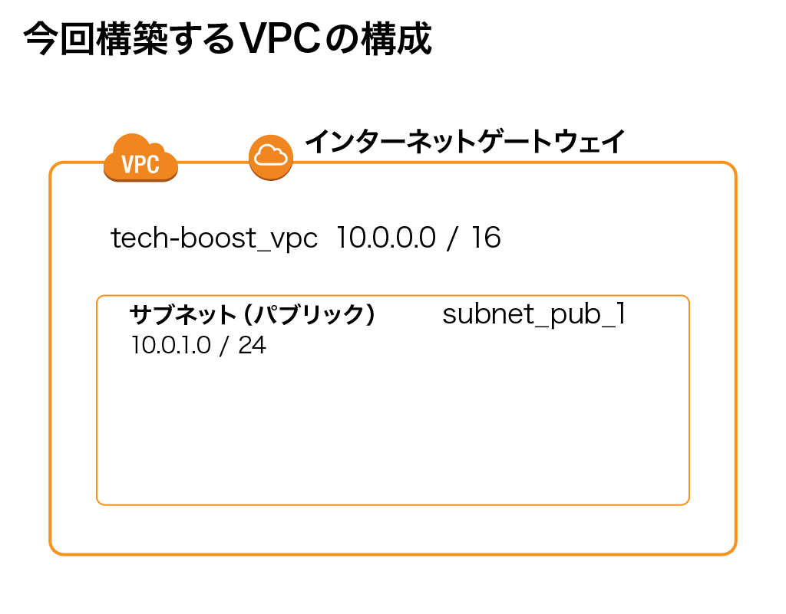
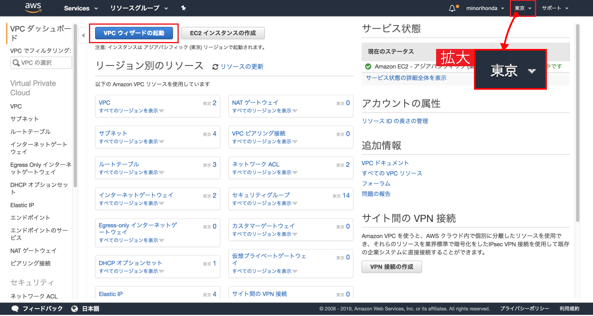

# (15)VPCの構築

## 1.本章の目的

- インターネットゲートウェイとは何かを学習する。
- AWSにてVPCやサブネットを構築する。

  
通常、ネットワークに参加する人やPCが多くなると、ネットワークを複数の単位に分割します。理由は、多数のサーバやPCを１つのネットワークにまとめてしまうと、一括管理をするのが難しくなってしまうからです。また、仕様変更に柔軟に対応するのも難しくなります。さらに、ネットワークの規模が大きくなると、比例して障害発生時の影響も大きくなリます。たった１台のPCのトラブルが、全体に及ぶこともあるのです。

上記の理由により複数のネットワークに分けて構成するのが一般的です。そして複数に分けたネットワーク1つ1つを**サブネット**といいます。サブネットを上手に活用し、部署やフロアごとにサブネットを分けたり、インターネットから接続できるサブネットとできないサブネットに分けてセキュリティを担保する、といったことができます。

このような内容は、12章で解説しました。不安のある方は12章をもう一度目を通しておくことをオススメします。

本章では、実際に **AWS VPC(Virtual Private Cloud)を構築し、その中にサブネットを立ち上げます。** またインターネットゲートウェイトサブネットを接続し、インターネット側からアクセスできるようにします。

## 2.今回構築するVPCの構成

まずはじめに、今回構築するVPCの全容をご確認ください。

この全体像をもとに、VPCやサブネットの構築方法を解説します。以降は、この全体像を見ながら読んでください。

### 2-1.VPC

 **AWS VPCは、仮想ネットワークを構築するAWSのサービスです。**
こういってしまえばそれまでですが、ここではとりあえず「今回構築するネットワーク全体を、AWS VPCというサービスで作る」「作ったネットワーク全体をVPCという」と理解してください。最初にVPCを作り、その中に要件に従ったサブネットを順次立ち上げていきます。

### 2-2.インターネットゲートウェイ

VPC内のサブネットにインターネット回線を引き込むために**インターネットゲートウェイ**を置きます。このインターネットゲートウェイにサブネットを接続（アタッチ）すると、インターネットとサブネット、サブネット内のサーバインスタンスが繋がります。

インターネットとサブネット、インターネットとサーバインスタンスは直接繋がっていません。よってVPCに通気孔を開けるようなイメージで、VPC内外の接続点にインターネットゲートウェイを設置しましょう。

### 2-3.VPCやサブネットの実装

ではこれより、実際にVPCやサブネットを実装していきましょう。もうここからはルートアカウントで作業せず、IAMで作った神アカウント「Administrator」でログインしてください。

コンソールよりVPCのサービスを開いてください。ここで再度、画面左上に東京リージョンが選択されている（つまり小さく「東京」と表示されている）ことを確認しておきましょう。

画面上部の青いボタン「VPCの作成」ボタンをクリックしてください。

ここでは説明に目を通しておきましょう。読み終わったら「選択する」ボタンをクリックしてください。

VPC名とサブネット名はわかりやすい名前なら結構ですが、もしうまくいかない時に質問を投稿することを考えて、できるだけ全体像に書いてあるのと同じ内容を入力してください。

VPC名     ： tech-boost_vpc  
サブネット名： subnet_pub_1

入力し終えたら「VPCの作成」ボタンをクリックしてください。

ほんの数秒後にはできました。左側のメニューに沿って順番に確認していきましょう。メニューの「VPC」をクリックしてください。

できてますね。あと同様に、サブネットやインターネットゲートウェイも先にあげた全体像と見比べて確認しておいてください。

## 3.まとめ

意外なほどに簡単にVPCとサブネットができたこと、体感していただけたでしょうか？次はいよいよVPC内にEC2インスタンスを立ち上げて、そこへ接続するまでを解説します。

