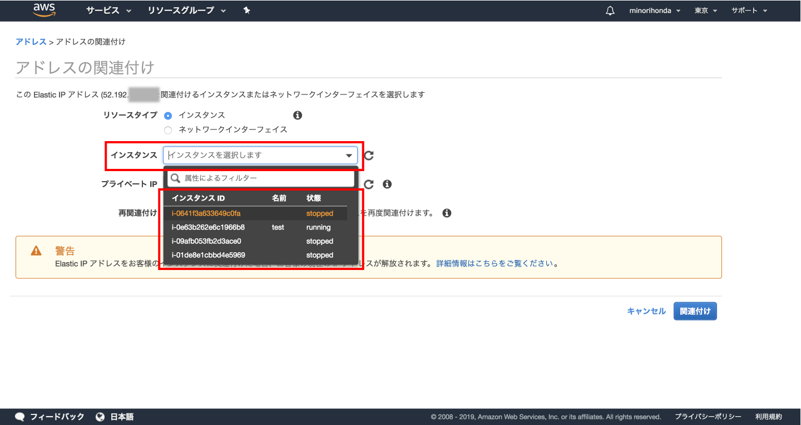

# (16)VPC内にEC2を立ち上げる 

## 本章の目的：

- 前章で構築したVPC内にサーバインスタンスを立ち上げる。
- クライアントPCからVPC内のサーバインスタンスに接続する。

***

本章では、前章で構築したVPC内にサーバインスタンスを立ち上げます。今まで学習してきたインスタンスの立ち上げのおさらいになります。作業的に大きく異なるところはありません。ただ、**VPCのサブネット内に立ち上げる**ということだけ意識してください。

AWSマネジメントコンソールにて、EC2ダッシュボードを開いて、「インスタンスの作成」ボタンをクリックしてください。


開いた画面で「AWSMarketPlace」をクリックし、検索窓で「CentOS7」と入力してEnterしてください。検索結果の中から「CentOS 7 (x86_64) - with Updates HVM」を選択してください。


詳細が表示されますが、特に何もしなくても大丈夫です。


確認後、「continue」ボタンをクリックしてください。


タイプを選択します。ここではデフォルトのt2.microのままにしてください。そして「次の手順:インスタンスの詳細の設定」をクリックしてください。


ここで注意するのは「ネットワーク」と「サブネット」です。前章までで作成したものが表示されているかを確認してください。基本的に複数作っていなければデフォルトで表示されるので問題ありません。確認したら「確認と作成」ボタンをクリックしてください。


選択した内容が一通り表示されます。「作成」ボタンをクリックして次へ進みましょう。キーペアの選択画面が開きます。


新たにキーペアを作成してもいいし、今までで作った既存のものを選択しても構いません。作成ならびに選択ができたら「インスタンスの作成」ボタンをクリックしてください。

数分待って、再びEC2ダッシュボードへ遷移すると、インスタンスができています。作成が終わって入れば、以下のような画面になっているはずです。下図でいうとインスタンスは2つあり、上の「running」の方が先ほど作ったものです。


では早速接続して見ましょう。接続情報を確認するために「接続」ボタンをクリックしてください。


「例」で表示されているコマンドが接続コマンドです。rootと表示されていますが、rootでログインできません。「centos」ユーザでログインしてください。つまり、皆さんの画面上に表示されたコマンドをそのままコピーし、貼り付け時にrootをcentosに変えればOKです。

```
(PC名):~ (ログインユーザ名)$ ssh -i "tech-boost_instance1insub1.pem" centos@ec2-***-***-***-***.ap-northeast-1.compute.amazonaws.com
The authenticity of host 'ec2-***-***-***-***.ap-northeast-1.compute.amazonaws.com (***-***-***-***)' can't be established.
ECDSA key fingerprint is SHA256:(長い英数字と記号)
Are you sure you want to continue connecting (yes/no)? 
```

「yes」と入力してください。

```
[centos@ip-***-***-***-*** ~]$ 
```

AmazonLinuxのインスタンスならばAA(アスキーアート)でEC2!と表示されますが、CentOSでは素っ気無いですね。でも、表示がcentos@〜と変っていることから、一応はログインできていることが分かります。

続けて、OS等々を最新の状態にアップデートしておきましょう。

yumというコマンドを使い、OSならびに今インストールされているものを一括でupdateします。以下コマンドを実行してください。

```
sudo yum update -y
```

結構な時間がかかるので、根気よく待ちましょう。画面が落ち着くとupdateが終わっているはずです。

次に、mysqlをセットアップします。

```
sudo yum install -y mysql
```

これでOKです。Webアプリをセットアップする下準備ができました。

しかし１つ問題があります。今の状態だと、再起動するたびにサーバインスタンスのIPアドレスが変わってしまいます。よって固定のIPアドレスを取得してインスタンスに割り当てましょう。

EC2ダッシュボードの左のメニューの中に「ElasticIP」というリンクがありますのでクリックしてください。


「新しいアドレスの割り当て」ボタンをクリックしてください。

この辺りは迷うことはありません。次の画面も「割り当て」ボタンを押すだけです。するとIPアドレスが一つ割り当たります。感覚的に、IPアドレスを入手できた、といった方が分かりやすいでしょうか。これを先ほど起動したインスタンスに割り当てましょう。

画面左のメニュー「ElasticIP」をもう一度クリックすると、先ほど得たIPアドレスが表示されています。左のチェックボックスにチェックが入っている（青色になっている）ことを確認し「アクション」ボタンをクリックしてください。


出てきたメニューの「IPアドレスの関連付け」をクリックしてください。


インスタンスは先ほど作ったものを選択、そして「再関連付け」にチェックを入れて「関連付け」ボタンをクリックしてください。



できました。


EC2ダッシュボードに戻ると、先ほどのIPアドレスが割り当てられているのが分かります。


この画面のまま、作成したインスタンスにチェックを入れて「接続」ボタンをクリックしてください。そこで表示されたsshコマンドを・・・あとは先ほどの手順と同じです。再度お伝えしますが、rootではなくcentosなのでお間違いなく。

「ssh〜」コマンドを実行した後、IPアドレスが変わったので既知のホストリストに追加するかどうかのメッセージが再度表示されます。そこは先ほどと同じくyesと入力してください。するとログインできるはずです。

これ以降、インスタンスを停止して再度起動しても、IPは変わりません。

Webサーバであるnginxやセキュリティグループの見直しは、これから徐々に進めます。とりあえずは最低限の設定が終わったことに喜びを感じ、ひとまず終わりにしましょう。

### まとめ

次章では、いよいよWebサーバならびにアプリの設定が始まります。さらに実務的な内容になります。ガンバってついてきてくださいね！
