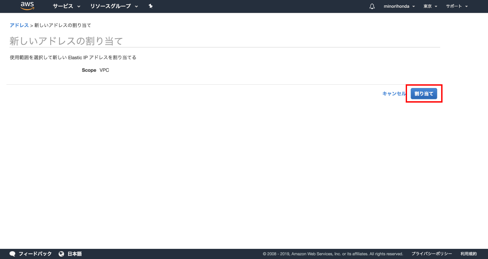

# (16)VPC内にEC2を立ち上げる 

## 1.本章の目的

- 前章で構築したVPC内にサーバインスタンスを立ち上げる。
- クライアントPCからVPC内のサーバインスタンスに接続する。

  
本章では、前章で構築したVPC内にサーバインスタンスを立ち上げます。今まで学習してきたインスタンスの立ち上げのおさらいになります。作業的に大きく異なるところはありません。ただ、**VPCのサブネット内に立ち上げる**ということだけ意識してください。

## 2.インスタンスの立ち上げ

### 2-1.インスタンスの立ち上げ

AWSマネジメントコンソールにて、EC2ダッシュボードを開いて、「インスタンスの作成」ボタンをクリックしてください。


開いた画面で「AWSMarketPlace」をクリックすると、一番上に「Amazon Linux 2 AMI (HVM), SSD Volume Type - ami-0d7ed3ddb85b521a6」が表示されます。枠内の青い「選択」ボタンをクリックしてください。


インスタンスタイプを選択します。ここではデフォルトのt2.microのままにしてください。そして「次の手順:インスタンスの詳細の設定」をクリックしてください。


ここで注意するのは「ネットワーク」と「サブネット」です。前章までで作成したものが表示されているかを確認してください。基本的に複数作っていなければデフォルトで表示されるので問題ありません。確認したら「確認と作成」ボタンをクリックしてください。


選択した内容が一通り表示されます。「作成」ボタンをクリックして次へ進みましょう。


キーペアの選択画面が開きます。新たにキーペアを作成してもいいし、今までで作った既存のものを選択しても構いません。キーペアの作成または既存のキーを選択したら、チェックボックスにチェックを入れて「インスタンスの作成」ボタンをクリックしてください。


作成中の画面です。


数分待って、画面下の「インスタンスの表示」ボタンをクリックするか再びEC2ダッシュボードへ遷移すると、インスタンスができています。作成が終わって入れば、以下のような画面になっているはずです。下図でいうとインスタンスは4つあり、一番下のインスタンス「running」となっているのが先ほど作ったものです。


### 2-2.IPアドレスの割り当て

せっかく出来たインスタンスですが、このままでは接続できません。パブリックなIPアドレスがこのインスタンスに割り当たっていないからです。インスタンス作成においてパブリックなIPアドレスを割り当てることもできますが、再起動するたびにIPアドレスが変わってしまいます。

よって、ElasticIPというサービスを使い、固定IPアドレスを取得し、それをインスタンスに割り当てます。EC2ダッシュボードから、ElasticIPをクリックしてください


「新しいアドレスの割り当て」ボタンをクリックします。


何も選択することはないので「割り当て」ボタンをクリックしてください。



IPアドレスを1つゲットできました。


「閉じる」ボタンをクリックしてください。取得済みIPアドレス一覧に遷移します。


取得できたIPアドレスの行のチェックボックスが入っていることを確認し「アクション」ボタンをクリックするとプルダウンメニューが開きます。そこで「アドレスの関連付け」を選択してください。


遷移した画面で「インスタンス」欄の右のプルダウンアイコンをクリックすると、インスタンスの一覧が開きます。ここで先ほど立ち上げたインスタンスを選択してください。選択した後「関連付け」ボタンをクリックしてください。


関連付けに成功しました。


EC2ダッシュボードに戻り、インスタンスの一覧をみてください。立ち上げたインスタンスにIPアドレスとパブリックDNS（簡単にいうと接続用URL）が表示されているのが分かります。


ここで、IPアドレスの枯渇問題に触れておきましょう。

IPアドレスは理論上は43億個取れるのですが、すでにもう底をついて事業者間で融通し合っている状態です。よって、無意味にたくさん取得しないよう、私たち全員が気をつけなくてはなりません。

詳しくは「IPv4 枯渇」でググってみてください。　

### 2-3.インスタンスに接続

今度はターミナルから接続してみましょう。目的のインスタンスのチェックボックスにチェックが入っていることを確認し「接続」ボタンをクリックしてください。

ここから、ちょっと復習です！

ターミナルで接続するところは、すでに10章で学びました。覚えている方はこのまま、忘れた方は10章に戻って復習して、接続できるところまではチャレンジしてみてください。

### 2-4.OSを最新の状態にする

続けて、OS等々を最新の状態にアップデートしておきましょう。

yumというコマンドを使い、OSならびに今インストールされているものを一括でupdateします。以下コマンドを実行してください。

```
sudo yum update -y
```

画面が落ち着くとupdateが終わっているはずです。

次に、mysqlをセットアップします。

```
sudo yum install -y mysql
```

これでOKです。Webアプリをセットアップする下準備ができました。

Webサーバやデータベースのセットアップは、これから徐々に進めます。とりあえずは最低限の設定が終わったことに喜びを感じ、ひとまず終わりにしましょう。

インスタンスとの接続を切断し、その後EC2ダッシュボードでインスタンスを停止しておくことを忘れずに！

この辺りで、一度復習がてらに課金を確認しておくのも良いでしょう。

## 3.まとめ

次章では、いよいよWebサーバならびにアプリの設定が始まります。さらに実務的な内容になります。ガンバってついてきてくださいね！
