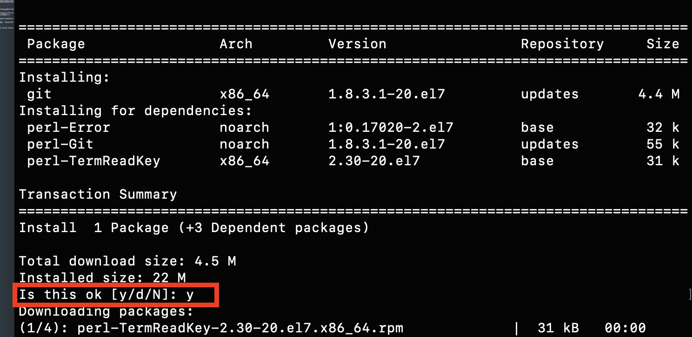
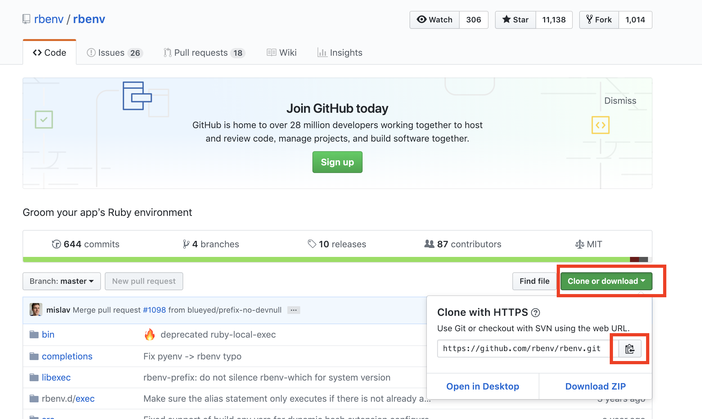

# (17)Ruby on railsアプリの公開(1) Rubyの環境構築

## 本章の目的：サーバーに必要なパッケージのインストールと特定のRubyバージョンのインストール  


- RubyとRailsの環境を構築する-それまでにいろんなものをインストールする必要があります。
- AWSはCentOSというLinuxですので、yumでインストールします。依存関係のパッケージをを入れてくれるので便利です。
- gitもインストールします。オープンソースのものを取ってくるのに利用します。ソースのバージョン管理もできますしね。
- node.jsをインストールします。バージョン管理のソフトがnvmです。サーバーサイドのJavaScriptですが、これがないと、いろんなものが、うまく動かなかったりインストールできなくなることがあります。
- MySQLのインストール、DBにMySQLをインストールします。DBのユーザーを作成したり、パスワードやuserに権限を設定したりします。

- Rubyのインストールをします。Rubyのインストールには、古いrubyの削除、rbenvというrubyのバージョン管理ツールのインストール、そしてrbenvによるRubyのインストールが含まれます。

  
 

***

いよいよ今回から自分のアプリケーションをデプロイして行く準備をします。  

デプロイとはWEB上に公開すると言うことですね。  

WEBで公開するために、IPアドレスを取得したり、VPC仮想ネットワークを前章までで作ってきました。  


#### まずログインします。

自分のPC内で、秘密鍵をおいてあるフォルダに移動してから実行します。  

[ ]はわかりやすくするために記載しています。実際には記載しないでください。  

```
ssh -i [秘密鍵のプライベート鍵を入力拡張子は.pem] ec2-user@[erasticIP]
```


Rubyインストールに必要なパッケージのインストール

#### その前にyumをupdateします。

yumとはCentOS系のコマンドで、依存関係をまとめてインストールしてくれる便利なコマンドです。	

```
$ sudo yum update
```

#### Rubyインストールに必要なパッケージをインストールします

```
$ sudo yum groupinstall "Development Tools"

$ sudo yum install openssl-devel libmetalink-devel libssh2-devel c-ares-devel lbzip2

$ sudo yum install xmlsec1-openssl-devel xmlsec1-openssl-devel readline-devel
```


#### fogのgemに必要なものをインストールします。
```
wget https://curl.haxx.se/download/curl-7.63.0.tar.gz

$ tar xfvz curl-7.63.0.tar.gz
$ cd curl-7.63.0
$ ls -la
$ ./configure --enable-libcurl-option
$ make
$ sudo make install

```


## gitのインストール	
まず、インストールの確認

```
git --version

//===
-bash: git: command not found
```

のように表示されるとインストールされていません。
環境を作るのは,cloud9とは違い大変です。	

#### Gitのインストール
```
$ sudo yum install git
```
yumでインストールすると依存関係のパッケージもインストールされるので、便利です。


依存関係のダウンロードが完了すると

```
Is this ok [y/d/N]: 	
```

と効いていきますので yと入力してあげましょう。これは毎回同じ作業になります。

ちなみに本家サイトもきちんと読みましょうね！  

このテキストのとおりにいかないときは、本家サイトを調べると問題が解決します。 

本家サイトを調べる習慣をつけましょう！  


https://git-scm.com/book/ja/v1/%E4%BD%BF%E3%81%84%E5%A7%8B%E3%82%81%E3%82%8B-Git%E3%81%AE%E3%82%A4%E3%83%B3%E3%82%B9%E3%83%88%E3%83%BC%E3%83%AB


#### インストールされたかの確認です。
バージョンが表示されればインストールされているということです。

```
$ git --version

//==
git version 1.8.3.1
```
このようにバージョンが表示されるとインストールされているということです。
これはインストールするたびに習慣づけましょう。

## nvmのインストール (node.jsをインストールするため)

nvmとはnode.jsのバージョン管理ツールです。
node.jsとはサーバー側で動くJavaScriptのことです。
node.jsがインストールされていないと、他のパッケージがインストールできなかったり、
railsなどのコマンドがうまく動いてくれないので、
サーバー側では必須のパッケージです。

ホームディレクトリで
```
$ curl -o- https://raw.githubusercontent.com/creationix/nvm/v0.34.0/install.sh | bash
```

#### nvmへのパスを通します

bashrcに書き込まれてしまったので、最後の一文を
以下を.bash_profileに書き加えます。

#### その前にvi の基本操作を教えます。

ファイルを開くときは
```
vi ファイル名
```
カーソルで移動して、修正したい箇所がありましたら i を押します
insertの略です。  

それで編集モードになります。  

抜けるときは
- 1-ESCキーを押します。
- 2-:コロンを押します　カーソルが左下に移動します
- 保存して終了するときは
- wq  書き込んで　write 終わり quit
- 間違えたので保存せずに終了するときは  q!
!は強制の意味です。  

#### では.bash_profileを編集しましょう

```
vi ~/.bash_profile
```
表示されたら下記の3行を加えましょう。

```
export NVM_DIR="$HOME/.nvm"
[ -s "$NVM_DIR/nvm.sh" ] && \. "$NVM_DIR/nvm.sh"  # This loads nvm
[ -s "$NVM_DIR/bash_completion" ] && \. "$NVM_DIR/bash_completion"
```

```
$ source ~/.nvm/nvm.sh
$ nvm --version

//==
0.34.0
```


バージョンが表示されたら成功です。

#### インストール可能な Node.js のバージョン一覧を表示します

```
$ nvm ls-remote
   
//==
v10.13.0   (LTS: Dubnium)
v10.14.0   (LTS: Dubnium)
v10.14.1   (LTS: Dubnium)
v10.14.2   (LTS: Dubnium)
v10.15.0   (Latest LTS: Dubnium)
```
#### node.jsは奇数が開発版で偶数が安定版です。

#### LTS は実務向けの安定版ということです。

この場合v10.15.0 をインストールします。（各自の環境構築時期により、異なります。）

```
$ nvm install v10.15.0

$node -v

//==
v10.15.0
```

#### デフォルトのバージョンを決めておきます。

```
$ nvm alias default v10.15.0

//==
default -> v10.15.0
```

## MySQLのインストール

バージョン確認
```
$ mysql --version
```
もしインストールされていなかったら、バージョンが表示されません。
その場合　インストール可能なmsqlのバージョンを調べる　から参照ください。  

#### インストールされているものの確認 

```
$ yum list installed | grep mysql

//===
mysql-config.x86_64                  5.5.62-1.23.amzn1             @amzn-updates
mysql57.x86_64                       5.7.24-1.10.amzn1             @amzn-updates
mysql57-common.x86_64                5.7.24-1.10.amzn1             @amzn-updates
mysql57-devel.x86_64                 5.7.24-1.10.amzn1             @amzn-updates
mysql57-libs.x86_64 
```
今回は最新版の5.7をインストールします。

上記画面では、
mysql57-serverが入っていません。
必要なのは 

```
mysql57
mysql57-devel
mysql57-server
```

です。

#### インストール可能なmsqlのバージョンを調べる　
#### yumでインストールできるmysqlを調べます。

```
$ yum list | grep mysql


//==
mysql57-server.x86_64
```
がありました。

必ずバージョンが同じものを入れましょう

#### serverをインストールします。

```
$ sudo yum install mysql57-server

//自動起動する
$ sudo chkconfig mysqld on


//===
Complete!
```

#### MySQLを起動して、rootでログインします。

パスワードはとりあえず、入力しません。 

```
$ sudo service mysqld start

$ mysql -u root
```
このように表示されたらmysqlにログインできています。
```
mysql> 

```
#### もし間違えたときの注意点

途中でコマンドを間違えた場合、ctl + c を2回押してリターンキーを押すと、またmysql>が表示されます。  

セミコロンが抜けていたときは、セミコロンを次の行で打てば大丈夫です。
mysqlは exit; で抜けます。

#### MySQLの文字コードの設定をします。
DBは、通常、日本語の全角文字等に対応していません。そのために行います。

まずmy.cof ファイルを探します。
探すときは find コマンドを利用します。

```
$ sudo find / -name my.cnf | grep my.cnf
  
//==  
sudo 権限で　find 探します　どこ？　/ルート以下 -name 名前は？ my.cnf です。その結果はたくさん表示されます。
なので grep して my.cnf 含む文字列を表示してください
というメソッドになります。
| 縦の棒はパイプと言って、メソッドをつなげることが出来ます。いくらでも出来ます。


//==　ここにありました。
/etc/my.cnf

```

#### その前にMySQlを一旦停止させましょう
my.cnfファイルを変更できないためです。

```
$ sudo service mysqld stop

//===
Stopping mysqld:   [  OK  ]

```

#### my.cnfを編集します
先程の場所へ移動して
my.cnfの所有者はroot なのでsudo を付けます
```
sudo vi my.cnf
```

#### 変更前
```
[mysqld]
datadir=/var/lib/mysql
socket=/var/lib/mysql/mysql.sock
# Disabling symbolic-links is recommended to prevent assorted security risks
symbolic-links=0
# Settings user and group are ignored when systemd is used.
# If you need to run mysqld under a different user or group,
# customize your systemd unit file for mysqld according to the
# instructions in http://fedoraproject.org/wiki/Systemd

[mysqld_safe]
log-error=/var/log/mysqld.log
pid-file=/var/run/mysqld/mysqld.pid

```
#### 変更後

```
[mysqld]
datadir=/var/lib/mysql
socket=/var/lib/mysql/mysql.sock
# Disabling symbolic-links is recommended to prevent assorted security risks
symbolic-links=0
# Settings user and group are ignored when systemd is used.
# If you need to run mysqld under a different user or group,
# customize your systemd unit file for mysqld according to the
# instructions in http://fedoraproject.org/wiki/Systemd

//===ここから
explicit_defaults_for_timestamp = 1
character-set-server=utf8
[client]
default-character-set=utf8
//==ここまでを追加

[mysqld_safe]
log-error=/var/log/mysqld.log
pid-file=/var/run/mysqld/mysqld.pid
```
#### MySQLを起動します。ついでに自動起動も設定します。

```
$ sudo service mysqld start
$ sudo chkconfig mysqld on

//==自動起動のチェック 3がonになっていると自動起動が設定されています。

$ chkconfig --list mysqld

//===
mysqld          0:off 1:off 2:on  3:on  4:on  5:on  6:off
```


#### DBを作成します

ここではrails_appというDBを作ります。

```
//DBを作成します
mysql> create database rails_app;

//userを作成します
mysql> create user rails_user@localhost;

//作成したユーザーにrails_appDBへの権限とパスワードを設定します。今回はpasswordですが各自変更してください。
mysql> grant all on rails_app.* to rails_user@localhost identified by 'password';


```

#### できたらチェックしてみましょう
データベースの確認

```
mysql> show databases;

//==
+--------------------+
| Database           |
+--------------------+
| information_schema |
| mysql              |
| performance_schema |
| rails_app          |
| sys                |
+--------------------+


mysql> select Host, User from user;


//==
+-----------+---------------+
| Host      | User          |
+-----------+---------------+
| localhost | mysql.session |
| localhost | mysql.sys     |
| localhost | rails_user    |
| localhost | root          |
+-----------+---------------+
4 rows in set (0.00 sec)

```
これで確認ができました。
抜けるには
```
exit;
```
です。

#### MySQLのソケットファイルの確認
ソケットファイルとは、MySQLに接続するために使われる、通信用ファイルです。ポート番号などの情報を含んでいます。

#### ソケットファイルを探します。

ファイルを探すコマンドはfind  です。  
|(縦棒、パイプと呼びます,キーボード右上の¥マークのところにあるキーになります。）  

パイプ以下は検索結果の中から mysql.sockを含むものを表示してくださいという意味です
```
$ sudo find / -name mysql.sock | grep mysql.sock

//===これをメモしておきましょう あとでRailsの設定のときに利用します。
/var/lib/mysql/mysql.sock

```


## Rubyのインストール
#### Rubyのバージョン確認

```
$ ruby -v

//==
ruby 2.0.0p648 (2015-12-16) [x86_64-linux]
```
バージョンが2.0ですし、2015とあるのでちょっと古いですね。
新しいRubyを　rbenv　というものを利用して入れます。

まず既存のRubyのアンインストールをします。

#### その前にyumでインストールされたRubyを一覧で確認します。
#### yum でインストールされたものは yumコマンドでuninstall する必要があります。

```
$yum list installed | grep ruby 

//==ここは各人の環境で異なります。
ruby.noarch                          1:2.0-0.3.amzn1               installed    
ruby20.x86_64                        2.0.0.648-1.31.amzn1          installed    
ruby20-irb.noarch                    2.0.0.648-1.31.amzn1          installed    
ruby20-libs.x86_64                   2.0.0.648-1.31.amzn1          installed    
rubygem20-bigdecimal.x86_64          1.2.0-1.31.amzn1              installed    
rubygem20-json.x86_64                1.8.3-1.51.amzn1              installed    
rubygem20-psych.x86_64               2.0.0-1.31.amzn1              installed    
rubygem20-rdoc.noarch                4.2.2-1.43.amzn1              installed    
rubygems20.noarch  
```

#### では一つづつアンインストールします。

```
$ sudo yum remove ruby20

//==
途中でyen no を聞いてきたら
yを入力します。

``` 

#### 最後に確認して、Rubyがなくなっていれば大丈夫です。

```
$ yum list installed

$ ruby -v
 
```

#### rbenvのインストール

Githubからダウンロードします。  

ここが本家サイト  

https://github.com/rbenv/rbenv


<hr>
<br />
<br />


#### gitからクローンします

```
$ git clone https://github.com/rbenv/rbenv.git ~/.rbenv

//こんな感じで表示されると思います。
[centos@ip-10-0-1-24 ~]$ git clone https://github.com/rbenv/rbenv.git ~/.rbenv
Cloning into '/home/centos/.rbenv'...
remote: Enumerating objects: 2744, done.
remote: Total 2744 (delta 0), reused 0 (delta 0), pack-reused 2744
Receiving objects: 100% (2744/2744), 515.63 KiB | 0 bytes/s, done.
Resolving deltas: 100% (1720/1720), done.
```

#### インストールしたらパスを通します。
このパスを通さないと、実際に利用できませんので、インストールしていないのと同じことになります。
大切ですね。

#### 参考サイト
https://qiita.com/Naggi-Goishi/items/2c49ea50602ea80bf015

パスは通常ユーザーフォルダの.bash_profileというファイルで管理しています。  

そこへ書き込んでおく必要があります。

```
$ echo 'export PATH="$HOME/.rbenv/bin:$PATH"' >> ~/.bash_profile
```
#### これは echo:出力しなさい >> このファイルへ（　~/.bash_profile ~/　はユーザーのデフォルト配下の)
という意味です。

通常ここへパスを通します。  

#### sourceコマンドで設定を反映します。
ウインドウズのF5キーのようなものだと思ってください。  


```
$ source .bash_profile
```

#### バージョンを確認してみましょう

```
$ rbenv -v

//==このように表示されると大丈夫です。
rbenv 1.1.1-39-g59785f6
```
#### rbenv をシェルにつなげます

```
~/.rbenv/bin/rbenv init


//==
# Load rbenv automatically by appending
# the following to ~/.bash_profile:

eval "$(rbenv init -)"
```

具体的にはこのようなことをしています。詳しく知りたい方は呼んでください。  

https://github.com/rbenv/rbenv#how-rbenv-hooks-into-your-shell


#### 指示どおりにパスを通します。

```
$ echo 'eval "$(rbenv init -)"' >> ~/.bash_profile

$source ~/.bash_profile

```

#### echo で書き出し　>>のマークはファイル場所を指します。
#### ''の中を　~/.bash_profileへ書き込んでねという意味です。  

ちなみに.bash_profileの中を確認するときちんとパスが設定されています

```
export PATH
export PATH="$HOME/.rbenv/bin:$GEM_PATH:$PATH"
eval "$(rbenv init -)"
```


#### .bash_profileを確認してみましょう。
ユーザーフォルダへは、
```
cd ~/
```
で移動できます。
	そこで
```
$ ls- la

total 16
drwx------. 5 centos centos 121 Dec 24 03:42 .
drwxr-xr-x. 3 root   root    20 Nov 26 13:39 ..
-rw-------. 1 centos centos 178 Dec 24 03:16 .bash_history
-rw-r--r--. 1 centos centos  18 Apr 11  2018 .bash_logout
-rw-r--r--. 1 centos centos 193 Apr 11  2018 .bash_profile
-rw-r--r--. 1 centos centos 231 Apr 11  2018 .bashrc
drwxrw----. 3 centos centos  19 Dec 24 03:42 .pki
drwxrwxr-x. 9 centos centos 219 Dec 24 03:42 .rbenv
drwx------. 2 centos centos  29 Nov 26 13:39 .ssh

```
.bash_profileがあるのがわかりますね。
ls -laは、ファイルを一覧表示して、権限なども表示する大切なコマンドですので、覚えておきましょう。

#### Linuxのコマンドは以下のサイト等で、勉強して下さい。

https://dotinstall.com/lessons/basic_unix_v2  

https://techacademy.jp/magazine/6406

#### .benv配下にpluginフォルダを作成します。
#### Q 上記サイトを確認して、フォルダを作成してみて下さい。	

.rbenv　配下に　plugins　というフォルダを作成してみてください。


#### 答え
```
 mkdir .rbenv/plugins
```

確認してみましょう
```
$ cd .rbenv
$ ls -la


//==こんな感じでpluginsフォルダができていると正解です。
drwxrwxr-x  2 ec2-user ec2-user  4096 Jan  5 08:21 libexec
-rw-rw-r--  1 ec2-user ec2-user  1058 Jan  5 08:21 LICENSE
drwxrwxr-x  2 ec2-user ec2-user  4096 Jan  5 08:25 plugins
drwxrwxr-x  3 ec2-user ec2-user  4096 Jan  5 08:21 rbenv.d
-rw-rw-r--  1 ec2-user ec2-user 18527 Jan  5 08:21 README.md
drwxrwxr-x  2 ec2-user ec2-user  4096 Jan  5 08:21 src
drwxrwxr-x  3 ec2-user ec2-user  4096 Jan  5 08:21 test
```

#### ruby-buildのインストール

rbenvを利用するといろんなバージョンのRubyが利用できます。  

いろんなバージョンのRubyをインストールするのに必須な	ruby-buildをインストールします。

```
$ git clone https://github.com/rbenv/ruby-build ~/.rbenv/plugins/ruby-build

//表示の例
Cloning into '/home/centos/.rbenv/plugins/ruby-build'...
remote: Enumerating objects: 14, done.
remote: Counting objects: 100% (14/14), done.
remote: Compressing objects: 100% (10/10), done.
remote: Total 9605 (delta 3), reused 11 (delta 2), pack-reused 9591
Receiving objects: 100% (9605/9605), 2.01 MiB | 1.83 MiB/s, done.
Resolving deltas: 100% (6291/6291), done.

```


#### rbenv-updateのインストール  

rbenvもupdateが頻繁にあります。それを簡単にupdateできるパッケージをインストールします。

本家サイト  

https://github.com/rkh/rbenv-update


```
$ git clone https://github.com/rkh/rbenv-update.git ~/.rbenv/plugins/rbenv-update
```

インストールしたらupdateします。

```
$ rbenv update

//こんなのが表示されます
Updating rbenv
Updating rbenv-update
Updating ruby-build
```


## rbenvによるRubyのインストール  

#### インストールできるRubyのバージョン一覧表示

```
$ rbenv install --list


//===
  2.4.4
  2.4.5
  2.5.0-dev
  2.5.0-preview1
  2.5.0-rc1
  2.5.0
  2.5.1
  2.5.2
  2.5.3
  2.6.0-dev
  2.6.0-preview1
  2.6.0-preview2
  2.6.0-preview3
  2.6.0-rc1
  2.6.0-rc2
```
数字だけのを見ます。  

ここから2.5.3が最新で有ることがわかります。  

devとかpreview1などは、開発版やリリース前に出される開発者向けのバージョンです。

#### 2.5.3をここでは仮にインストールします。各自自分が作成したRubyのバージョンと合わせてください。  

各自バージョンを読み替えて実行して下さい。

```
$rbenv install -v 2.5.3
```
しばらく時間がかかりますが、コーヒーでも飲みながら少し待ちましょう。
インストール中ですので、リターンキーなど途中で押さないようにしましょう。


最後にこのように表示されれば成功です。
```
installing rdoc:                    /home/centos/.rbenv/versions/2.5.3/share/ri/2.5.0/system
installing capi-docs:               /home/centos/.rbenv/versions/2.5.3/share/doc/ruby
Installed ruby-2.5.3 to /home/centos/.rbenv/versions/2.5.3
```

インストールの確認
今回はrbenvを利用しました。  

それでrubyコマンドはこのバージョンでしか存在しませんと表示されています。

```
$ ruby -v

//===
rbenv: ruby: command not found

The `ruby' command exists in these Ruby versions:
  2.5.3
```
#### 2.5.3をグローバル（どこでも利用できるRubyのバージョンにします。）

```
$ rbenv global 2.5.3

```

#### 設定を反映

```
$ rbenv rehash
```


#### 確認
```
$ ruby -v

//==今度はきちんと表示されました。
ruby 2.5.3p105 (2018-10-18 revision 65156) [x86_64-linux]
```

### まとめ

#### これでいよいよRailsをインストールする準備が整いました。
#### 次のレッスンでは、Railsのインストールです。
	


