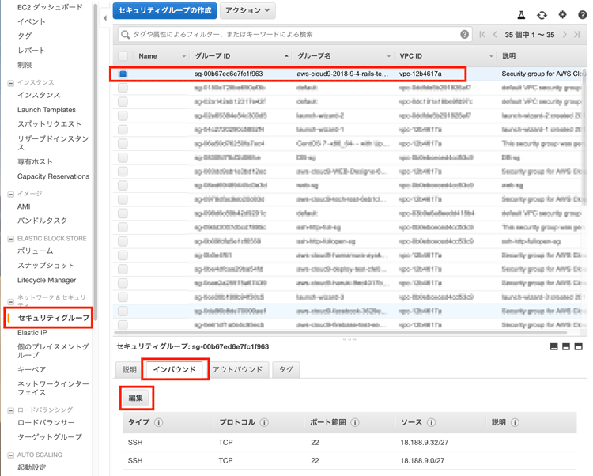

# Railsアプリの環境構築

## 本章の目的：

- 前章でRbenvにより構築したRubyにrailsをインストールする。
- Railsアプリをとりあえず作成する方法をやってみます。
- すでに作成してあるRailsプロジェクトと GitHub からpullしてくる方法をやってみます。
- おそらく初めのRailsアプリはDBの設定が Sqltite3 になっているので、DBを変更する設定もやってみます。


***

本章では、前章で構築したRubyの環境に、Railsを構築していきます。当然RubyのバージョンやOSのバージョンによりRailsのバージョンも異なります。

まずいつものようにログインします。

```
ログイン方法はまだ未確定
```

####Rubyのバージョンの確認
```
$ ruby -v

//
ruby 2.5.3p105 (2018-10-18 revision 65156) [x86_64-linux]
```

####bundlerのバージョンの確認
```
$ bundler -v

//
Bundler version 1.17.2
```

####Railsのインストール
```
$ gem install rails
```

しばらく時間がかかります。

```
$ rails -v

//
Rails 5.2.2
```
5.2.2がインストールされました。

どこにインストールされたのだろうと思うかもしれません。
アプリのコマンドの場所を表示するにはwhichを使います。

```
$ which rails

//ここにパスがあることがわかります。
~/.gem/bin/rails
```
binというフォルダは、基本コマンドやプログラムが置かれる場所になります。
unixのフォルダ構成について知りたい方は下記を参照下さい。
https://oxynotes.com/?p=5987

####現在のフォルダ構成の確認

```
$ ls -la

//
total 16
drwx------.  6 centos centos  133 Dec 24 16:06 .
drwxr-xr-x.  3 root   root     20 Nov 26 13:39 ..
-rw-------.  1 centos centos 1669 Dec 24 18:20 .bash_history
-rw-r--r--.  1 centos centos   18 Apr 11  2018 .bash_logout
-rw-r--r--.  1 centos centos  321 Dec 24 14:57 .bash_profile
-rw-r--r--.  1 centos centos  231 Apr 11  2018 .bashrc
drwxrwxr-x. 10 centos centos  124 Dec 24 16:06 .gem
drwxrw----.  3 centos centos   19 Dec 24 03:42 .pki
drwxrwxr-x. 12 centos centos  278 Dec 24 16:05 .rbenv
drwx------.  2 centos centos   29 Nov 26 13:39 .ssh
```
設定ファイルや隠しファイルばかりですね。
ですのでアプリケションを開発するフォルダを作ってそこにRailsアプリを作っていきましょう

####フォルダ作成

フォルダ作成には　mkdir というコマンドを利用します。
 make directry という意味です。
```
$ mkdir rails_app

確認してみます。

$ ls -la

//
total 16
drwx------.  7 centos centos  150 Dec 27 02:33 .
drwxr-xr-x.  3 root   root     20 Nov 26 13:39 ..
-rw-------.  1 centos centos 1669 Dec 24 18:20 .bash_history
-rw-r--r--.  1 centos centos   18 Apr 11  2018 .bash_logout
-rw-r--r--.  1 centos centos  321 Dec 24 14:57 .bash_profile
-rw-r--r--.  1 centos centos  231 Apr 11  2018 .bashrc
drwxrwxr-x. 10 centos centos  124 Dec 24 16:06 .gem
drwxrw----.  3 centos centos   19 Dec 24 03:42 .pki
drwxrwxr-x.  2 centos centos    6 Dec 27 02:33 rails_app
drwxrwxr-x. 12 centos centos  278 Dec 24 16:05 .rbenv
drwx------.  2 centos centos   29 Nov 26 13:39 .ssh	
```
フォルダが、ちゃんとできていますね。
先頭に d がついているものがフォルダの意味です。
その後に付いているrwxなどが、パーミッションです。アクセス権のことですね。
これもサーバーを構築する際には、大切なので、ここでは触れませんが、下記記事などを読んで理解しておいて下さい。

https://wa3.i-3-i.info/word1169.html
https://www.mdn.co.jp/di/contents/2104/12696/

####作成したフォルダに移動します

```
$ cd rails_app
```

####Railsアプリを作ります。
DBにmysqlを利用しますので、オプション引数を渡します。

その前に一応mysqlがインストールされているか確認。

```
$ mysql --version

//
mysql  Ver 15.1 Distrib 5.5.60-MariaDB, for Linux (x86_64) using readline 5.1	
```
入っていますね。


#### bundlerとRailsとRubyとgemの整理

頭の中がこんがらがっているかもしれませんので、ここで整理しておきましょう。
Rubyには、機能追加するパッケージをインストールできます。
これがgemファイルです。
しかし、このインストール,1つ2つなら問題ないですが、WEB開発の場合20〜30ものgemを入れたりします。
一行づつ入力するのも面倒ですし、それぞれ依存関係がありますので、微妙にバージョンも変更する必要があります。

そこでbundlerの登場です。　これがgemを一元管理してくれます。依存関係も把握できます。
このbundlerを利用してほとんどすべてのgemをインストールします。
Railsもgemのひとつなのです。

ですから最初、bundlerだけ インストールしました。
それからrailsのgemを入れました。
これでRailsアプリケーションを開発する準備ができました。
この関係をしっかり覚えておきましょう。


####Railsアプリの作成

まず場所の確認

```
$ pwd

//***
/home/centos/rails_app
```
先ほど作成したrails_app フォルダにいることがわかります。
pwdとは print working directory 今の作業フォルダを出力しなさいというコマンドです。


===================================================================

ここでは　sample という名前のアプリを作成します。
DBにmysqlを利用しますので、引数を渡しています。
```
$ rails new sample --database mysql	
```

vendor/bundle に入ったgemを使ってコマンドを実行したい場合は上記のように bundle exec 〜 を
先頭に付けます。毎回忘れないようにしましょう。

また　--skip-bundle の指定を忘れないようにして下さい。
そうでないと bundle install が発動し、Ruby環境にgemがインストールされてしまいます。

railsプロジェクトフォルダの確認
```
$ ls -la


//
total 12
drwxrwxr-x.  5 centos centos  105 Dec 27 09:49 .
drwx------.  8 centos centos  165 Dec 27 03:15 ..
drwxrwxr-x.  2 centos centos   20 Dec 27 09:41 .bundle
-rw-rw-r--.  1 centos centos   43 Dec 27 09:32 Gemfile
-rw-rw-r--.  1 centos centos 2901 Dec 27 09:42 Gemfile.lock
-rw-rw-r--.  1 centos centos    6 Dec 27 08:38 .ruby-version
drwxrwxr-x. 14 centos centos  276 Dec 27 09:49 sample
drwxrwxr-x.  3 centos centos   20 Dec 27 09:41 vendor
```
ちゃんと sample  アプリができていますね。
移動して

```
$ cd sample/
```

げっげげ
[centos@ip-10-0-1-24 sample]$ rails -v
-bash: rails: command not found


これからいよいよアプリ作成または、自分のアプリをGithubからpullしてきます。
Railsアプリ作成時は、良いgemを見つけるのがいいアプリにつながります。
以下のサイトなどを参考にして下さい。

Railsのデフォルトのgemについて。
これはきちんと読んでおきましょう。
https://qiita.com/kkenya/items/e9eba0021b1cf5efca2b

アプリ開発で参考になるgemです。
https://qiita.com/s3pw/items/a0c77cf3d9592e9e1bad


####Railsアプリの起動
いままでcloud9などで開発している場合や、仮想環境で開発している場合、固定IPはありませんでした。
今回は、インターネット上に公開しますので、rails s　のコマンドにも必要な要素を指定しなくてはいけません。
まず自分の公開固定IPを知る必要があります。
AWSのEC2インスタンスのページから自分のIPを調べます。



####簡単なアプリの作成
今のままでは、DBに何もデータがないので表示せきません。
userモデルだけの簡単なアプリを作ってみましょう。


### まとめ

次章では、GitHubからPull　してくる方法で,デプロイしてみたいと思います。

