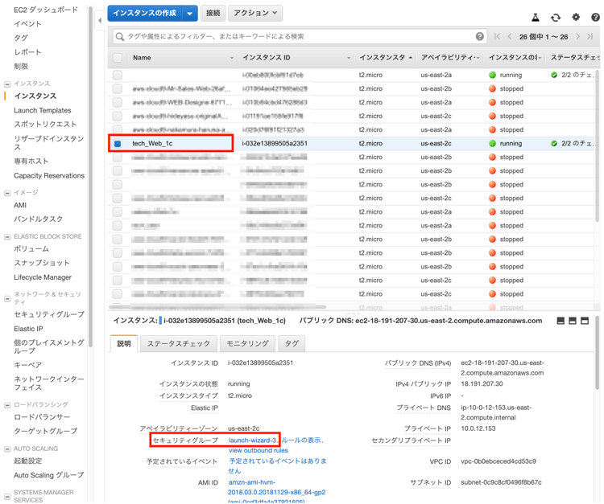
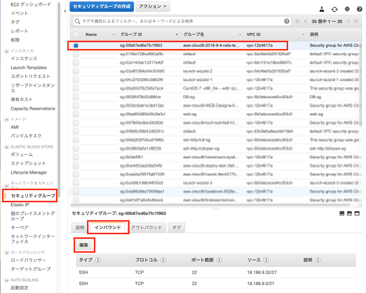
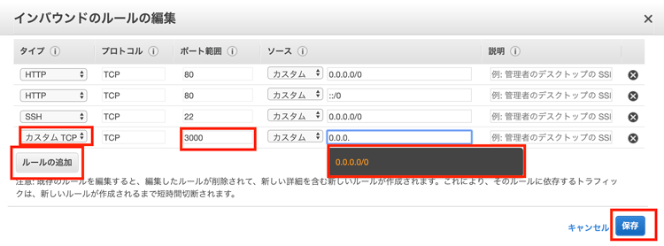
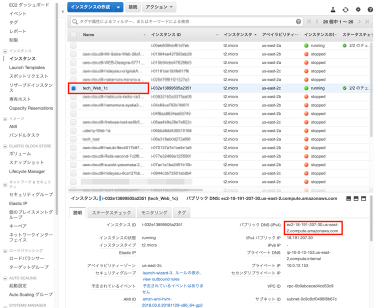
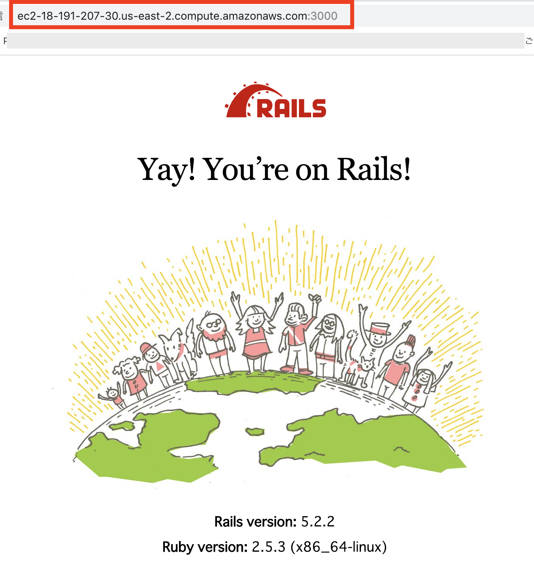

# (18)Ruby on railsアプリの公開(2)

## 本章の目的：Railsのインストール	

- bundler,Rails,Rubyとgemの整理
- 前章でrbenvにより構築したRubyにrailsをインストールする。
- Railsアプリをとりあえず作成する方法をやってみます。


***

### 本章では、前章で構築したRubyの環境に、Railsを構築していきます。当然RubyのバージョンやOSのバージョンによりRailsのバージョンも異なります。

その前にbundler,Rails,Rubyとgemの整理がつかなくなってわからなくなっている方もいるかも知れません
それで簡単にまとめておきます。


#### bundlerとRailsとRubyとgemの整理

頭の中がこんがらがっているかもしれませんので、ここで整理しておきましょう。  

Rubyには、機能追加するパッケージをインストールできます。  

これがgemファイルです。  

しかし、このインストール,1つ2つなら問題ないですが、WEB開発の場合20〜30ものgemを入れたりします。
一行づつ入力するのも面倒ですし、それぞれ依存関係がありますので、微妙にバージョンも変更する必要があります。

#### そこでbundlerの登場です。　これがgemを一元管理してくれます。依存関係も把握できます。
このbundlerを利用してほとんどすべてのgemをインストールします。
Railsもgemのひとつなのです。

ですから最初、gemでインストールするのは、bundlerと railsだけです。
railsも巨大なgemなのです。
bundlerがあれば、それぞれのRailsのバージョンで、gem とバージョンをまとめて管理できます。  
<br />
例えば、Railsプロジェクトで、このWEBアプリでのgemのバージョンでは、2.3以上にしてね。
<br />
でもほかのgemは　4.2以前のgemでないとうごかないよ。
とか、便利ですね。


#### まずいつものようにログインします。
[]はつけないでくださいね。わかりやすくするために付けいています。

```
$ ssh -i [秘密鍵] ec2-user@[自分のEC2インスタンスIP]
```

#### Rubyのバージョンの確認

```
$ ruby -v

//
ruby 2.5.3p105 (2018-10-18 revision 65156) [x86_64-linux]
```


#### gemをアップデートしておきます。
Railsもgemの一つの種類だからです。

```
$ gem update


//==
途中で
Overwrite the executable? 
聞いてきたら y を押してください

//このように表示されたら成功です
Gems updated: bigdecimal csv etc fileutils ipaddr psych rdoc stringio
```


#### bundlerのインストール

```
$ gem install bundler

//このように表示されたら成功です。
Done installing documentation for bundler after 3 seconds
1 gem installed
```

#### bundlerのバージョンの確認
```
$ bundler -v

//==バージョンは環境により異なります
Bundler version 1.17.2
```

#### Railsのインストール
```
$ gem install -v [自分が作ったrailsのバージョン] rails
```

しばらく時間がかかります。

```
$ rails -v

//
Rails 5.2.2
```
5.2.2がインストールされました。

どこにインストールされたのだろうと思うかもしれません。
アプリのコマンドの場所を表示するにはwhichを使います。

```
$ which rails

//ここにインストールされています。rbenv/shims配下にあるということですので、うまく行っていますね。
~/.rbenv/shims/rails
```

#### Rails5.2より追加のgem が必要になったのでインストールします。

```
sudo yum install sqlite-devel
```


### Railsアプリの作成 練習-gitからcloneするだけの方はみておくだけでも良いです。

ここでは　sample という名前のアプリを作成します。
```
$ rails new sample 
```

#### Railsプロジェクトフォルダの確認
```
$ ls -la


//
total 12
drwxrwxr-x.  5 centos centos  105 Dec 27 09:49 .
drwx------.  8 centos centos  165 Dec 27 03:15 ..
drwxrwxr-x.  2 centos centos   20 Dec 27 09:41 .bundle
-rw-rw-r--.  1 centos centos   43 Dec 27 09:32 Gemfile
-rw-rw-r--.  1 centos centos 2901 Dec 27 09:42 Gemfile.lock
-rw-rw-r--.  1 centos centos    6 Dec 27 08:38 .ruby-version
drwxrwxr-x. 14 centos centos  276 Dec 27 09:49 sample
drwxrwxr-x.  3 centos centos   20 Dec 27 09:41 vendor
```
ちゃんと sample  アプリができていますね。
移動して

```
$ cd sample/
```

#### sqlite3 バージョン1.4がリリースされて、Railsの簡易DBでエラーが出るようになったので、gemfileを修正
参考
https://qiita.com/Kta-M/items/254a1ba141827a989cb7

#### sqlite-develのパッケージをインストールします	
```
$ sudo yum install sqlite-devel
```

#### Rails のアプリケーションフォルダへ移動して、GemFileを修正します。

```
//== '~> 1.3.6'を追加

gem 'sqlite3', '~> 1.3.6'
```

#### 最近のRailsでgem 関係でエラーが出るようになったので、修正します。
下記参照
http://blog.livedoor.jp/tessai99/archives/34420514.html

```
$ gem uninstall fileutils

$  gem update --default
```


#### bundler によるgemのインストール	

```
bundle install
```

#### DBのマイグレーション(DBをとりあえず作ります-空です)	

```
$ rails db:migrate
```


これからいよいよアプリ作成または、自分のアプリをGithubからpullしてきます。
#### Railsアプリ作成時は、良いgemを見つけるのがいいアプリにつながります。
参考サイト

#### Railsのデフォルトのgemについて。
これはきちんと読んでおきましょう。

別タブで開いてくださいね。  

https://qiita.com/kkenya/items/e9eba0021b1cf5efca2b

#### アプリ開発で参考になるgemです。  

https://qiita.com/s3pw/items/a0c77cf3d9592e9e1bad


#### Railsアプリの起動

```
$ rails s

//===
> Booting Puma
=> Rails 5.2.2 application starting in development 
=> Run `rails server -h` for more startup options
Puma starting in single mode...
* Version 3.12.0 (ruby 2.5.3-p105), codename: Llamas in Pajamas
* Min threads: 5, max threads: 5
* Environment: development
//ここです
* Listening on tcp://0.0.0.0:3000
```

このように表示されます
#### ポートの3000番を利用していますね。
今回作成したサーバーのportの3000番を開いてあげないと、外部から接続できません。
それでportの修正をします。  

#### 自分のインスタンスを選択して、セキュリティーグループを押します。  

<br />

  
<hr>
<br />
<br />

#### それからインバウンドの設定をします。  

#### インバウンドというのは外からサーバーに入ってくるところの設定ということです。  
<br />
<br />


<hr>
<br />
<br />


#### ルールを追加して、カスタム、3000番のポートを0.0.0.0/0世界中からつなげられるようにします。  

<br />
<br />


<hr>
<br />
<br />


#### いよいよブラウザでつなげてみましょう！
自分のEC2インスタンスのページからパブリックドメインをコピーして、ブラウザのアドレス欄に入力しましょう。

<br />
<br />


<hr>
<br />
<br />


#### 完成！
これで、自分の作ったRailsが世界中に公開される準備ができました。

<br />
<br />


<hr>
<br />
<br />

## サーバーのkillの方法
rails s でサーバーを起動した後、別のコマンドを入力すると、pumaのWEBサーバーがCTR + Cでストップできなくなります。  
その時の方法を説明しておきます。 

#### lsof コマンド

```
$ lsof -i :3000

//===
COMMAND  PID USER   FD   TYPE             DEVICE SIZE/OFF NODE NAME
ruby    3493 boku   19u  IPv4 0x7d113ea5337c08c9      0t0  TCP *:hbci (LISTEN)
```
ここでrubyが　PID　プロセスIDが__3493__で有ることがわかりました。

```
$ kill 3493
```
もう一度 lsof -i :3000　をして無くなっていれば成功です。


### まとめ

ここまでで、Railsアプリを動かすところまで行きました。  
この、Railsのバンザイの画面ができたら、もう仕事はできたようなものという人もいます。  
環境は、なかなかに大変ですね。  


次章では、GitHubからPullしてくる方法で,Railsアプリをデプロイしてみたいと思います。  

S3という、画像保存専用のサーバーとも接続してみたいと思います。

