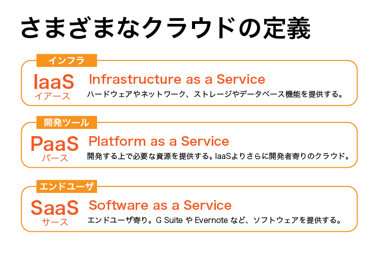

# (2)SaaS/IaaS/PaaSとは

## 本章の目的：

- クラウドの種類とその違いを理解する

***

クラウドとは、クラウドプロバイダ側のリソース（ハードウェアやネットワークなど）を一切意識せず、サービスだけを受け取れるという説明をしました。本章では、その「サービス」とは何を指すか？について解説します。

例えば、以下の両方とも「クラウドの利用」なのです。

- 乗換案内やGoogleスプレッドシートを使う  
- 皆さんがプロジェクトをデプロイしてWebシステムを公開する

この違いって、説明してみると分かりそうで分かりませんよね。ちょっとここで考えてみましょう。実は、クラウドの分類はすでに行われており、細かいものも含めるともっとありますが、大きく分けて3つに分類されます。

IaaSとPaaS、SaaSです。この分類はインフラの捉え方によるものと考えてください。順に説明していきます。

## 2. IaaS

Iaasは、Infrastracture as a Serviceの頭文字をとった用語です。まさしく私たちがこれから使おうとしているサービスです。Infrastracture（インフラストラクチャ：以降インフラと略）とは、ネットワークや設備、機材、サーバやハードディスクなど、システムを下支えするものです。私たちはこれらを意識せずに、サーバやネットワークの機能だけを利用できます。

前章で説明したように、サーバ環境を構築するにはサーバを買うかパーツから組み立てる必要があります。本コースでは機材を買っておいてくださいとは言いません。サーバを使ってプロジェクトをデプロイして、Webサイトを公開できます。つまり、機械やネットワーク（つまりハブやLANケーブル）の実体を一切意識せず、Webシステムを構築できるのです。

## 3. PaaS

次は、PaaSです。これはちょっと難しいかもしれません。PaaSはPlatform as a Serviceの頭文字をとったものです。Platformとは、開発に必要なもの（データベースやデータ、開発ツール、その他インフラ等）と考えてください。それをセットで提供するのがPaaSです。具体例は、Salesforceです。Salesforceとはクラウドの先駆けとなった企業とツールです。

## 4. Saas

最後はSaaSです。Saasは、System as a Serviceの頭文字をとった用語です。SaaSが一番理解しやすく身近なものではないでしょうか？SaaSの具体例は、今まで説明してきたように、路線検索やGmail、Googleスプレッドシートなどを指します。これらのサービスを使う時、サービスプロバイダの機材や設備、データなどを意識したり、専用ソフトのインストールをすることは基本的に不要（厳密にいうと必要になることもありますが）です。

## まとめ

クラウドと一口に言っても、さまざまな切り口がありますね。今後クラウドについての解説を読んだり、他のエンジニアと会話する際に、本章の解説を理解しておくと便利でしょう。
