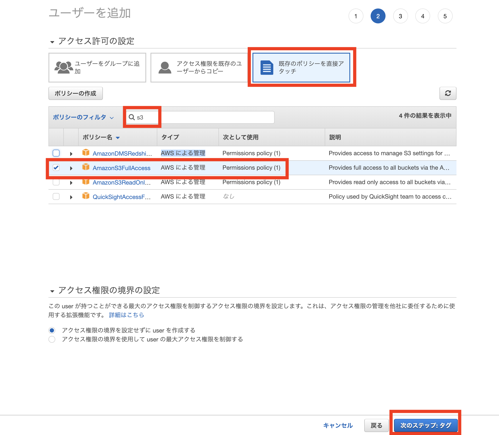
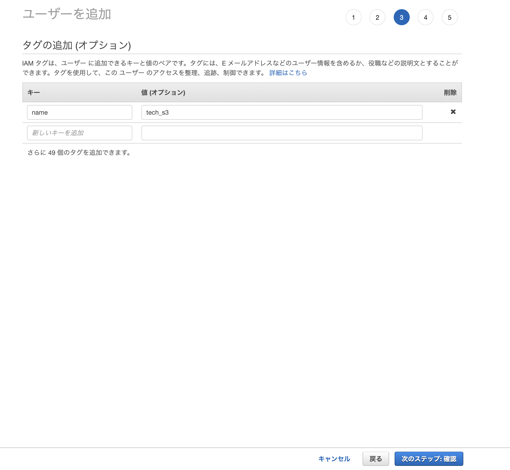
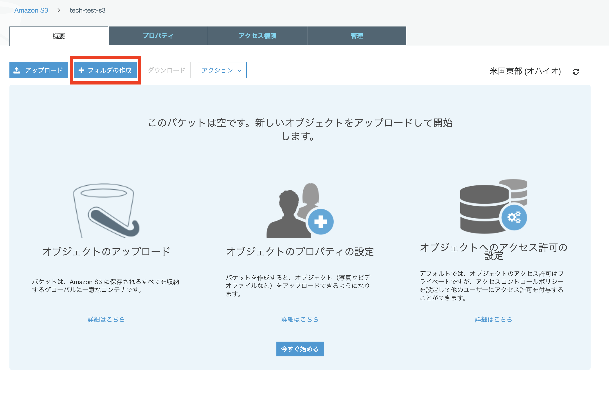

# (21)Laravelアプリの公開 composerのインストール

## 本章の目的：Composerのインストール  


- composerとはRubyのバージョン管理rbenvとbundlerを足したようなものです。
- パッケージの依存関係を解消しながら、目的のパッケージをインストールしてくれるもの

 

***


#### まずcomposerのインストーラーを取得して、バイナリがあるとこに移動します。

```
$ curl -sS https://getcomposer.org/installer | sudo php

$ sudo mv composer.phar /usr/local/bin/composer

```

#### 実行権限を与えます。

```
$ sudo chmod +x /usr/local/bin/composer
```

chmod とは権限を与えるコマンドです。
パーミッションといいます。
必要な知識ですので、下記サイトなどを参照して、各自勉強しておいてください。

https://eng-entrance.com/linux-permission-basic


#### パーミッションの確認
バージョンが表示されるということは、composerが実行権限を持ったということです。

```
$ composer --version
Composer version 1.8.4 2019-02-11 10:52:10

```

#### Laravelプロジェクトフォルダをホーム配下に作ります


```
//==homeフォルダに移動して
$ cd

//==アプリのフォルダを作成します。名前は任意に決めてください。
$ mkdir mynews

```

#### gitで自分のアプリをpullしてきましょう。
ここでは、Laravelレッスンで作成したアプリをpullしています。

```
$ git init

$ git pull https://github.com/MutsumiMatsuda/mynews4ec2.git
```


## S3の利用
#### S3とは

画像などをDBに保存すると、検索などが遅くなります。  
それで通常は、画像、動画などを保存しておく、別のサーバーを構築します。後々の拡張も可能です。  

AWSではそれを簡単にしてくれるS3というサービスがあります。  

それを利用してみましょう。


## amazonS3サービスの利用

AWSのコンソールにてs3で検索するとS3サービスが出てきます。  

ユーザー名は何でも良いです。
<br>

<br>

## ポリシーの選択
権限のようなものです。

<br>



#### タグは後でわかりやすいように書き込んでおきます。必須ではありませんし、値はなんでも良いです
<br>



#### シークレットキーとアクセスキーはcarrywaveの設定に必要ですのできちんと分かるようにしておきましょう。
<br>


#### バケットを作って公開します。uploadsというフォルダを公開設定にします。


carrywaveを入れるとデフォルトでuploadsを見に行きます。

## S3にuploadsフォルダを作成します。

バケットを作成してください
(この画像では、すでにできています)
<br>


アクセス権限を設定します。  
画像データなど、見れないと意味がないので、公開にします。  

チェックを入れると横から、サイドバーが表示されます。  
アクセス権限をクリック  

<br>


#### 編集をクリック  
#### すべてFalseにします

<br>


確認を入力し、ボタンを押します。
これは、サーバーlogなどをs3に保存することもあるので、公開していいですか？と確認しているわけです。  
今回は、公開する画像ファイルしかないので、問題ありません。


<br>


## uploadsフォルダを作成し公開する
<br>



#### 画像は公開するので暗号化は付けません。
<br>


#### 公開しましょう
<br>


<br>


<br>
<br>


#### Laravelの環境ファイルを作ります。
プロジェクトの直下に作ります。
名前は .env


下記を貼り付けます。

```
APP_NAME=Laravel
APP_ENV=local
APP_KEY=base64:PAOxi8AN6ISrrDhmQaZEB9hEJgka7T2oRxNSXJkFeLQ=
APP_DEBUG=true
APP_URL=http://localhost

LOG_CHANNEL=stack

DB_CONNECTION=mysql
DB_HOST=127.0.0.1
DB_PORT=3306
DB_DATABASE=mynews4ec2
DB_USERNAME=root
DB_PASSWORD=

BROADCAST_DRIVER=log
CACHE_DRIVER=file
QUEUE_CONNECTION=sync
SESSION_DRIVER=file
SESSION_LIFETIME=120

REDIS_HOST=127.0.0.1
REDIS_PASSWORD=null

REDIS_PORT=6379

MAIL_DRIVER=smtp
MAIL_HOST=smtp.mailtrap.io
MAIL_PORT=2525
MAIL_USERNAME=null
MAIL_PASSWORD=null
MAIL_ENCRYPTION=null

PUSHER_APP_ID=
PUSHER_APP_KEY=
PUSHER_APP_SECRET=
PUSHER_APP_CLUSTER=mt1

MIX_PUSHER_APP_KEY="${PUSHER_APP_KEY}"
MIX_PUSHER_APP_CLUSTER="${PUSHER_APP_CLUSTER}"


# 松田追加

# Storage種別 (local or s3)
FILESYSTEM_DRIVER_TYPE_LOCAL=local
FILESYSTEM_DRIVER_TYPE_S3=s3

# 以下を切り替えてローカルとAWS S3に画像保存先を変更
#FILESYSTEM_DRIVER="${FILESYSTEM_DRIVER_TYPE_LOCAL}"
FILESYSTEM_DRIVER="${FILESYSTEM_DRIVER_TYPE_S3}"

NO_NEWS_IMAGE_FILENAME=no-image4news.png
NO_PROFILE_IMAGE_FILENAME=no-image4profile.png
IMAGE_URL_PREFIX=public/image

#S3の設定

//== 各自のACCESS_KEYを入力します
AWS_S3_ACCESS_KEY=各自のACCESS_KEY

//== 各自のSECRET_KEYを入力します
AWS_S3_SECRET_KEY=各自のSECRET_KEY
AWS_S3_REGION=ap-northeast-1

//== 各自のS3バケット名を入力します
AWS_S3_BUCKET=

//===このurlの.com以下にバケット名を追加します。
AWS_S3_URL=https://s3-ap-northeast-1.amazonaws.com/各自のバケット名
```


#### composerのupdateするときにamazon のS3を使えるようにする。

composer.jsonのrequireに
#### "league/flysystem-aws-s3-v3" : "~1.0"
を追加


```
$ vi composer.json

//==一部省略
   "require": {
        "php": "^7.1.3",
        "doctrine/dbal": "^2.9",
        "fideloper/proxy": "^4.0",
        "laravel/framework": "5.7.*",
        "laravel/tinker": "^1.0",
     //==ここです
        "league/flysystem-aws-s3-v3" : "~1.0"
    },
```

### S3の定義をする。

#### config>filesystems.php

#### disksにs3の項目を追加します。

```
 'disks' => [
        // 松田変更ここから
        's3' => [
            'driver' => 's3',
            'key' => env('AWS_S3_ACCESS_KEY'),
            'secret' => env('AWS_S3_SECRET_KEY'),
            'region' => env('AWS_S3_REGION'),
            'bucket' => env('AWS_S3_BUCKET'),
            'url' => env('AWS_S3_URL'),
        // 松田変更ここまで
        ],

```

#### composerをupdateします


```
$ composer update
```

こんなエラーが出ます。
メモリが足りないと言っています。

```
The following exception is caused by a lack of memory or swap, or not having swap configured
Check https://getcomposer.org/doc/articles/troubleshooting.md#proc-open-fork-failed-errors for details

```


#### メモリ管理のswapファイルを変更します。

```
$ sudo dd if=/dev/zero of=/swap bs=1M count=1024

$ sudo mkswap /swap

$ swapon /swap

$ sudo swapon /swap

$ sudo chmod 600 /swap

//==チェックします。

$ free

//==良さそうですね
             total       used       free     shared    buffers     cached
Mem:       1009432     946648      62784         60       2056     681556
-/+ buffers/cache:     263036     746396
Swap:      1048572          0    1048572
```

#### 再度composerをupdateに挑戦
```
$ composer update


//==
Discovered Package: laravel/tinker
Discovered Package: nesbot/carbon
Discovered Package: nunomaduro/collision
Package manifest generated successfully.
```
うまくいきました。めでたし、めでたし


### SASSの設定をしていきます。

自分のプロジェクトフォルダに移動します。
その直下に
webpack関係をインストールしていきます。

```
$ npm i -D webpack webpack-cli
$ npm i -D css-loader
$ npm i -D node-sass sass-loader
```


#### SASSファイルをコンパイルしてCSSを生成します。

```
$ npm run watch
```
npmについての資料。
https://qiita.com/hashrock/items/15f4a4961183cfbb2658


##DBを作成します
####MySQLにログインして作成します。

```
$ mysql -u root


//==DBを作成します。名前は各自自由に決めて、.envとの整合を取ってください。
mysql> create database mynews4ec2;

//==
Query OK, 1 row affected (0.01 sec)

//==userを作成します。user名とpasswordは、 各自自由に決めて、.envとの整合を取ってください。
create user 'techboost'@'localhost' idenfified by 'password';

//== techboost ユーザーに　先程つくったDBへの権限を与えます パスワードも各自のに変更してください
mysql> grant all on mynews4ec2.* to 'techboost'@'localhost' identified by 'password';

//==設定を反映します。
mysql> flush privileges;

//==
Query OK, 0 rows affected (0.02 sec)

```


####設定の確認をします

```
//==まずユーザー

mysql> select User,Host from mysql.user;

//techboostユーザーがあります。
+---------------+-----------+
| User          | Host      |
+---------------+-----------+
| mysql.session | localhost |
| mysql.sys     | localhost |
| root          | localhost |
| techboost     | localhost |
+---------------+-----------+
4 rows in set (0.00 sec)


//DBがあることも確認しましょう

mysql> show databases;

//== DBの　mynews4ec2　があります 
+--------------------+
| Database           |
+--------------------+
| information_schema |
| mynews4ec2         |
| mysql              |
| performance_schema |
| sys                |
+--------------------+
5 rows in set (0.00 sec)

//==mysqlを抜けます。

mysql> exit;
Bye

```
####Laravel でDBを作成します。

先程のDB名とDBUSER名を .env ファイルに記載しておきます。
各自でやってください。

```
$ php artisan migrate

//==こんな感じになります。
Migration table created successfully.
Migrating: 2014_10_12_000000_create_users_table
Migrated:  2014_10_12_000000_create_users_table
Migrating: 2014_10_12_100000_create_password_resets_table
Migrated:  2014_10_12_100000_create_password_resets_table
```


残作業

S3の設定をコントローラーに記載する。
ngnxの設定
FRP nginxとPHPが通信するためのCGI


#### WEBサーバーのnginxをインストールします。


```
$ sudo yum install nginx
$ sudo yum install nginx-all-modules

```
テストです


