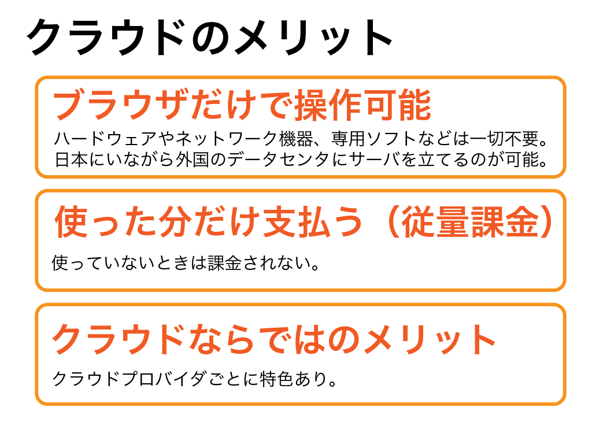

# (3)クラウドのメリット

## 1.本章の目的

- 従来のインフラとの違いと、導入するメリットを理解する  

  
今までクラウドとは何かを解説してきましたが、改めてクラウドを導入するメリットを考えてみましょう。また、クラウドについてよく聞く質問である「レンタルサーバとクラウドはどう違うのか」も一緒に考えましょう。その問いの答えがそのままクラウドのメリットや魅力ということです。

その前に１つ、**オンプレミス**という用語を覚えてください。従来のように、ハードウェア等々の設備を自前で購入・構築・運用する形態を表す用語です。エンジニアの中には「オンプレ」と省略して呼んでいる人もいます。クラウドを語る上で、クラウドの対義語として非常によく聞きます。

## 2.クラウドのメリット

今までの解説の総まとめとなります。クラウドのメリットをまとめましょう。

### 2-1.ブラウザだけで操作可能

10章あたりからサーバを立ち上げます。サーバを立ち上げるといっても、特別なものは何一つ要りません。**PCでブラウザを立ち上げて数分でサーバを構築可能**です。必要に応じて、日本にいながら海外のAWSのデータセンターにサーバを立ち上げることすらできます。海外拠点をもつ企業は、日本からサーバの立ち上げや運用ができてしまいます。

またAWSの拠点間は強力な回線で結ばれていることから、仮に日本本社と海外支社のサーバを繋いでも、通信費を心配する必要はありません。災害対策としてサーバは東京で、海外にバックアップを置く、というのも良い使い方です。

### 2-2.使った分だけ支払う

**基本的にクラウドは従量課金（使った分だけ請求）です。**月額固定費用ではありません。使った時間×単価で課金されます。もちろん月額固定という契約形態もありますが、本コースでは扱いません。

これってオンプレミス時代にはなかった革命的なメリットです。オンプレミスではサーバを立ち上げるのは一苦労です。しかも一度立ち上げてしまえば運用しなくてはならないし、場合によっては維持費もかかります。レンタルサーバを借りるとしても、使ってないから課金されないということはありません。

使った分だけということは、検証用環境や実験環境を立ち上げて、使わないときは落としておくという運用にすれば、コスト面で大助かりですよね。他に、キャンペーン中や繁忙期などといった一時的な負荷の高まりに対しても、その時だけサーバを追加して対応するといったことも可能です。

サーバ立ち上げは簡単ですが、同時に、要らなくなった場合も破棄するのも数クリックで済みます。

### 2-3.その他のメリット

その他、クラウド上の仮想サーバであるがゆえのメリットがたくさんあります。その一例を挙げてみます。

サーバを一台立ち上げたら、同じ仕様でもう一台立ち上げなくてはならない、ということがよくあります。例えば複数台のサーバを立ち上げて負荷分散したり、Webサーバやメールサーバ、DBサーバとを構築したり、といったケースです。

そんな時もクラウドなら楽勝です。**すでに構築したサーバを丸ごと複製できます。** 構築手順書を作ってその通りに作業して、というのも手ですが、人手を介することになるのでどうしてもミスの可能性が出てきます。サーバ丸ごとコピーできるのなら、構築作業にミスが混入する可能性は無くなります。

またクラウドプロバイダごとに提供されるサーバに違いがあります。本コースではAWSを使いますが、同様なプロバイダに**Google Cloud Pratform(GCP)やMicfosoft Azure**があります。GCPはG Suiteとの連携が得意であったり、AzureはWindows製品との相性が良かったり、といった特色があります。本コースでAWSやクラウドとはどのようなものかを学習した後に、ぜひ他のクラウドプロバイダ間を比較してみることをオススメします。

## 3.レンタルサーバとの違い

オンプレミスとクラウドの比較はよく聞きますが、同じようにレンタルサーバとクラウドの比較もよく聞きます。

レンタルサーバは一般的に共用型のものを指します。よってここでも共用型を基本に解説を進めます。レンタルサーバは、１台の物理サーバを共用で使用するのが基本です。よって、他のいわゆる「行儀の悪い同居者」つまりすぐに暴走するシステムや負荷をかなり高めてしまうシステムの影響を受けてしまいます。またサーバでできないことは入居者であるユーザもできない、というデメリットもあります。

契約が始まると、使う使わないに関わらず、ずっと課金され続けるのも辛いところです。

ところがクラウドではこれらの心配は無用です。クラウドの基盤上に仮想サーバを立てるので、いわゆる「あなただけのサーバ」です。実機でサーバを立てたのと同じように、他のユーザの影響を受けません。また使わないときは落としておくと課金されない、自由なカスタマイズが可能（自分だけのサーバですから、当たり前ですよね）といったメリットがあります。またクラウドプロバイダの持つ多彩なサービスを利用できる、というメリットも見逃せません。

## 4.まとめ

本章では、クラウドを導入するメリットを解説しました。次章から、そもそもAWSとは何なのかについて学習していきましょう。
