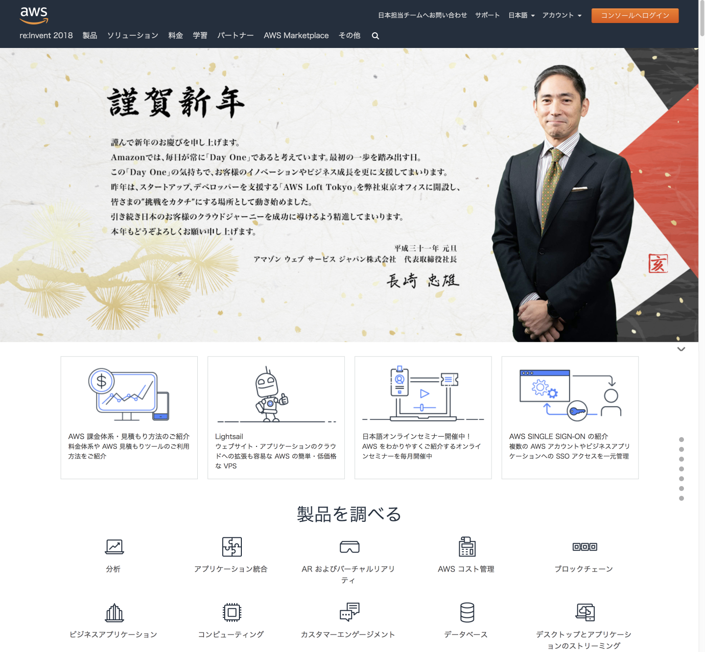
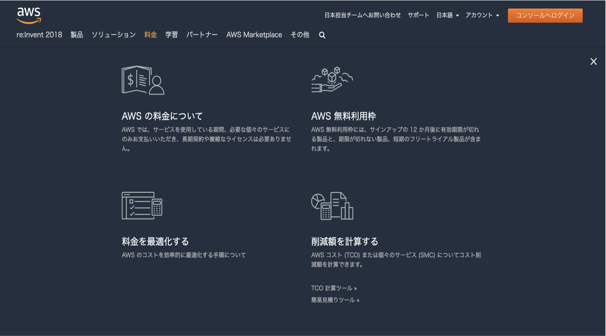

# (4)AWSとは何か

## 本章の目的：

- 前章までの基礎知識をもって、AWSとは何かを理解する

***

クラウドの持つ特徴やメリットを解説してきたので、本章以降ではもう少し解説をAWSに絞りましょう。

### 4-1.AWSとは何か？

改めて申し上げます。**AWSとはAmazon Web Service（アマゾンウェブサービス）** の略です。クラウド環境を提供している会社です。Amazonという名を冠しているからといってAWSが通販をしているわけではありません。そもそも通販でよく知られているAmazonがなぜクラウドサービスを売ってるの？という疑問が湧くでしょう。その答えは、AWSの長崎社長のコメントを見ればわかります。こちらをご覧ください。

https://www.sbbit.jp/article/cont1/29803

もともとは、アマゾン社内のインフラ課題を解決するために生まれたとのことです。アマゾンが顧客のニーズを満たすためにシステムを拡張していくうちに、インフラの構築や運用がネックになってきました。そこで、インフラを簡単に構築・変更できるような仕組み（API化）を構築しました。その結果、セールス側の要望に対し、インフラ側が素早く対応できるようになったのです。

ここで構築した基盤を一般に公開し、誰でもそのメリットを享受できるようしたのが、AWSのサービスの始まりというわけです。よって、決してAmazonがクラウドを商材として販売し始めたのではありません。AWSは顧客のニーズを満たすために必然的に生まれたともいえますね。

AWSは現在、100を超えるサービスを提供しています。ユーザはスタートアップ企業から大企業までさまざまです。スタートアップ企業はランニングコストを低く抑えることができるし、大企業は大量データを処理したり、ハードウェアのコストを抑えつつ自在に拡張できる、などのメリットが受けています。公式ホームページによると、世界で数百万以上、日本でも10万以上のユーザがいるそうです。ちなみにオンラインで映画等のコンテンツを提供しているNetFlixもAWSのヘビーユーザとして有名です。

### 4-2. 基本的に従量課金

AWSは基本的に従量課金です。つまり、使った分だけ支払います。固定の月額基本料といった使った分以外への支払いは発生しません。仮想サーバを立てたとしても、動いていなければ課金されません。また、とりあえず使ってみたい！という人のために、１年間の無料枠が用意されているのもうれしいですね。

### 4-3. コミュニティが活発

AWSユーザによるコミュニティであるJapan AWS User Group (JAWS-UG)があります。、ジョーズにちなんでかわいいサメのロゴです。全国に70の支部がありますので、みなさんのお住いの地区にもあるはずです。

https://jaws-ug.jp/

本コースを終えてもっと深く学習したくなった時、分からないことや知りたいことを気軽に相談できる仲間がいるとうれしいですね。ぜひ上記のホームページで身近な支部を検索してのぞいてみてください。

### 4-4. AWS公式ホームページを見てみよう！

AWSの公式ホームページを見てみましょう。

https://aws.amazon.com/jp/

トップページは、だいたいその時のメイントピックが出ています。例えばAWSのイベントである「re:Invent」であったり、新サービスであったりします。教材作成時は2019年初頭だったので、長崎社長の挨拶でした。その下から延々とサービスの解説や導入事例が続きます。

ここで特に注目して欲しいのが、画面上部にある「学習」です。ここをクリックすると、以下のページに遷移します。AWSやクラウドについて、基本的な説明が書かれています。本コースの教材の副読本として、ぜひ一度読んでみてください。

### 4-3.現在の求人案件におけるAWS

AWSは本当に業界で使われているのか？を知るためには、求人案件を見てみるとよいでしょう。AWSに限らず、ある技術が本当に業界で需要があるかを知りたいときは、求人案件を見るのが一番リアルです。

というわけで検索してみたところ、かなりの数がヒットしました。それもインフラ関係の案件はもちろんのこと、Webシステム開発やゲーム開発などなど、さまざまです。ここから言えるのは、もはや自前で基盤を構築するのが古くなり、最初からクラウドを導入するのが当たり前になりつつあるということです。最近**クラウドファースト**という言葉がよく聞かれるようになったのも、うなずけますね。

