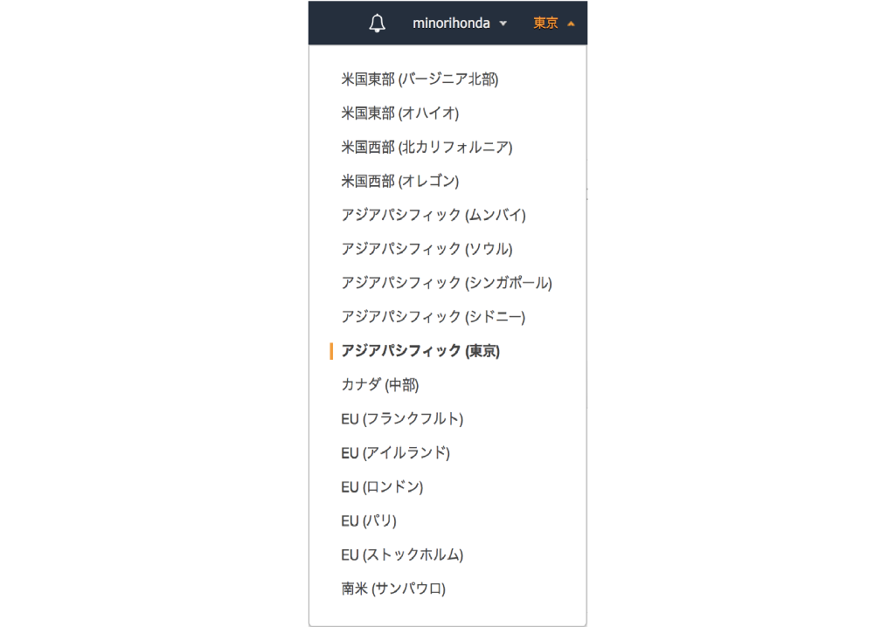
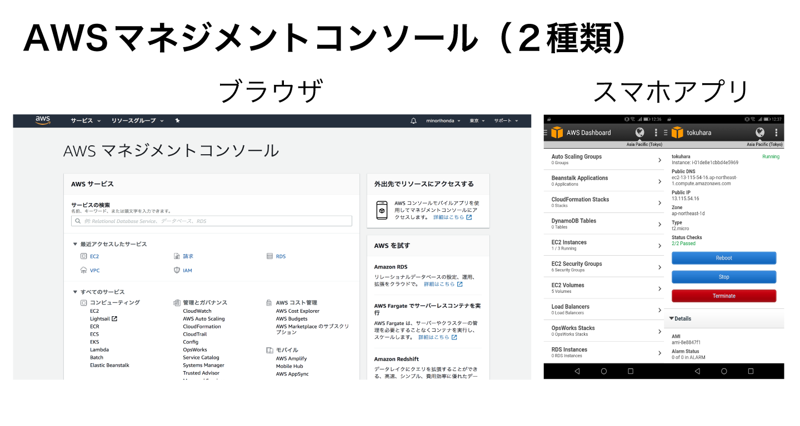

# (5)AWSの基礎知識

## 本章の目的：

- AWSを学習する上で必要な基礎知識を理解する。
- 各種サービスに共通な基礎知識を理解する。

***

ここでは、AWSを学習する上で必要な知識や、各種サービスに依存せず共通して必要となる知識を学習します。特にリージョンとアベイラビリティゾーンは必須の知識です。

### 5-1. リージョン

データセンターをAWSでは**リージョン(region)** と呼んでいます。2019年1月現在、全世界に19のリージョンがあり、さらに4箇所に追加される予定です。

ちなみにAWSの東京リージョンが開設されたのは、2011年3月です。当時AWSユーザは「やっと日本にもリージョンが開設されるのか！」と歓喜したものです。ところで東京リージョンは実際にはどこにあるのか、それはAWSの「中の人」すら知らないトップシークレットとのことです。一時期WikiLeakに暴露されたとか、成田や江東区、千葉などにあるのでは、との憶測が飛んでいましたが、結局のところ公式には一切非公開です。

日本には東京の他に、大阪リージョンもあります。ただし利用するには申請して審査を通過して、という手順を踏まなくてはなりません。よって東京リージョンのように気軽に使えるのはまだ先になりそうです。

AWSは基本的に、後ほど出てくる「AWSマネジメントコンソール」というWebページにて行います。このページはリージョンごとの操作になります。つまり、東京リージョンで立てたサーバは東京リージョンに切り替えないと見えない、ということが起こります。よって、何か新たにサービスを使うときは、リージョンを必ずチェックするようにしましょう。

AWSマネジメントコンソールの右上に、リージョンを選択するプルダウンがあります。それをクリックすると、以下のようになります。図は、東京リージョンを選択している状態です。アジアパシフィック（東京）が濃くなっています。



### 5-2. アベイラビリティゾーン

リージョンは、障害対策として複数の区画に分かれています。その区画を**アベイラビリティゾーン**といいます。AZと省略されることが多くあります。設備そのものが物理的に離れており、電源系ももちろん別です。よって何らかの災害が発生しても、他のリージョンへ影響を与えません。

図のように、1aのリージョンにサーバを立てて、障害対策として1cのリージョンにバックアップを置くといった設計をするのが定石です。

### 5-3. AWSマネジメントコンソール

すでに出てきていますが、ここで改めて解説します。AWSは基本的にAWSマネジメントコンソールによって操作します。ログインしていきなり開く画面がAWSマネジメントコンソールです。

AWSマネジメントコンソールは、ブラウザからアクセスする方法と、スマホアプリからアクセスする方法があります。

スマホ版は機能が限定的ではあるものの、大半のことが可能です。例えば緊急でサーバを再起動しなければいけない時などは、スマホ版を使えば出先でも可能です。

