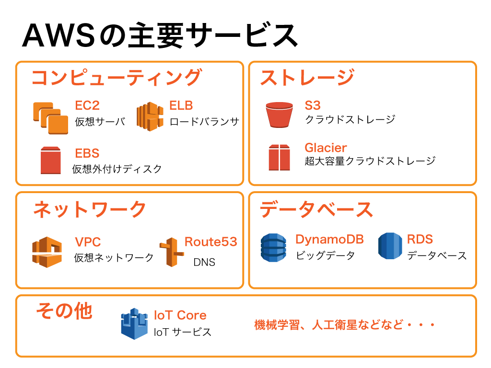

# (6)AWSの主要なサービス

## 本章の目的：

- AWSの主要サービスを理解する

***

前章まででAWSとは何か、またAWSを使うメリットについて説明してきました。本章では、AWSの主要サービスについて解説します。

### 6-1. AWSが提供しているもの

AWSは、本来は私たちが高い専門性と、場合によっては莫大な費用をもって構築しなければいけないインフラ類を、いとも簡単に提供してくれます。一体どんなサービスを提供してくれるのでしょうか？順に見ていきましょう。コンピューティングやデータベースはもちろんのこと、IoTや機械学習、果ては人工衛星まで・・・とにかくすごいです。

**＜ コンピューティング ＞**

主要サービス： EC2 / EBS / ELB

ブラウザからクリック操作だけで仮想サーバを構築できます。実際のサーバではなく、あくまでAWS環境内に作成された仮想サーバですが、利用者側からログインしたり、Webサーバとしてサービスを提供する上では普通の（つまりオンプレミスの）サーバと全く同じです。

また、コンピューティングの周辺サービスも充実しています。動きながらにして着脱可能な仮想ディスク「EBS(Elastic Block Store」や負荷分散を管理してくれる「ELB(Elastic Load Balancing:ロードバランサのこと）」もあります。特にロードバランサは一般的にウン百万する機材と高い技術力を要するのが一般的ですが、AWSではそれが初期投資なしでブラウザから構築・運用できるので驚きです。

**＜ ストレージ ＞**

主要サービス： S3 / Glacier

データを保存する、というシンプルな目的をもつサービス「S3(Simple Storage Service)」です。AWSのサービス立ち上げ時から存在している古参のサービスです。ユーザがブラウザからドラッグドロップしてデータを保存することができるし、Webシステムにてユーザがアップロードした画像やデータファイルの保存先として使用することもできます。

S3は頻繁にアクセスが発生することが予想されるところで使われますが、中にはほとんどアクセスしないけど超大容量になるデータを保存したい、そんなニーズに応えてくれるのが「Glacier（グレーシャ）」です。スピーディーな読み書きができないのが弱点ですが、その弱点を補って余りあるほどの大容量のデータを低価格で保存できます。

**＜ ネットワーク ＞**

主要サービス： VPC / Route53

AWS内に構築できるのは、仮想サーバだけではありません。ネットワークを丸ごと構築できてしまいます！VPC(Virtual Private Cloud)を使って、複数のネットワークをVPC内に構築できます。また自社内のネットワークの拡張先としてVPCを使うこともできます。

通常、EC2のインスタンスを立ち上げると、以下のようなURLが割り当てられます。

ec2-***-***-***-***.ap-northeast-1.compute.amazonaws.com

私たちが何らかのサービスを立ち上げて一般公開する時、このようなアドレスでは流行りそうにありませんよね。よって、好きなドメイン（URLだと思ってください）を購入し、自分の立てたサーバに割り当てることができます。その際使うのがRoute53です。

**＜ データベース ＞**

主要サービス： RDS / DynamoDB

OracleやMySQL、SQLServer等でデータベースを立ち上げるとき、通常はサーバにデータベースをインストールしてコマンドを実行して、という流れになります。データベースを使いたいだけなのに、データベースサーバを立ち上げなくてはならないのは、ちょっと疲れますよね。

それらを解決してくれるのがRDS(Relational Database Service)です。このサービスは、いわゆる「むき出しのデータベース」と表現したくなるような、データベース単体で使えるサービスです。RDSでデータベースを立ち上げた直後から、いきなりクライアントツールで接続してしようすることが可能です。サーバに直接インストールした時ほど細かなチューニングはできませんが、普通に使うならRDSの採用を是非とも検討すべきです。

**＜ IoT ＞**

主要サービス： IoT Core 

本格的なIoTサービスです。インターネットに直接接続したデバイスからデータを収集し、そのデータをS3やDynamoDBに保存し、SageMakerで分析してアウトプットするという、かなり本格的なIoTサービスです。

**＜ 機械学習 ＞**

主要サービス： SageMaker

AWSは機械学習のサービス「SageMaker」があります。SageMakerはデータサイエンティストや開発者が機械学習モデルを構築・デプロイできるサービスです。TensorFlowやChainer、Scikit-learnといったメジャーなアルゴリズムに対応していたり、Jupyter Notebookで操作したりといった、いわゆる一般的な機械学習のやり方がAWS基盤上で実装できるのが魅力です。

**＜ その他すごいサービス ＞**

AWSはとうとう人工衛星まで操ることができるそうです。Ground Stationというサービスがあります。公式ホームページによると、天気予報、地表画像撮影、などなど。要は自分が使いたい通信衛星をいつからいつまで使います、と申請して、収集されたデータをAWSでお好きに料理してください、というサービスです。

実際にAWSコンソールから試してみたのですが、2019年1月時点ではまだ限定公開で東京リージョンから操作できず、さらに申請して初めて使えるという状態でした。気軽に使えるようになるのにはもう少しかかるようです。

でも、これってすごくないですか？自分で衛星を打ち上げる必要も、基地局を設置・運用する必要もなく、データを衛星から得られるのです！アイデア次第ではすごいことができそうですね。

### まとめ

AWSのサービスの多彩さ、お分りいただけたでしょうか？実はまだまだ多数のサービスがあります。ご紹介したのはほんの一部です。

興味のある方は、是非公式ホームページをのぞいてみてください。

そして次章から、いよいよAWSのアカウント登録です。
