# （7）アカウント登録

## 1.本章の目的

- AWSのアカウント登録をする。
- マネジメントコンソールへのログイン方法を理解する

  
いよいよAWSのアカウント登録をします。本章ではアカウント登録してAWSマネジメントコンソールにログインするまでを目的とするので、理論や設計といったことは一切省いています。

本章は「1. 事前準備」と「2. 登録手順」の２部構成になっています。事前準備を読んで足りないものがあれば準備しておいてください。それから登録手順へ進むと、作業がよりスムーズに進みます。

## 2.事前準備

アカウント登録は、以下のものが必要です。作業に入る前に準備しておきましょう。

- メールアドレス
- パスワード
- クレジットカード

### 2-1.メールアドレス

メールアドレスは今後のルートユーザ（後述）のIDも兼ねています。またAWS側が何らかのメッセージを送る時に使われるのもこのメールアドレスです。一度設定すると変更ができないので、慎重に考えてください。

### 2-2.パスワード

パスワードは以下のルールがあります。全てを満たす必要があります。以下を満たすものであれば、お好きなものを設定して大丈夫です。

- 最低8文字
- 最低3種類（大文字、小文字、数字、記号）
- メールアドレスと異なる

パスワードは自分が覚えやすいものが便利ですが、それではあなたのことを知る誰かが類推できてしまう可能性があります。よって、完全に自分とは関連のないパスワードが必要なら、**パスワードジェネレータ**を使って生成することをオススメします。

検索サイトで「パスワードジェネレータ」と検索してみてください。サイト間で機能的に大きな違いはありません。満たすべきルールを入力すると、それを満たすランダムなパスワードを作ってくれます。

以下はパスワードジェネレータの一例です。文字種（英数字や記号など）と文字数を条件として指定すれば、ジェネレータは条件を満たすパスワードを自動生成します。

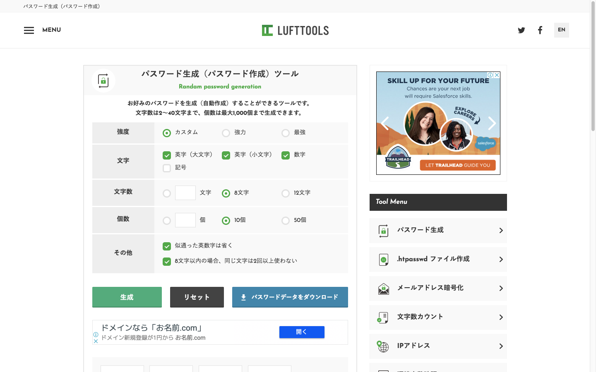

このサイトの場合、好みの条件を指定して「生成」ボタンをクリックすると、パスワードを生成します。

インターネットに公開するサーバーのログインパスワードや、その他重要なパスワードが必要な時は、ぜひパスワードジェネレータを利用してください。

### 2-3.クレジットカード

AWSのアカウント登録には、クレジットカードが必要です。AWSは１年間の無償期間を設けていますが、**無償期間内であっても決して完全なゼロ円ではありません！** 何をやってもタダというわけではなく、サービスごとに無償枠が決まっていてその範囲内なら無償、といえば分かりやすいでしょうか。

実際に料金が発生しても問題のないカードを準備しましょう。

### 2-4.その他

登録の途中で、入力した電話番号に自動音声による電話がかかってきて、聞こえた4桁のPIN（暗証番号）を画面で入力するところがあります。よって **入力する電話番号は、着信があったらすぐに取れる、かつ着信制限をしていない番号** を入力してください。

アカウントの種類を、プロフェッショナル（企業利用）またはパーソナル（個人利用）のいずれかから選ぶ箇所があります。プロフェッショナルを選択すると、会社名を入力する欄が現れます。本コースではパーソナルを選択しますが、お使いの状況に応じて選択してください。この選択はAWSの使い方そのものには影響しません。

基本的に全て英数字で入力します。よって住所も英語で入力しなくてはなりません。住所を英語で書くのが難しければ、インターネットで「住所 英語 変換」などのキーワードで検索してみてください。日本語の住所を英語表記に変換してくれるサービスがヒットします。

以下はそのサイトの一例「JuDress」です。

<a href="http://judress.tsukuenoue.com/" target="_blank">http://judress.tsukuenoue.com/</a>

試しにtech-boostの住所を変換してみました。

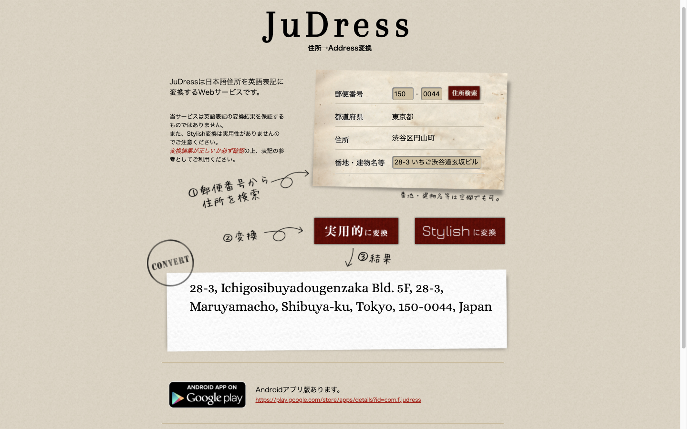

## 3.登録手順

必要なものがそろったらいよいよ登録を開始します。以下にアクセスしてください。

<a href="https://aws.amazon.com/jp/free/" target="_blank">https://aws.amazon.com/jp/free/</a>

画面中央の「まずは無料で始める」ボタンをクリックしてください。以下の画面に遷移します。

### 3-1.ステップ１：アカウント基本情報

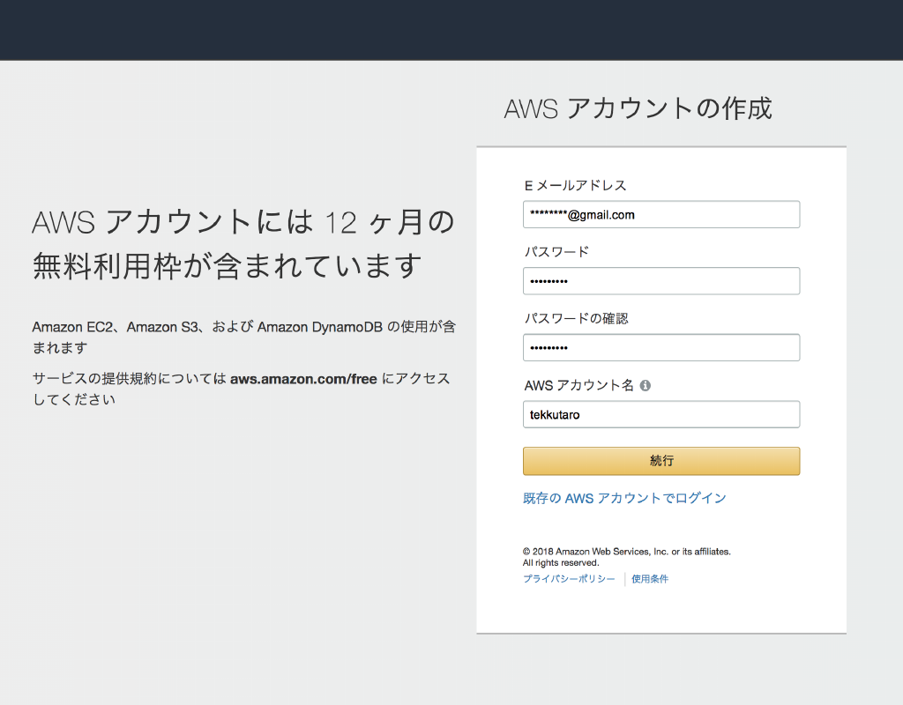

Eメールアドレスとパスワードは特に悩む箇所はないでしょう。最後のAWSアカウントは、文字通りアカウント名です。あとで変更できるので、とりあえず名前でも入れておきましょう「テック太郎」さんなら「tekkutaro」という感じです。姓と名の間のスペースは不要です。

全て入力したら「続行」ボタンをクリックしてください。次の画面へ遷移します。

### 3-2.ステップ２：連絡先

この画面は、プロフェッショナルとパーソナルのいずれかによって入力内容が変わります。プロフェッショナルを選択すると、会社名を入力しなくてはなりません。

プロフェッショナルまたはパーソナルのいずれを選択しても、この画面は全て必須かつ全て英数字で入力してください。本コースではパーソナルを選択した場合を解説します。

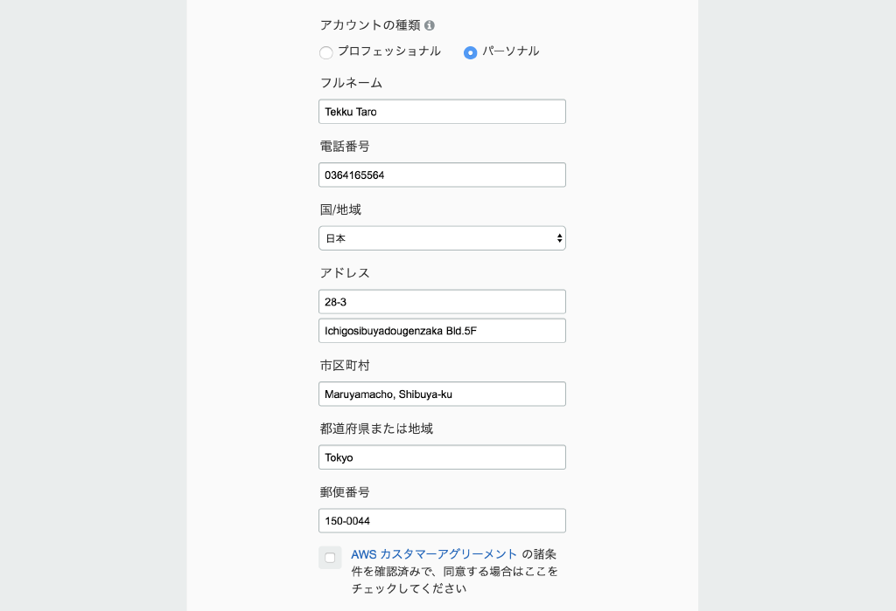

入力を終えたら「アカウントを作成して続行」ボタンをクリックしてください。

### 3-3.ステップ３：支払い情報

カード情報を入力します。ここも迷うことはないでしょう。

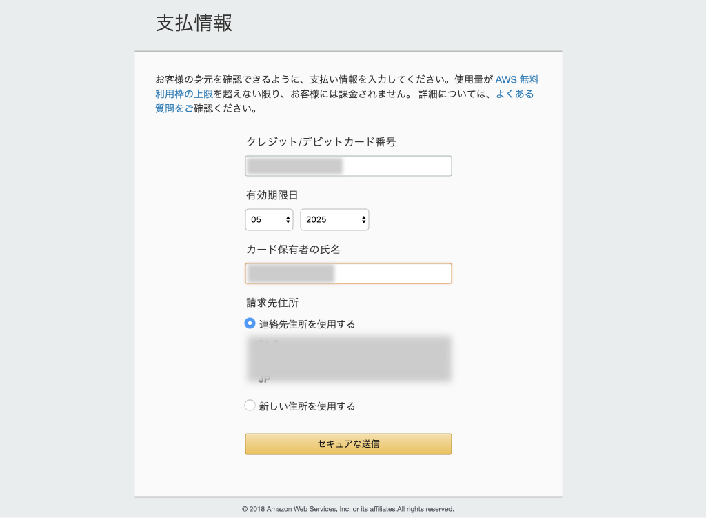

全てを入力したら「セキュアな送信」ボタンをクリックしてください。

### 3-4.ステップ４：アカウント認証

国番号と電話番号を入力します。国番号を入力するので、電話番号の先頭のゼロを取らなくてはいけないの？と思われた方もいるでしょう。しかしその必要はありません。普通に市外局番からハイフン抜きで入力して大丈夫です。

セキュリティチェックは、画面に表示されている画像の番号を入力します。セキュリティチェックの画像の文字列は、まれにとても読みづらい場合があります。そんな時は、画像の右のスピーカーアイコンをクリックして音で番号を聞くか、その下の円型矢印のアイコンをクリックして別の画像に再描画することができます。

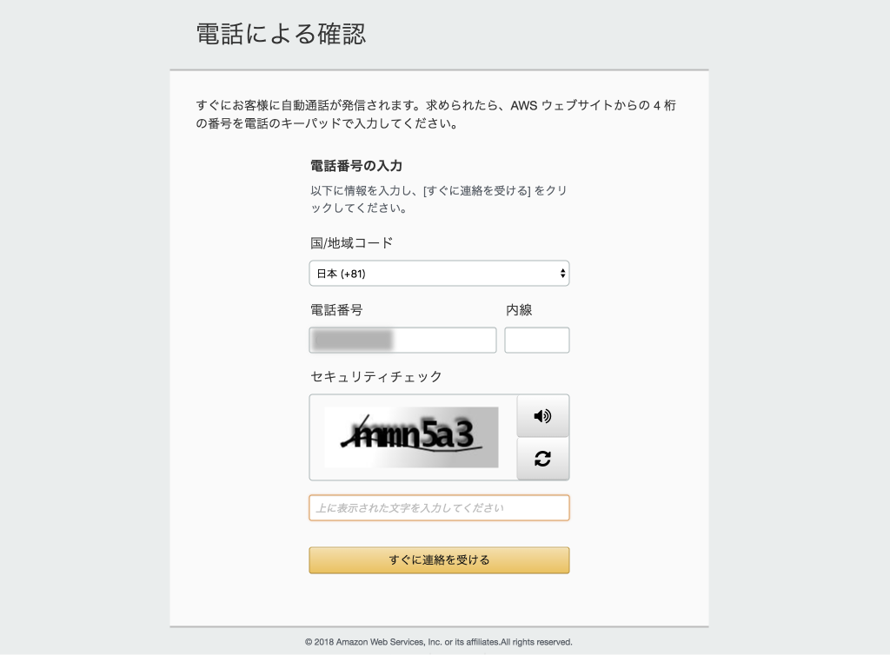

全て入力したら「すぐに連絡を受ける」ボタンをクリックしてください。4桁の暗証番号が大きく表示されます。

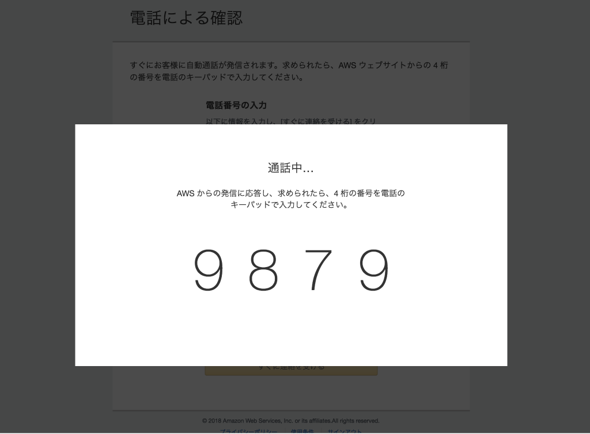

それと同時に入力した電話番号に着信があります。自動音声かつ日本語です。音声に従って番号を入力すると・・・

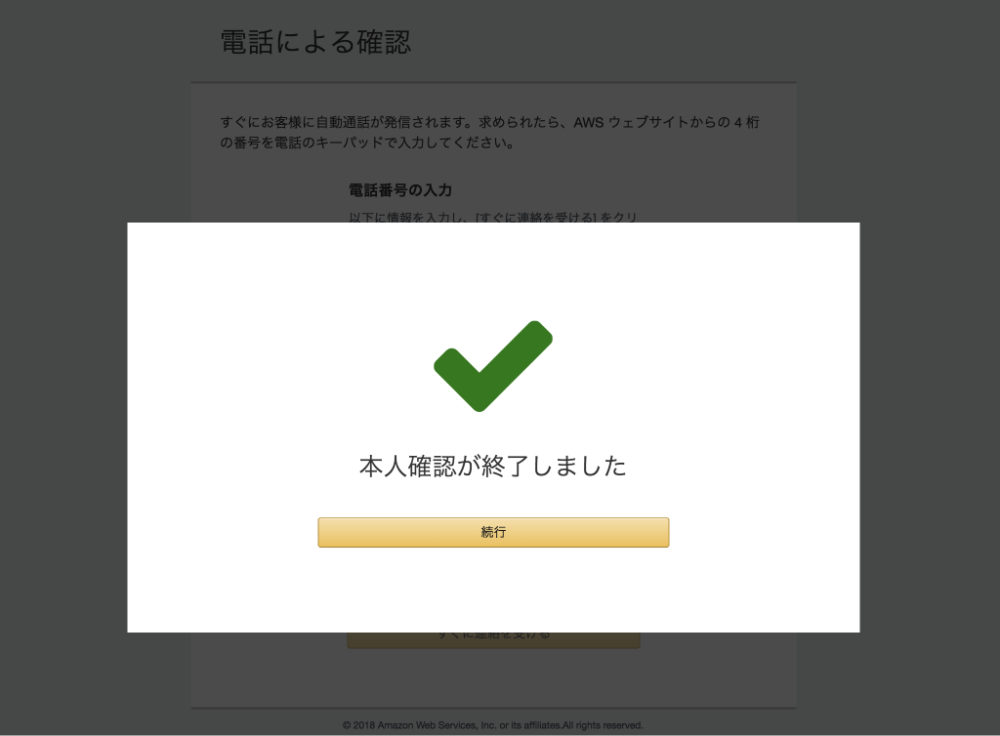

認証できました。「続行」ボタンをクリックしてください。

### 3-5.ステップ５：サポートプランの選択

サポートプランを選択します。今回はベーシックプランを選択しますので「無料」ボタンをクリックしてください。

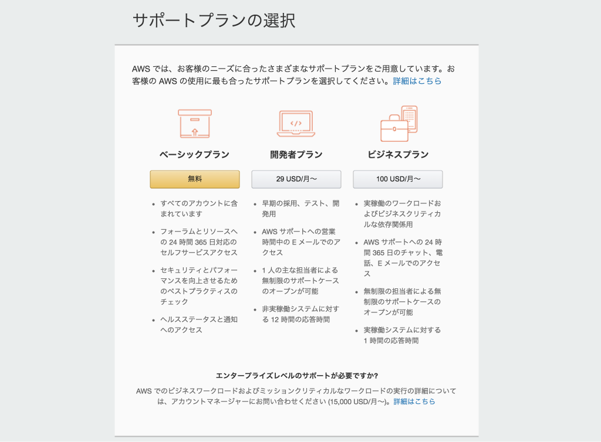

### 3-6.完了！

これでアカウント登録は全て完了しました。

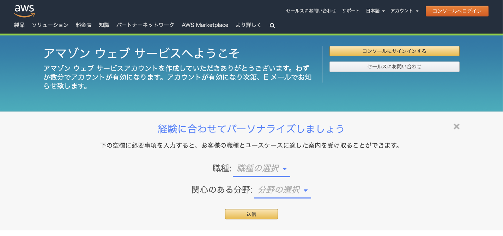

「コンソールにサインインする」ボタンをクリックしてみましょう。

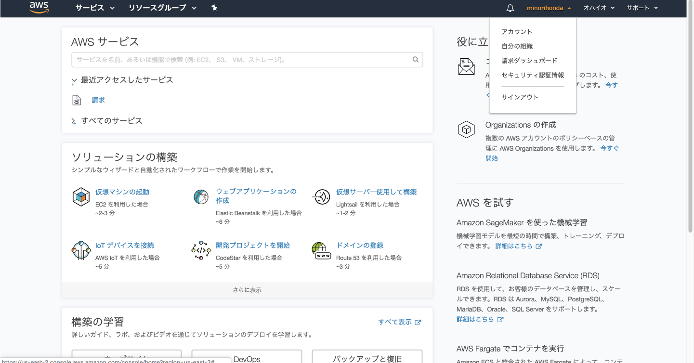

正確には「AWSマネジメントコンソール」といいます。「コンソールにサインインする」ボタンをクリックすると、サインインせずにAWSのホームページに遷移する場合があります。その時は、アカウント登録時に入力したメールアドレスを確認して下さい。以下の2通のメールが届いているはずです。

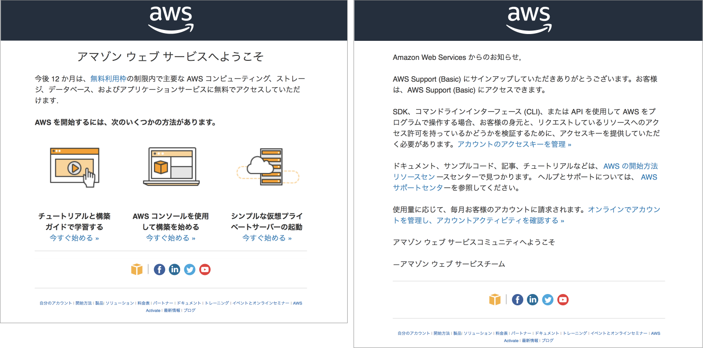  

その後、AWSのホームページの「コンソールへログイン」ボタンをクリックすれば、アカウントとパスワードを入力する画面が出てきます。以降は同じです。

### 3-7.サインアウト

いったんサインアウトしましょう。コンソールの右上に表示されているアカウント名をクリックしてください。出てきたプルダウンの中の「サイ
ンアウト」をクリックしてください。

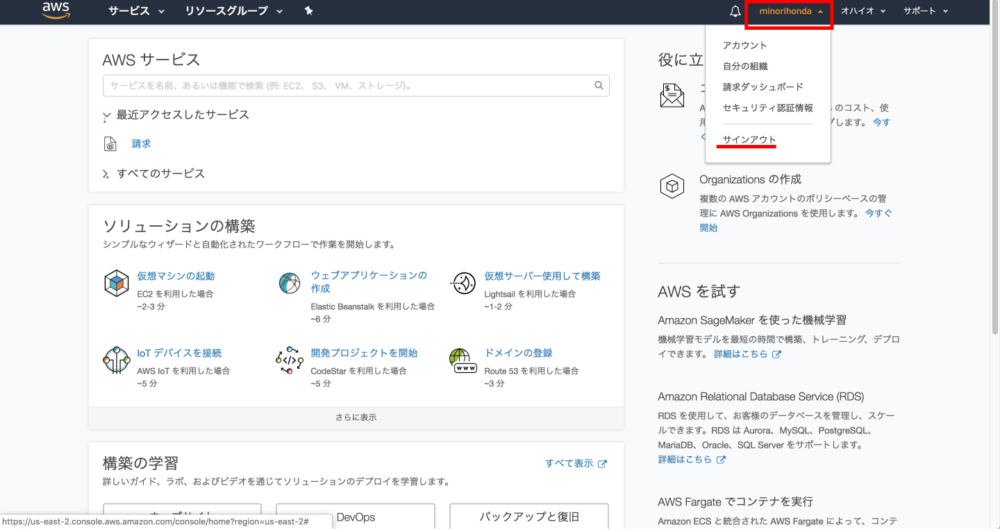

サインインの画面に遷移します。次節2-8で引き続きログインするので、閉じないようにしてください。

### 3-8.サインインする

コンソールへのログイン方法を確認しておきましょう。

サインアウトした直後の画面の右上にある「コンソールへログイン」ボタンをクリックしてください。AWS全体を通じてAWSのサービスへ入ることをサインインと表現していますが、なぜかここだけ「ログイン」と表示されています。違いは気にしないでください。

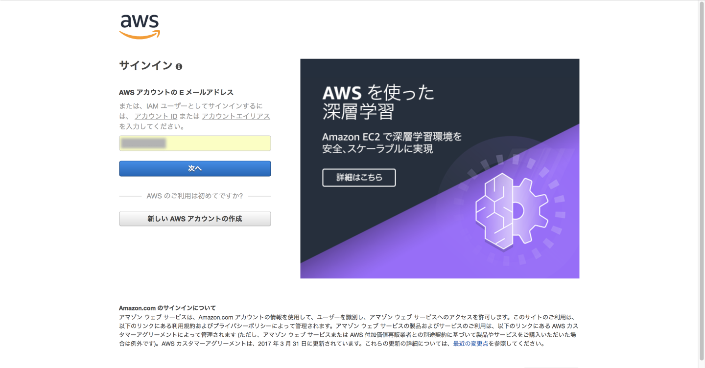

この画面をブックマークにしておいてください。今後はこのブックマークからログインしましょう。

登録時に入力したメールアドレスまたはAWSアカウント名、パスワードが自動的に表示されます。もし入力欄が出てきたら入力してください。入力後「サインイン」ボタンをクリックしてください。

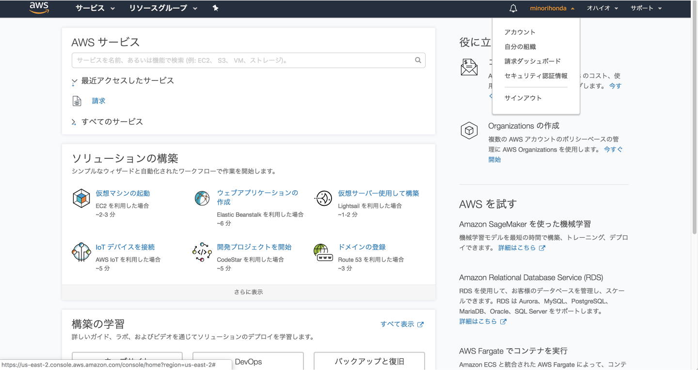

サインインできました。引き続き次章を学習する場合はそのまま、学習を終わるならサインアウトしてください。

## 4.まとめ

本章では、アカウント登録とコンソールへのサインイン方法を確認しました。次章では、課金方法と請求額の確認方法、課金アラートの設定をします。
  