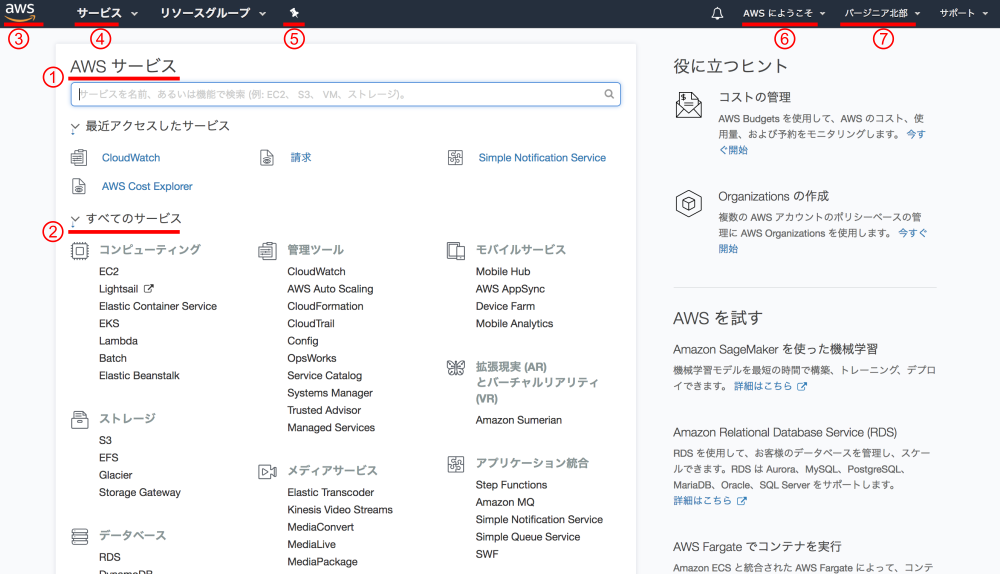
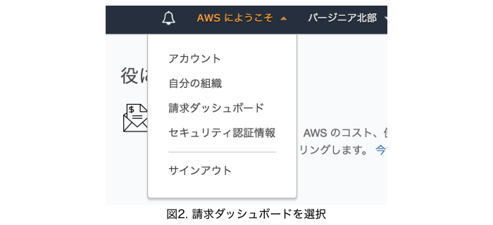
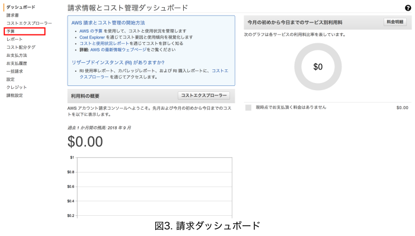
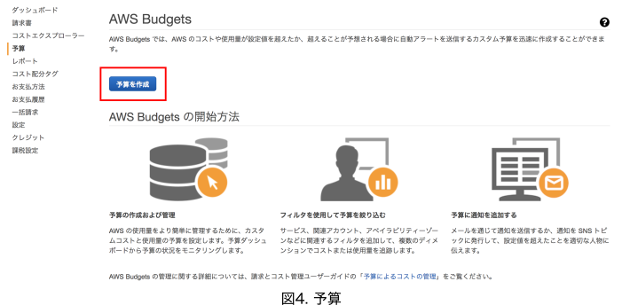
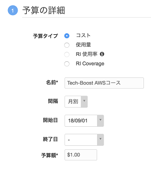
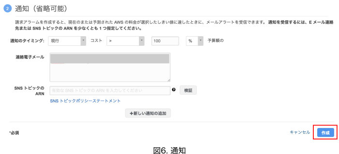
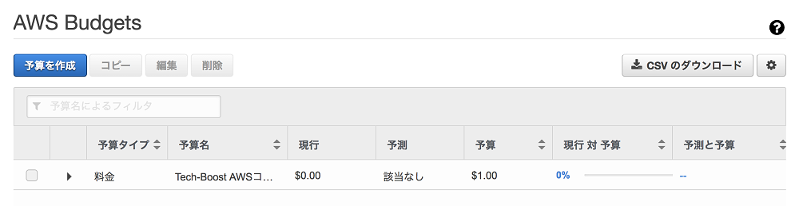
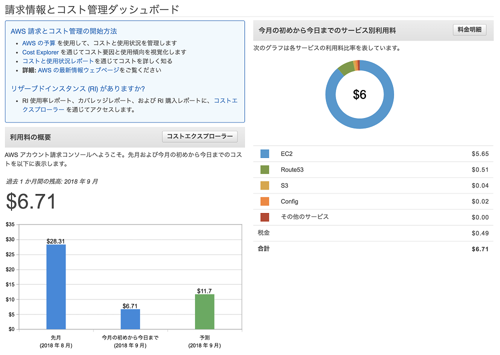

# （8）AWSマネジメントコンソールと課金

## 本章の目的：

- AWSマネジメントコンソールの使い方
- 課金体系と課金アラートを設定する

***

本章では、AWSマネジメントコンソールの基本的な使い方やAWSの課金について学習します。

AWSの課金は基本的に複雑です。後述のEC2など、単純なサービスはすぐに把握できますが、複数のサービスを組み合わせると課金はとても複雑になります。

サービスAのバックでサービスBが動くといったことがよくあります。こんな時、サービスAの料金以外にサービスBまで課金されます。「サービスA以外になぜサービスBまで課金されているの？」ということがよくあるのです。

よって、最初のうちは課金体系自体を深追いしないほうが無難です。万一に備えて料金の上限アラートを設定しておいて、かつこまめに課金状況を観察して、という地道なアプローチをおススメします。

本コースでは、『第３章 AWS初級編』あたりまで進んでも月額20ドル、つまり日本円で2000円程度を上回ることはありません。もし上回ることがあればサービスを立ち上げたまま放置している可能性があります。

本スクールは、AWSのサービスへの課金について、いかなる場合でも負担しません。全てご自身の責任下でAWSを利用してください。

### AWSマネジメントコンソールの基本

AWSマネジメントコンソール（以降、全コースを通じて「コンソール」と省略）を解説します。ログインまでは前章を参考にしてください。

#### 1.サービス名から検索

「AWS サービス」のタイトルの下に、検索キーワードを入れる大きな欄があります。ここにサービス名を入力して検索します。

「最近アクセスしたサービス」には、文字通り使ったサービスが表示されます。コース受講者の皆さんは、初めてなので当然何も表示されません。

この検索機能の良いところは、サービス名の一部でも略名でもヒットするところです。例えば「Simple Nortification Service」を検索したい場合は、「SNS」というサービス略称でも正しくヒットします。

#### 2.すべてのサービスから検索

検索欄の下の「すべてのサービス」で目当てのサービスをクリックしても遷移できます。

#### 3.AWSロゴ

サービストップ画面へ遷移します。

#### 4.ヘッダーの「サービス」

画面遷移はせず、サービストップ画面が上に覆うように表示されます。

#### 5.ショートカット

頻繁に使うサービスをショートカットとして表示させておくことができます。使い慣れてきたら、活用してください。

#### 6.AWSにようこそ

アカウントと請求に関連する設定が全てここに集約されています。後ほど、ここの「請求」を使って課金に関するアラートを設定します。

#### 7.リージョン設定

標準では米国東部（バージニア北部）が設定されています。使うサービスごとに設定します。サービスによってはリージョンをまたげなかったり、希望するリージョンで希望するサービスが開設していなかったり、ということがあります。

サービスを切り替えたら、このリージョン設定を確認する習慣をつけましょう。

### 課金アラートの設定

前節の『6.AWSにようこそ』をクリックしてください。

「請求ダッシュボード」をクリックしてください。

左のメニューの中から、赤枠の「予算」をクリックしてください。

予算、と書かれていてピンときませんが、これも立派なAWSのサービス「AWS Budget」です。「予算を作成」ボタンをクリックしてください。

画面の通りに入力してください。しきい値を1ドルと低く設定したのは、まずは練習のためです。1ドルを超えて通知を受けたら次に10ドル、それも超えたら20ドル・・・と順に増やしましょう。

画面の通りに入力してください。通知先のメールアドレスは複数の指定が可能です。複数の場合、メールアドレスをカンマ区切りで入力してください。PCとスマホや携帯、といった複数の送信先を指定すれば見逃すこともありません。

入力が終わったら「作成」ボタンをクリックしてください。

これで完了です。

ただし、設定ミスで通知が届かない場合があります。通知に頼り切らず、通知を自ら確認する習慣をつけましょう。そして1ドルを超えても通知が届かない場合は、設定を確認してください。

課金が始まると、請求ダッシュボードの表示は以下のように変わります。ご参考にどうぞ。

### 課金体系と無償枠

課金について考えるときに、重要なポイントをまとめました。

#### 完全従量金制

使った分だけしか課金されません。つまり、開発環境と検証環境、本番のサーバーを立てたとします。本番機は常時稼働、それ以外は開発時のみ使用するとします。この場合、本番機以外は落としている間は課金されません！これがAWSというより、クラウドを使うメリットです。

（従量金制でない課金方法もありますが、今のところは考えなくてもよいです。）

#### リージョンによって微妙に変わる

どのリージョンでサービスを立ち上げるかによって、微妙に料金が異なります。

#### カード払いのみ

AWSの料金は、基本的にドル建てのカード払いです。ドルで課金されて、カード引き落とし時に円換算されます。

#### 簡易見積もりツール

AWSの利用料金を、簡易に見積もるツールがあります。以下へアクセスしてください。

http://calculator.s3.amazonaws.com/index.html?lng=ja_JP#

リージョンや必要なサービスを入力すれば、月額でいくらになるのかを計算できます。ただしここで得られるのは、あくまで簡易の見積金額で、かつ無償枠を考慮しない額です。

AWSへ登録したばかりだと、1年間の無償枠が適用されます。

#### 1年間の無償枠

AWSへ登録したときに付与される、1年間の無償枠の詳細です。以下のページをご覧ください。

https://aws.amazon.com/jp/free/

無償となる対象が厳密に決まっています。無償対象のリソースの規模は、正直いって確かにトライアルであれば十分かな、といった感じです。それ以上のものを選択すると、直ちに課金が牙を剥いて襲いかかるので気をつけましょう。

### まとめ

本章では、AWSマネジメントコンソールと課金について学習しました。次の章では、IAMを使ったアカウント管理について学習します。

請求額を確認する習慣、必ず身につけてください。
