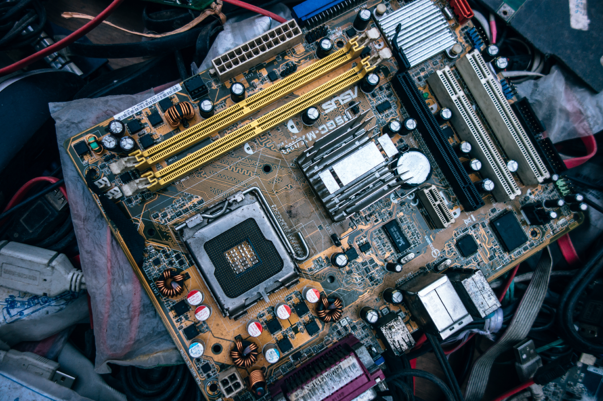
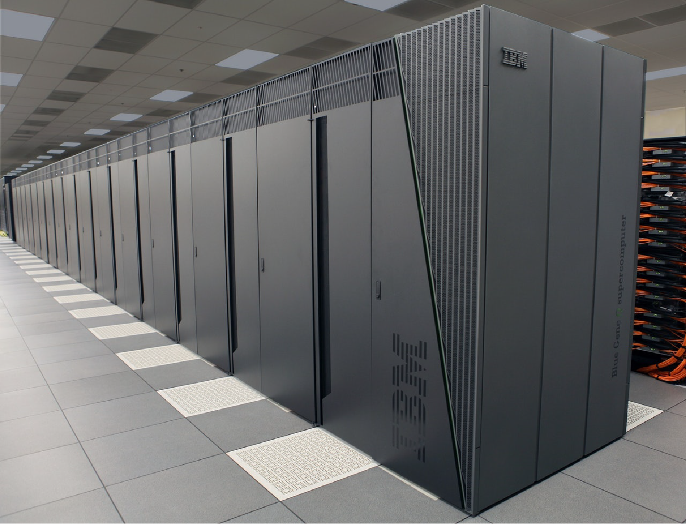
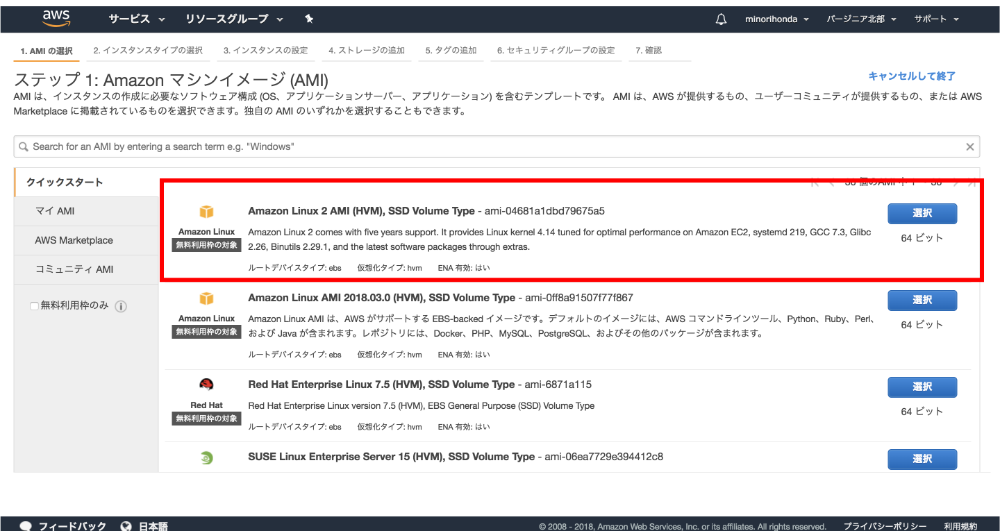
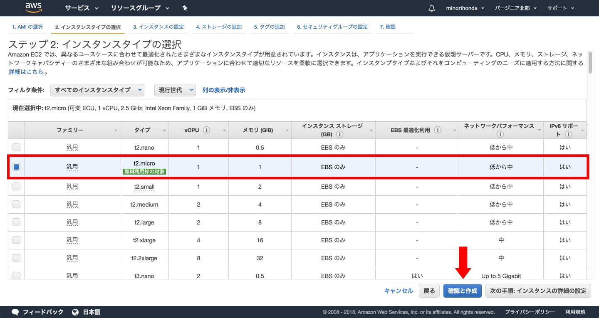
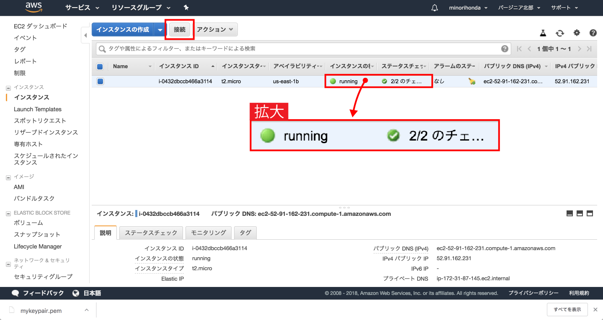

# (9) EC2とは

## 1.本章の目的

- EC2とは何かを理解する。

  
本コースの『３．AWS初級編』の7〜10章では、AWSのサービスをとりあえず触ってみることにチャレンジします。その例として、AWSの代表的なサービスである**EC2**を取り上げます。

実際にEC2に触ってみる前に、本章ではEC2とは何かということから解説します。 

※本章では実作業はありません。

## 2.EC2とは何か

EC2とは何かを説明することだけを目的としたので、不自然な言い回しがあります。例えば、インスタンスと呼ばずに仮想サーバ、などです。ご了承ください。

**EC2(Amazon Elastic Compute Cloud)とは、AWSのデータセンタ内に仮想サーバを立ち上げるサービスです。** 私たちはこれから仮想サーバを立ち上げます。

「作ったWebアプリを公開したいので、サーバーを立ち上げてください」

こう頼まれたら、皆さんはどうしますか？近くの電気屋さんにPCを買いに行きますか？それとも、PCパーツを買いに行きますか？

サーバとはいえコンピュータには違いありません。では、手続きをしてAWSのデータセンタ内に実機のコンピュータを構築するのでしょうか？サーバを立ち上げるというと、どうしても以下のようなイメージを描いてしまいます。

マザーボードやケース、ハードディスクや電源ユニットなどなどを組み合わせて、さらにOSをインストールして、というイメージです。

またデータセンタという語感からは・・・

入り口に守衛さんが立っていて、緊張感あふれる雰囲気のエリア内に威圧感のある大きい筐体（ケース）、というイメージです。では、これからEC2のサーバを立てるからといって、このように実機を組み立ててセットアップするのでしょうか？

決してそうではなく、これから行うのはあくまで **データセンタのインフラ内に、仮想にサーバを立ち上げるだけです。** 機械などの実体はありません。実体がない仮想サーバだからそこドライバーやその他工具は必要なく、ブラウザで必要な条件を入力するだけです。

実体はなくても、ソフトウェア上で仮想サーバを立ち上げることが技術的に可能なのです。それがまさしく「EC2」というものなのです。

## 3.仮想サーバを立ち上げる過程

次の章に出てくる仮想サーバーを立ち上げるための画面を先にお見せします。とても簡単ということが分かります。まずはOSを選択して、

次にスペックやメモリを指定して、

あとは数分待てば出来上がり。

立ち上がった仮想サーバに接続して、各種アプリをインストールしたり、みなさんが頑張って作ったRailsやLaravelのプロジェクトをデプロイ（要はサーバにセットすること）してアプリを動かしたり、といったことができるわけです。電気屋さんやパーツ屋さんに行く必要もありません。もっというと、機材に一切触れることなくサーバを構築できるのです。

くどいようですが、実機と仮想サーバの違いは、ただ単に **実体があるかどうか** だけです。できることに変わりはありません。

従来のように、実機を自前で構築して運用してくスタイルを**オンプレミス**といいます(*)。この言葉はクラウドの対義語として頻繁に出てくるので、覚えておきましょう。

(*)エンジニアの中には**オンプレ**と省略する人が多くいます。

## 4.まとめ

EC2はとても奥が深く、もっとお伝えしなければいけないことがあります。一部だけお伝えしましたが、雰囲気は伝わったでしょうか？これ以上深い話は、また追ってお伝えします。

次章では、具体的にサーバインスタンスを立ち上げます。

